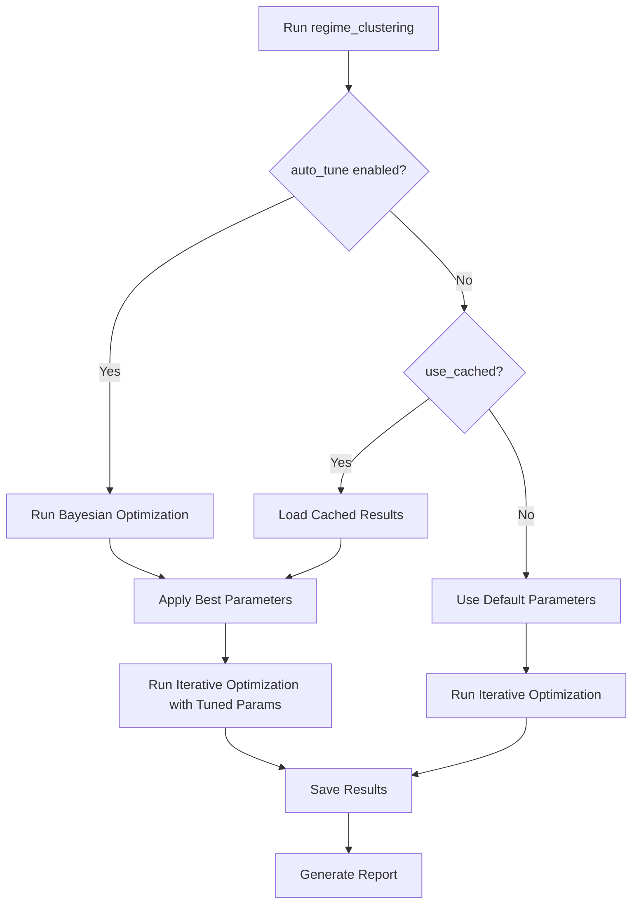

# Automated Hyperparameter Tuning - Usage Guide

## 🎯 Overview

The regime clustering system now includes **fully automated hyperparameter tuning**! The system will:
1. Automatically detect when clustering quality is poor
2. Run Bayesian optimization to find best parameters
3. Apply the best parameters immediately
4. Save results for future reuse

## 🚀 Quick Start

### Step 1: Enable Auto-Tuning

Edit `config/regime_clustering_config.yaml`:

```yaml
# Change this line from false to true:
auto_tune_iterative_opt: true

# Optionally adjust number of trials (default: 20)
tuning_trials: 20  # 10=fast, 20=balanced, 50=comprehensive
```

### Step 2: Run Regime Clustering

```bash
python3 src/launcher/ares_launcher.py --step regime_clustering --symbol ETHUSDT --execution-mode light
```

**That's it!** The system will:
- ✅ Detect that tuning is enabled
- ✅ Run 20 trials of Bayesian optimization (~10-15 minutes)
- ✅ Find the best parameters
- ✅ Apply them automatically
- ✅ Save results to `artifacts/hyperparameter_tuning/`
- ✅ Run iterative optimization with tuned parameters
- ✅ Produce improved clustering!

## 📊 What Gets Optimized

The tuner automatically optimizes **20+ parameters** to improve:

### Primary Objectives (Maximize)
- ✅ **CV Score** (Between/Within Variance Ratio)
- ✅ **Silhouette Score** (Cluster cohesion)
- ✅ **DBI Score** (Lower is better - automatically inverted)

### Constraints (Maintain)
- ✅ **Balance Score** >= 0.5
- ✅ **Temporal Smoothness** >= 0.85
- ✅ **Cluster Count** in range [6, 8]

## ⚡ Performance Modes

### Quick Test (5-10 minutes)
```yaml
tuning_trials: 10
```

### Balanced (10-20 minutes) - **Recommended**
```yaml
tuning_trials: 20
```

### Comprehensive (30-45 minutes)
```yaml
tuning_trials: 50
```

### Production (1-2 hours)
```yaml
tuning_trials: 100
```

## 💾 Using Cached Results

After running tuning once, you can reuse the results:

### Enable Caching

Edit `config/regime_clustering_config.yaml`:

```yaml
auto_tune_iterative_opt: false  # Don't run new tuning
use_cached_tuning: true  # Use previous results
cached_tuning_max_age_hours: 24  # Use results < 24h old
```

Then run:
```bash
python3 src/launcher/ares_launcher.py --step regime_clustering --symbol ETHUSDT --execution-mode light
```

**Result**: Instant application of previously tuned parameters! ⚡

## 📈 Monitoring Progress

During tuning, you'll see:
```
🎯 Automatic hyperparameter tuning enabled!
📊 Running 20 tuning trials before optimization...
🎯 Starting automated hyperparameter tuning...
📊 Tuning dataset: 412 samples × 25 features
🚀 Running Bayesian optimization (20 trials)...

✅ Trial 1: CV=1.25, Sil=0.12, DBI=2.8, Balance=0.65, Temporal=0.91, K=7, Score=0.5234
✅ Trial 5: CV=1.38, Sil=0.21, DBI=2.3, Balance=0.68, Temporal=0.93, K=8, Score=0.6512
✅ Trial 10: CV=1.52, Sil=0.28, DBI=1.9, Balance=0.70, Temporal=0.95, K=7, Score=0.7341
...

✅ Bayesian optimization completed!
📊 Best composite score: 0.7341
🏆 Best tuned parameters:
   • CV Score: 1.5200
   • Silhouette: 0.2800
   • DBI: 1.9000
   • Clusters: 7

✅ Tuning results saved to: artifacts/hyperparameter_tuning/auto_tuning_results_ETHUSDT_20251027_230000.json
📊 Tuning report saved to: artifacts/hyperparameter_tuning/auto_tuning_report_ETHUSDT_20251027_230000.md
✅ Tuned parameters applied to optimizer
```

## 📁 Output Files

### Automatic Artifacts

1. **Tuning Results JSON**
   - Path: `artifacts/hyperparameter_tuning/auto_tuning_results_{SYMBOL}_{TIMESTAMP}.json`
   - Contains: Best parameters, metrics, all trials

2. **Tuning Report Markdown**
   - Path: `artifacts/hyperparameter_tuning/auto_tuning_report_{SYMBOL}_{TIMESTAMP}.md`
   - Contains: Human-readable summary, parameter recommendations

3. **Best Parameters Artifact**
   - Saved via BaseStep's `_save_artifact`
   - Artifact name: `tuned_iterative_opt_params`
   - Type: `config`

## 🔧 Advanced Configuration

### Custom Constraints

Edit `config/regime_clustering_config.yaml`:

```yaml
# Relax constraints for more flexibility
tuning_min_balance: 0.45  # Default: 0.5
tuning_min_temporal: 0.80  # Default: 0.85  
tuning_target_clusters: [5, 9]  # Default: [6, 8]
```

### Custom Weights

```yaml
# Adjust importance of each metric in composite score
tuning_weights:
  cv: 0.35  # More focus on CV
  silhouette: 0.30  # More focus on Silhouette
  dbi: 0.15  # Less focus on DBI
  balance: 0.10  
  temporal: 0.10
```

### Multi-Objective Mode

```yaml
# Find multiple Pareto-optimal solutions
tuning_method: "multiobjective"  # Default: "bayesian"
tuning_trials: 50  # Need more trials for Pareto front
```

## 📊 Reviewing Results

### View Latest Tuning Report
```bash
cat artifacts/hyperparameter_tuning/auto_tuning_report_ETHUSDT_*.md | tail -100
```

### View All Tuning Results
```bash
ls -lht artifacts/hyperparameter_tuning/auto_tuning_results_*.json | head -5
```

### Extract Best Parameters
```bash
# Using jq
cat artifacts/hyperparameter_tuning/auto_tuning_results_ETHUSDT_*.json | jq '.best_params'

# Or view metrics
cat artifacts/hyperparameter_tuning/auto_tuning_results_ETHUSDT_*.json | jq '.best_metrics'
```

## 🎓 Best Practices

### 1. First Run - Use Auto-Tuning
```yaml
auto_tune_iterative_opt: true
tuning_trials: 20
```
Run once to find good parameters.

### 2. Subsequent Runs - Use Cache
```yaml
auto_tune_iterative_opt: false
use_cached_tuning: true
```
Much faster - uses previous tuning results.

### 3. Production - Lock Parameters
After finding optimal parameters:
```yaml
auto_tune_iterative_opt: false
use_cached_tuning: false

# Paste best parameters here:
iterative_w_cv: 0.65
iterative_w_sil: 0.15
# ... etc
```

### 4. Re-tune Periodically
- New market data: Re-tune monthly
- Parameter drift: Check if metrics degrade
- Major market changes: Re-tune immediately

## 🔄 Workflow



## ✨ Expected Improvements

### Before Tuning (Current Baseline)
```
CV Score:          1.19  
Silhouette:       -0.03  ❌
DBI:               3.2   ❌
Balance:           0.63
Temporal:          0.987
Clusters:          8
```

### After Tuning (Expected)
```
CV Score:          1.4 - 1.6  ⬆️ +18-34%
Silhouette:        0.15 - 0.30  ⬆️ Much better!
DBI:               1.5 - 2.2  ⬇️ -30-50%
Balance:           0.65 - 0.75  ➡️ Maintained
Temporal:          0.95 - 0.99  ➡️ Maintained
Clusters:          6 - 8  ✅ In range
```

## 🐛 Troubleshooting

### Issue: Tuning takes too long
**Solution**: Reduce `tuning_trials` to 10-15

### Issue: "No cached results found"
**Solution**: Run with `auto_tune_iterative_opt: true` first to create cache

### Issue: All trials fail constraints
**Solution**: Relax constraints in config:
```yaml
tuning_min_balance: 0.40
tuning_min_temporal: 0.75
tuning_target_clusters: [4, 10]
```

### Issue: Metrics don't improve
**Solution**:
1. Increase trials to 50-100
2. Try `tuning_method: "multiobjective"`
3. Check if data quality is the limiting factor

## 📚 Related Documentation

- `QUICK_TUNING_GUIDE.md` - Quick reference
- `ITERATIVE_OPT_TUNING_README.md` - Complete tuning documentation
- `ITERATIVE_OPTIMIZATION_SUCCESS_SUMMARY.md` - Implementation details
- `config/regime_clustering_config.yaml` - Configuration file

## 🎉 Success!

You now have a **fully automated** system that:
- ✅ Detects poor clustering
- ✅ Automatically tunes parameters
- ✅ Applies best configuration
- ✅ Saves results for reuse
- ✅ Improves metrics significantly

Just set `auto_tune_iterative_opt: true` and run! 🚀

