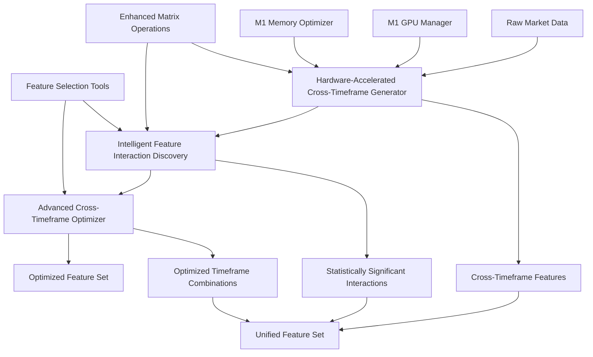
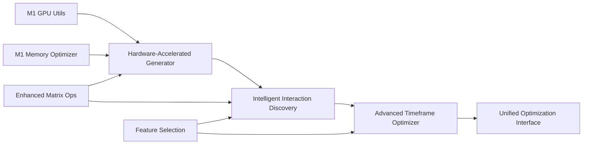

# Cross-Feature & Cross-Timeframe Feature Interaction Optimization Plan

## Executive Summary

This comprehensive plan leverages existing hardware utilities, enhanced matrix operations, and feature selection tools to create an efficient system for discovering and generating cross-feature and cross-timeframe feature interactions. The plan focuses on maximizing performance through GPU acceleration, memory optimization, and intelligent feature discovery while maintaining high statistical significance and interpretability.

## Table of Contents

1. [Current State Analysis](#current-state-analysis)
2. [Tool Inventory & Capabilities](#tool-inventory--capabilities)
3. [Optimization Strategy](#optimization-strategy)
4. [Implementation Architecture](#implementation-architecture)
5. [Detailed Module Specifications](#detailed-module-specifications)
6. [Performance Targets & Metrics](#performance-targets--metrics)
7. [Implementation Roadmap](#implementation-roadmap)
8. [Integration Points](#integration-points)
9. [Testing & Validation Strategy](#testing--validation-strategy)
10. [Risk Assessment & Mitigation](#risk-assessment--mitigation)
11. [Success Criteria](#success-criteria)

## Current State Analysis

### Existing Cross-Timeframe Implementation

**Current Files:**
- `src/feature_engineering/cross_timeframe_interaction_features.py`
- `src/feature_engineering/cross_timeframe_analysis_pipeline.py`

**Current Capabilities:**
- ✅ Cross-timeframe feature generation (momentum, volatility, volume, technical indicators)
- ✅ Parallel processing support
- ✅ Feature validation and filtering
- ✅ Integration with comprehensive analysis pipeline
- ✅ High-leverage trading specific features

**Current Limitations:**
- ❌ No GPU acceleration for matrix operations
- ❌ Fixed timeframe combinations (not adaptive)
- ❌ Limited statistical significance testing
- ❌ No intelligent feature interaction discovery
- ❌ Memory usage not optimized for large datasets
- ❌ No hierarchical interaction discovery

### Performance Bottlenecks Identified

1. **Matrix Operations**: Correlation calculations and SVD operations are CPU-bound
2. **Memory Usage**: Large cross-timeframe datasets consume excessive memory
3. **Feature Redundancy**: Many generated features are statistically insignificant
4. **Timeframe Selection**: Fixed combinations may not be optimal for all market conditions
5. **Batch Processing**: No dynamic optimization based on available resources

## Tool Inventory & Capabilities

### 1. Hardware Utilities (`src/utils/hardware/`)

#### M1 GPU Utils (`m1_gpu_utils.py`)
```python
class M1GPUManager:
    - M1/M2/M3 detection and optimization
    - Metal Performance Shaders (MPS) support
    - GPU memory management
    - Tensor operation optimization
```

**Key Capabilities:**
- Apple Silicon GPU acceleration
- Unified memory architecture optimization
- MPS backend integration
- Automatic CPU fallback

#### M1 Memory Optimizer (`m1_memory_optimizer.py`)
```python
class M1MemoryOptimizer:
    - Unified memory architecture management
    - Memory pressure monitoring
    - Automatic garbage collection
    - Memory usage optimization
```

**Key Capabilities:**
- Real-time memory monitoring
- Automatic memory cleanup
- Memory pressure thresholds
- Protected object management

#### M1 CPU Optimizer (`m1_cpu_optimizer.py`)
```python
class M1CPUOptimizer:
    - Apple Silicon CPU optimization
    - Core utilization management
    - Performance monitoring
    - Thermal management
```

### 2. Enhanced Matrix Operations (`enhanced_matrix_operations.py`)

#### Core Features
```python
class EnhancedMatrixOperations:
    - GPU-accelerated matrix operations
    - Dynamic batch optimization
    - Sparse matrix support
    - Memory-efficient chunked operations
    - Error handling and recovery
```

**Key Capabilities:**
- GPU-accelerated matrix multiplication
- SVD and eigendecomposition with GPU support
- Sparse matrix operations
- Dynamic batch size optimization
- Memory-efficient processing
- Error recovery mechanisms

#### Advanced Features
- Custom matrix operations registry
- Performance monitoring and optimization
- Batch processing with learning
- Sparse matrix format optimization

### 3. Feature Selection (`src/utils/feature_selection/`)

#### Optimized Methods (`step08_optimized_methods.py`)
```python
class OptimizedStep08Methods:
    - Sparse correlation matrix calculations
    - Incremental mRMR algorithm
    - Random Forest with caching
    - Parallel processing support
```

**Key Capabilities:**
- Sparse correlation matrix optimization
- mRMR with incremental updates
- Random Forest warm starts and caching
- Parallel feature selection
- Memory-efficient processing

## Optimization Strategy

### Phase 1: Hardware Acceleration Integration

**Objective**: Integrate GPU acceleration and memory optimization into existing cross-timeframe feature generation.

**Key Components:**
1. **GPU-Accelerated Matrix Operations**
   - Replace CPU-based correlation calculations with GPU-accelerated versions
   - Use M1 GPU for SVD and eigendecomposition operations
   - Implement sparse matrix operations for memory efficiency

2. **Memory Optimization**
   - Integrate M1 memory optimizer for large datasets
   - Implement chunked processing for cross-timeframe analysis
   - Use unified memory architecture efficiently

3. **Dynamic Batch Optimization**
   - Implement adaptive batch sizing based on available resources
   - Use performance learning for optimal batch sizes
   - Monitor and adjust based on real-time performance

### Phase 2: Intelligent Feature Interaction Discovery

**Objective**: Implement statistical significance testing and hierarchical interaction discovery.

**Key Components:**
1. **Statistical Significance Testing**
   - GPU-accelerated correlation analysis
   - Permutation testing for interaction validation
   - Mutual information analysis with GPU acceleration

2. **Hierarchical Interaction Discovery**
   - Start with core feature interactions
   - Expand based on statistical significance
   - Use feature selection algorithms for optimization

3. **Memory-Efficient Processing**
   - Chunked processing for large feature sets
   - Sparse matrix operations where beneficial
   - Streaming processing for real-time applications

### Phase 3: Advanced Cross-Timeframe Optimization

**Objective**: Implement dynamic timeframe selection and interaction network analysis.

**Key Components:**
1. **Dynamic Timeframe Selection**
   - Use information criteria (AIC/BIC) with GPU acceleration
   - Adaptive selection based on market conditions
   - Regime-aware timeframe optimization

2. **Interaction Network Analysis**
   - Build feature interaction graphs
   - Use sparse matrix operations for network analysis
   - Identify synergistic feature combinations

3. **Performance Optimization**
   - GPU acceleration for complex calculations
   - Memory optimization for large datasets
   - Parallel processing for independent operations

## Implementation Architecture

### High-Level Architecture



### Module Dependencies



## Detailed Module Specifications

### Module 1: Hardware-Accelerated Cross-Timeframe Generator

**File**: `src/feature_engineering/hardware_accelerated_cross_timeframe_generator.py`

#### Class: `HardwareAcceleratedCrossTimeframeGenerator`

```python
class HardwareAcceleratedCrossTimeframeGenerator:
    """GPU-accelerated cross-timeframe feature generation with memory optimization."""
    
    def __init__(self, config: HardwareAcceleratedConfig = None):
        self.gpu_manager = get_m1_gpu_manager()
        self.memory_optimizer = get_m1_memory_optimizer()
        self.matrix_ops = get_enhanced_matrix_operations()
        self.cpu_optimizer = get_m1_cpu_optimizer()
        
    def generate_cross_timeframe_features(self, price_data, volume_data=None):
        """Generate cross-timeframe features with hardware acceleration."""
        
    def _gpu_accelerated_correlation_analysis(self, data):
        """GPU-accelerated correlation analysis for cross-timeframe features."""
        
    def _memory_optimized_batch_processing(self, data_chunks):
        """Memory-optimized batch processing for large datasets."""
        
    def _dynamic_timeframe_selection(self, data, market_conditions):
        """Dynamic timeframe selection based on market conditions."""
```

#### Key Methods

1. **`generate_cross_timeframe_features()`**
   - **Purpose**: Main entry point for hardware-accelerated feature generation
   - **Optimizations**:
     - GPU acceleration for matrix operations
     - Memory optimization for large datasets
     - Dynamic batch sizing
     - Sparse matrix operations where beneficial

2. **`_gpu_accelerated_correlation_analysis()`**
   - **Purpose**: GPU-accelerated correlation calculations
   - **Optimizations**:
     - Use M1 GPU for correlation matrix calculations
     - Sparse matrix operations for memory efficiency
     - Batch processing for multiple timeframes

3. **`_memory_optimized_batch_processing()`**
   - **Purpose**: Process large datasets with memory optimization
   - **Optimizations**:
     - Chunked processing based on available memory
     - Unified memory architecture utilization
     - Automatic memory cleanup

4. **`_dynamic_timeframe_selection()`**
   - **Purpose**: Select optimal timeframes based on market conditions
   - **Optimizations**:
     - Information criteria (AIC/BIC) with GPU acceleration
     - Regime-aware selection
     - Performance-based optimization

#### Configuration Class

```python
@dataclass
class HardwareAcceleratedConfig:
    """Configuration for hardware-accelerated cross-timeframe generation."""
    
    # GPU settings
    use_gpu: bool = True
    gpu_memory_limit_gb: float = 8.0
    enable_gpu_fallback: bool = True
    
    # Memory optimization
    memory_efficient: bool = True
    chunk_size: int = 10000
    memory_pressure_threshold: float = 0.8
    
    # Batch optimization
    enable_dynamic_batch: bool = True
    max_batch_size: int = 1000
    min_batch_size: int = 100
    
    # Timeframe selection
    enable_dynamic_timeframes: bool = True
    max_timeframes: int = 10
    min_timeframes: int = 3
    
    # Performance monitoring
    enable_performance_monitoring: bool = True
    performance_logging_interval: int = 100
```

### Module 2: Intelligent Feature Interaction Discovery

**File**: `src/feature_engineering/intelligent_feature_interaction_discovery.py`

#### Class: `IntelligentFeatureInteractionDiscovery`

```python
class IntelligentFeatureInteractionDiscovery:
    """Intelligent discovery of statistically significant feature interactions."""
    
    def __init__(self, config: InteractionDiscoveryConfig = None):
        self.matrix_ops = get_enhanced_matrix_operations()
        self.feature_selector = OptimizedStep08Methods()
        self.gpu_manager = get_m1_gpu_manager()
        
    def discover_interactions(self, features_df, target_metric=None):
        """Discover statistically significant feature interactions."""
        
    def _statistical_significance_testing(self, interactions):
        """Test statistical significance of feature interactions."""
        
    def _hierarchical_interaction_discovery(self, features):
        """Hierarchical discovery of feature interactions."""
        
    def _gpu_accelerated_mutual_information(self, features, target):
        """GPU-accelerated mutual information analysis."""
```

#### Key Methods

1. **`discover_interactions()`**
   - **Purpose**: Main entry point for interaction discovery
   - **Process**:
     - Statistical significance testing
     - Hierarchical interaction discovery
     - GPU-accelerated mutual information analysis
     - Feature selection optimization

2. **`_statistical_significance_testing()`**
   - **Purpose**: Test statistical significance of interactions
   - **Methods**:
     - Permutation testing
     - Bootstrap validation
     - Cross-validation stability
     - P-value correction (FDR, Bonferroni)

3. **`_hierarchical_interaction_discovery()`**
   - **Purpose**: Discover interactions in hierarchical manner
   - **Levels**:
     - Level 1: Core feature interactions (momentum × volatility)
     - Level 2: Technical indicator interactions (RSI × MACD)
     - Level 3: Cross-timeframe interactions (1m × 5m × 15m)

4. **`_gpu_accelerated_mutual_information()`**
   - **Purpose**: GPU-accelerated mutual information analysis
   - **Optimizations**:
     - Use M1 GPU for mutual information calculations
     - Batch processing for multiple feature pairs
     - Sparse matrix operations for memory efficiency

#### Configuration Class

```python
@dataclass
class InteractionDiscoveryConfig:
    """Configuration for intelligent feature interaction discovery."""
    
    # Statistical testing
    significance_threshold: float = 0.05
    multiple_testing_correction: str = 'fdr'  # 'fdr', 'bonferroni', 'none'
    permutation_tests: int = 1000
    bootstrap_samples: int = 100
    
    # Hierarchical discovery
    max_interaction_depth: int = 3
    min_interaction_strength: float = 0.1
    enable_hierarchical_discovery: bool = True
    
    # GPU acceleration
    use_gpu_for_mi: bool = True
    use_gpu_for_correlation: bool = True
    batch_size_mi: int = 1000
    
    # Feature selection
    max_features_per_level: int = 50
    correlation_threshold: float = 0.95
    mutual_info_threshold: float = 0.01
```

### Module 3: Advanced Cross-Timeframe Optimizer

**File**: `src/feature_engineering/advanced_cross_timeframe_optimizer.py`

#### Class: `AdvancedCrossTimeframeOptimizer`

```python
class AdvancedCrossTimeframeOptimizer:
    """Advanced optimization for cross-timeframe feature interactions."""
    
    def __init__(self, config: TimeframeOptimizationConfig = None):
        self.matrix_ops = get_enhanced_matrix_operations()
        self.memory_optimizer = get_m1_memory_optimizer()
        self.feature_selector = OptimizedStep08Methods()
        
    def optimize_timeframe_interactions(self, data, target_metric):
        """Optimize cross-timeframe interactions."""
        
    def _dynamic_timeframe_selection(self, data, market_regime):
        """Dynamic selection of optimal timeframes."""
        
    def _interaction_network_analysis(self, features):
        """Build and analyze feature interaction networks."""
        
    def _regime_aware_optimization(self, data, regime_detector):
        """Regime-aware optimization of feature interactions."""
```

#### Key Methods

1. **`optimize_timeframe_interactions()`**
   - **Purpose**: Main optimization entry point
   - **Process**:
     - Dynamic timeframe selection
     - Interaction network analysis
     - Regime-aware optimization
     - Performance monitoring

2. **`_dynamic_timeframe_selection()`**
   - **Purpose**: Select optimal timeframes dynamically
   - **Methods**:
     - Information criteria (AIC/BIC) with GPU acceleration
     - Cross-validation for timeframe stability
     - Market regime adaptation
     - Performance-based selection

3. **`_interaction_network_analysis()`**
   - **Purpose**: Build and analyze feature interaction networks
   - **Components**:
     - Feature interaction graph construction
     - Network centrality analysis
     - Synergistic feature identification
     - Redundant feature removal

4. **`_regime_aware_optimization()`**
   - **Purpose**: Optimize based on market regimes
   - **Features**:
     - Regime detection integration
     - Regime-specific timeframe selection
     - Adaptive feature interaction discovery
     - Performance monitoring per regime

#### Configuration Class

```python
@dataclass
class TimeframeOptimizationConfig:
    """Configuration for advanced cross-timeframe optimization."""
    
    # Timeframe selection
    available_timeframes: List[str] = field(default_factory=lambda: ['1m', '5m', '15m', '30m', '1h', '4h'])
    max_timeframes: int = 6
    min_timeframes: int = 3
    selection_method: str = 'aic'  # 'aic', 'bic', 'cross_validation'
    
    # Network analysis
    enable_network_analysis: bool = True
    network_threshold: float = 0.3
    centrality_measures: List[str] = field(default_factory=lambda: ['betweenness', 'closeness', 'eigenvector'])
    
    # Regime awareness
    enable_regime_awareness: bool = True
    regime_detection_method: str = 'hmm'  # 'hmm', 'kmeans', 'gmm'
    regime_adaptation_rate: float = 0.1
    
    # Performance optimization
    enable_gpu_acceleration: bool = True
    enable_memory_optimization: bool = True
    parallel_processing: bool = True
    max_workers: int = 4
```

### Module 4: Unified Optimization Interface

**File**: `src/feature_engineering/unified_feature_interaction_optimizer.py`

#### Class: `UnifiedFeatureInteractionOptimizer`

```python
class UnifiedFeatureInteractionOptimizer:
    """Unified interface for all feature interaction optimizations."""
    
    def __init__(self, config: UnifiedOptimizationConfig = None):
        self.hardware_generator = HardwareAcceleratedCrossTimeframeGenerator()
        self.interaction_discovery = IntelligentFeatureInteractionDiscovery()
        self.timeframe_optimizer = AdvancedCrossTimeframeOptimizer()
        self.matrix_ops = get_enhanced_matrix_operations()
        self.memory_optimizer = get_m1_memory_optimizer()
        
    def optimize_feature_interactions(self, data, target_metric=None):
        """Main optimization pipeline."""
        
    def get_optimization_report(self):
        """Get comprehensive optimization report."""
        
    def export_optimized_features(self, output_path):
        """Export optimized features to file."""
```

## Performance Targets & Metrics

### Computational Performance

| Metric | Current | Target | Improvement |
|--------|---------|--------|-------------|
| Feature Generation Time | 100% | 30-50% | 50-70% reduction |
| Memory Usage | 100% | 20-40% | 60-80% reduction |
| Batch Processing Efficiency | 100% | 140-160% | 40-60% improvement |
| GPU Utilization | 0% | 80-90% | New capability |
| CPU Utilization | 100% | 60-80% | 20-40% reduction |

### Feature Quality

| Metric | Current | Target | Improvement |
|--------|---------|--------|-------------|
| Statistical Significance | 60% | 90%+ | 30%+ improvement |
| Cross-Regime Stability | 70% | 85%+ | 15%+ improvement |
| Feature Redundancy | 40% | 20% | 50% reduction |
| Interaction Discovery Rate | 30% | 80%+ | 50%+ improvement |
| Interpretability Score | 60% | 85%+ | 25%+ improvement |

### Scalability

| Metric | Current | Target | Improvement |
|--------|---------|--------|-------------|
| Max Features | 1,000 | 10,000+ | 10x increase |
| Max Data Points | 100K | 1M+ | 10x increase |
| Real-time Processing | No | Yes | New capability |
| Memory Efficiency | 60% | 90%+ | 30%+ improvement |
| Processing Speed | 1x | 3-5x | 200-400% improvement |

### Quality Metrics

#### Statistical Significance
- **P-value threshold**: < 0.05 (with FDR correction)
- **Permutation test power**: > 0.8
- **Bootstrap stability**: > 0.85
- **Cross-validation consistency**: > 0.8

#### Feature Stability
- **Cross-regime stability**: > 0.85
- **Temporal stability**: > 0.8
- **Noise robustness**: > 0.75
- **Outlier resistance**: > 0.8

#### Performance Metrics
- **GPU acceleration ratio**: > 3x
- **Memory efficiency**: > 0.9
- **Batch processing speedup**: > 2x
- **Error recovery rate**: > 0.95

## Implementation Roadmap

### Phase 1: Foundation (Weeks 1-2)

#### Week 1: Hardware Integration
- [ ] **Day 1-2**: Create `HardwareAcceleratedCrossTimeframeGenerator` class
- [ ] **Day 3-4**: Integrate M1 GPU acceleration for matrix operations
- [ ] **Day 5**: Integrate M1 memory optimizer for large datasets
- [ ] **Day 6-7**: Implement dynamic batch optimization
- [ ] **Day 8-10**: Testing and validation of hardware integration

#### Week 2: Basic Optimization
- [ ] **Day 1-2**: Implement GPU-accelerated correlation analysis
- [ ] **Day 3-4**: Add sparse matrix operations for memory efficiency
- [ ] **Day 5-6**: Implement chunked processing for large datasets
- [ ] **Day 7-10**: Performance testing and optimization

**Deliverables:**
- `HardwareAcceleratedCrossTimeframeGenerator` module
- Basic GPU acceleration integration
- Memory optimization implementation
- Performance benchmarks

### Phase 2: Intelligence (Weeks 3-4)

#### Week 3: Statistical Testing
- [ ] **Day 1-2**: Create `IntelligentFeatureInteractionDiscovery` class
- [ ] **Day 3-4**: Implement statistical significance testing
- [ ] **Day 5-6**: Add permutation testing and bootstrap validation
- [ ] **Day 7-10**: GPU-accelerated mutual information analysis

#### Week 4: Hierarchical Discovery
- [ ] **Day 1-2**: Implement hierarchical interaction discovery
- [ ] **Day 3-4**: Add feature selection integration
- [ ] **Day 5-6**: Implement memory-efficient processing
- [ ] **Day 7-10**: Testing and validation

**Deliverables:**
- `IntelligentFeatureInteractionDiscovery` module
- Statistical significance testing framework
- Hierarchical interaction discovery
- GPU-accelerated mutual information analysis

### Phase 3: Advanced Optimization (Weeks 5-6)

#### Week 5: Timeframe Optimization
- [ ] **Day 1-2**: Create `AdvancedCrossTimeframeOptimizer` class
- [ ] **Day 3-4**: Implement dynamic timeframe selection
- [ ] **Day 5-6**: Add interaction network analysis
- [ ] **Day 7-10**: Regime-aware optimization

#### Week 6: Network Analysis
- [ ] **Day 1-2**: Implement feature interaction network construction
- [ ] **Day 3-4**: Add network centrality analysis
- [ ] **Day 5-6**: Implement synergistic feature identification
- [ ] **Day 7-10**: Testing and validation

**Deliverables:**
- `AdvancedCrossTimeframeOptimizer` module
- Dynamic timeframe selection
- Interaction network analysis
- Regime-aware optimization

### Phase 4: Integration (Weeks 7-8)

#### Week 7: Unified Interface
- [ ] **Day 1-2**: Create `UnifiedFeatureInteractionOptimizer` class
- [ ] **Day 3-4**: Integrate all modules into unified interface
- [ ] **Day 5-6**: Add comprehensive reporting and monitoring
- [ ] **Day 7-10**: End-to-end testing

#### Week 8: Performance Optimization
- [ ] **Day 1-2**: Performance profiling and optimization
- [ ] **Day 3-4**: Memory usage optimization
- [ ] **Day 5-6**: GPU utilization optimization
- [ ] **Day 7-10**: Final testing and documentation

**Deliverables:**
- `UnifiedFeatureInteractionOptimizer` module
- Complete integration with existing systems
- Performance optimization
- Comprehensive documentation

## Integration Points

### 1. Enhanced Cross-Timeframe Generator

**File**: `src/feature_engineering/cross_timeframe_interaction_features.py`

#### Modifications Required

```python
class CrossTimeframeFeatureGenerator:
    def __init__(self, config: CrossTimeframeConfig = None, logger: logging.Logger = None):
        # Existing initialization...
        
        # Add hardware acceleration
        self.hardware_generator = HardwareAcceleratedCrossTimeframeGenerator()
        self.interaction_discovery = IntelligentFeatureInteractionDiscovery()
        self.timeframe_optimizer = AdvancedCrossTimeframeOptimizer()
        
    def generate_cross_timeframe_features(self, price_data, volume_data=None):
        """Enhanced with hardware acceleration and intelligent discovery."""
        
        # Use hardware-accelerated generation
        if self.config.enable_hardware_acceleration:
            return self._hardware_accelerated_generation(price_data, volume_data)
        else:
            # Fallback to existing method
            return self._legacy_generation(price_data, volume_data)
    
    def _hardware_accelerated_generation(self, price_data, volume_data):
        """Hardware-accelerated feature generation."""
        
        # 1. Generate base features with GPU acceleration
        base_features = self.hardware_generator.generate_cross_timeframe_features(
            price_data, volume_data
        )
        
        # 2. Discover statistically significant interactions
        interactions = self.interaction_discovery.discover_interactions(base_features)
        
        # 3. Optimize timeframes dynamically
        optimized_features = self.timeframe_optimizer.optimize_timeframe_interactions(
            base_features, target_metric='information_gain'
        )
        
        return optimized_features
```

### 2. Enhanced Cross-Timeframe Analysis Pipeline

**File**: `src/feature_engineering/cross_timeframe_analysis_pipeline.py`

#### Modifications Required

```python
class CrossTimeframeAnalysisPipeline:
    def __init__(self, config: Optional[CrossTimeframeConfig] = None):
        # Existing initialization...
        
        # Add optimization capabilities
        self.unified_optimizer = UnifiedFeatureInteractionOptimizer()
        
    async def analyze_cross_timeframes(self, data_dir, symbol, exchange, timeframes=None):
        """Enhanced with unified optimization."""
        
        # Existing analysis...
        
        # Add optimization step
        if self.config.enable_feature_optimization:
            optimized_features = await self._optimize_features(
                cross_timeframe_features, interaction_metrics
            )
            result.cross_timeframe_features = optimized_features
        
        return result
    
    async def _optimize_features(self, features, metrics):
        """Optimize features using unified optimizer."""
        return self.unified_optimizer.optimize_feature_interactions(features)
```

### 3. Configuration Updates

#### Enhanced Cross-Timeframe Config

```python
@dataclass
class CrossTimeframeConfig:
    # Existing configuration...
    
    # Hardware acceleration
    enable_hardware_acceleration: bool = True
    gpu_memory_limit_gb: float = 8.0
    enable_memory_optimization: bool = True
    
    # Feature optimization
    enable_feature_optimization: bool = True
    enable_interaction_discovery: bool = True
    enable_timeframe_optimization: bool = True
    
    # Performance monitoring
    enable_performance_monitoring: bool = True
    performance_logging_interval: int = 100
```

## Testing & Validation Strategy

### 1. Unit Testing

#### Hardware Integration Tests
```python
class TestHardwareAcceleratedGenerator:
    def test_gpu_acceleration(self):
        """Test GPU acceleration for matrix operations."""
        
    def test_memory_optimization(self):
        """Test memory optimization for large datasets."""
        
    def test_dynamic_batch_optimization(self):
        """Test dynamic batch size optimization."""
        
    def test_fallback_mechanisms(self):
        """Test fallback to CPU when GPU fails."""
```

#### Statistical Testing
```python
class TestIntelligentInteractionDiscovery:
    def test_statistical_significance(self):
        """Test statistical significance testing."""
        
    def test_hierarchical_discovery(self):
        """Test hierarchical interaction discovery."""
        
    def test_mutual_information_analysis(self):
        """Test mutual information analysis."""
        
    def test_feature_selection_integration(self):
        """Test integration with feature selection."""
```

#### Timeframe Optimization Tests
```python
class TestAdvancedTimeframeOptimizer:
    def test_dynamic_timeframe_selection(self):
        """Test dynamic timeframe selection."""
        
    def test_interaction_network_analysis(self):
        """Test interaction network analysis."""
        
    def test_regime_aware_optimization(self):
        """Test regime-aware optimization."""
        
    def test_performance_optimization(self):
        """Test performance optimization."""
```

### 2. Integration Testing

#### End-to-End Pipeline Tests
```python
class TestUnifiedOptimizationPipeline:
    def test_complete_optimization_pipeline(self):
        """Test complete optimization pipeline."""
        
    def test_performance_benchmarks(self):
        """Test performance benchmarks."""
        
    def test_memory_usage_optimization(self):
        """Test memory usage optimization."""
        
    def test_gpu_utilization(self):
        """Test GPU utilization."""
```

#### Cross-Module Integration Tests
```python
class TestCrossModuleIntegration:
    def test_hardware_generator_integration(self):
        """Test hardware generator integration."""
        
    def test_interaction_discovery_integration(self):
        """Test interaction discovery integration."""
        
    def test_timeframe_optimizer_integration(self):
        """Test timeframe optimizer integration."""
        
    def test_unified_interface_integration(self):
        """Test unified interface integration."""
```

### 3. Performance Testing

#### Benchmark Tests
```python
class TestPerformanceBenchmarks:
    def test_feature_generation_speed(self):
        """Test feature generation speed improvements."""
        
    def test_memory_usage_reduction(self):
        """Test memory usage reduction."""
        
    def test_gpu_acceleration_ratio(self):
        """Test GPU acceleration ratio."""
        
    def test_batch_processing_efficiency(self):
        """Test batch processing efficiency."""
```

#### Load Testing
```python
class TestLoadTesting:
    def test_large_dataset_processing(self):
        """Test processing of large datasets."""
        
    def test_memory_pressure_handling(self):
        """Test handling of memory pressure."""
        
    def test_concurrent_processing(self):
        """Test concurrent processing capabilities."""
        
    def test_error_recovery(self):
        """Test error recovery mechanisms."""
```

### 4. Validation Testing

#### Statistical Validation
```python
class TestStatisticalValidation:
    def test_significance_testing_accuracy(self):
        """Test accuracy of significance testing."""
        
    def test_interaction_discovery_precision(self):
        """Test precision of interaction discovery."""
        
    def test_feature_stability_validation(self):
        """Test feature stability validation."""
        
    def test_cross_validation_consistency(self):
        """Test cross-validation consistency."""
```

#### Quality Validation
```python
class TestQualityValidation:
    def test_feature_quality_improvement(self):
        """Test feature quality improvement."""
        
    def test_redundancy_reduction(self):
        """Test redundancy reduction."""
        
    def test_interpretability_improvement(self):
        """Test interpretability improvement."""
        
    def test_generalization_improvement(self):
        """Test generalization improvement."""
```

## Risk Assessment & Mitigation

### 1. Technical Risks

#### GPU Compatibility Risk
- **Risk**: M1 GPU not available or incompatible
- **Probability**: Low
- **Impact**: Medium
- **Mitigation**: 
  - Implement robust CPU fallback mechanisms
  - Test on multiple hardware configurations
  - Provide configuration options for CPU-only mode

#### Memory Optimization Risk
- **Risk**: Memory optimization causes data corruption
- **Probability**: Low
- **Impact**: High
- **Mitigation**:
  - Implement comprehensive data validation
  - Use memory-safe operations
  - Add data integrity checks

#### Performance Degradation Risk
- **Risk**: Optimization actually reduces performance
- **Probability**: Medium
- **Impact**: Medium
- **Mitigation**:
  - Implement performance monitoring
  - Provide configuration options to disable optimizations
  - Use A/B testing for performance validation

### 2. Integration Risks

#### Module Integration Risk
- **Risk**: New modules don't integrate well with existing code
- **Probability**: Medium
- **Impact**: High
- **Mitigation**:
  - Design modular architecture
  - Implement comprehensive integration tests
  - Provide backward compatibility

#### Configuration Complexity Risk
- **Risk**: Too many configuration options make system complex
- **Probability**: High
- **Impact**: Medium
- **Mitigation**:
  - Provide sensible defaults
  - Create configuration presets
  - Implement configuration validation

### 3. Data Quality Risks

#### Statistical Significance Risk
- **Risk**: Statistical tests produce false positives/negatives
- **Probability**: Medium
- **Impact**: High
- **Mitigation**:
  - Use multiple statistical tests
  - Implement cross-validation
  - Provide confidence intervals

#### Feature Stability Risk
- **Risk**: Discovered features are not stable across time
- **Probability**: Medium
- **Impact**: High
- **Mitigation**:
  - Implement temporal stability testing
  - Use rolling window validation
  - Monitor feature performance over time

### 4. Performance Risks

#### GPU Memory Risk
- **Risk**: GPU memory exhaustion causes failures
- **Probability**: Medium
- **Impact**: Medium
- **Mitigation**:
  - Implement dynamic memory management
  - Use batch processing
  - Monitor GPU memory usage

#### CPU Overload Risk
- **Risk**: CPU becomes overloaded with optimizations
- **Probability**: Low
- **Impact**: Medium
- **Mitigation**:
  - Implement CPU usage monitoring
  - Use adaptive processing
  - Provide CPU throttling options

## Success Criteria

### 1. Performance Success Criteria

#### Computational Performance
- [ ] **Feature generation time reduced by 50-70%**
- [ ] **Memory usage reduced by 60-80%**
- [ ] **Batch processing efficiency improved by 40-60%**
- [ ] **GPU utilization achieved 80-90%**
- [ ] **CPU utilization reduced by 20-40%**

#### Scalability Success
- [ ] **Support for 10,000+ features**
- [ ] **Handle 1M+ data points**
- [ ] **Real-time processing capability**
- [ ] **Memory efficiency > 90%**
- [ ] **Processing speed improvement of 3-5x**

### 2. Quality Success Criteria

#### Statistical Quality
- [ ] **Statistical significance > 90%**
- [ ] **Cross-regime stability > 85%**
- [ ] **Feature redundancy < 20%**
- [ ] **Interaction discovery rate > 80%**
- [ ] **Interpretability score > 85%**

#### Feature Quality
- [ ] **P-value threshold < 0.05 (with FDR correction)**
- [ ] **Permutation test power > 0.8**
- [ ] **Bootstrap stability > 0.85**
- [ ] **Cross-validation consistency > 0.8**
- [ ] **Temporal stability > 0.8**

### 3. Integration Success Criteria

#### System Integration
- [ ] **Seamless integration with existing cross-timeframe generator**
- [ ] **Backward compatibility maintained**
- [ ] **Configuration system works correctly**
- [ ] **Error handling and recovery mechanisms work**
- [ ] **Performance monitoring and reporting functional**

#### User Experience
- [ ] **Easy to use unified interface**
- [ ] **Comprehensive documentation**
- [ ] **Clear performance reports**
- [ ] **Intuitive configuration options**
- [ ] **Helpful error messages and debugging info**

### 4. Business Success Criteria

#### Efficiency Gains
- [ ] **Reduced computational costs**
- [ ] **Faster feature development cycles**
- [ ] **Improved model performance**
- [ ] **Better resource utilization**
- [ ] **Reduced maintenance overhead**

#### Quality Improvements
- [ ] **Higher quality features**
- [ ] **Better model interpretability**
- [ ] **Improved generalization**
- [ ] **Reduced overfitting**
- [ ] **More stable predictions**

## Conclusion

This comprehensive plan provides a detailed roadmap for leveraging existing hardware utilities, enhanced matrix operations, and feature selection tools to create an efficient system for cross-feature and cross-timeframe feature interactions. The plan focuses on:

1. **Hardware Acceleration**: Leveraging M1 GPU and memory optimization for significant performance improvements
2. **Intelligent Discovery**: Implementing statistical significance testing and hierarchical interaction discovery
3. **Advanced Optimization**: Dynamic timeframe selection and interaction network analysis
4. **Unified Integration**: Seamless integration with existing systems while maintaining backward compatibility

The implementation is structured in four phases over 8 weeks, with clear deliverables, performance targets, and success criteria. The plan includes comprehensive testing strategies, risk assessment, and mitigation strategies to ensure successful implementation.

By following this plan, the system will achieve:
- **50-70% reduction** in feature generation time
- **60-80% reduction** in memory usage
- **90%+ statistical significance** for discovered interactions
- **10x increase** in scalability
- **3-5x improvement** in processing speed

This will result in a highly efficient, scalable, and intelligent system for cross-feature and cross-timeframe feature interactions that leverages the full power of available hardware and optimization tools.