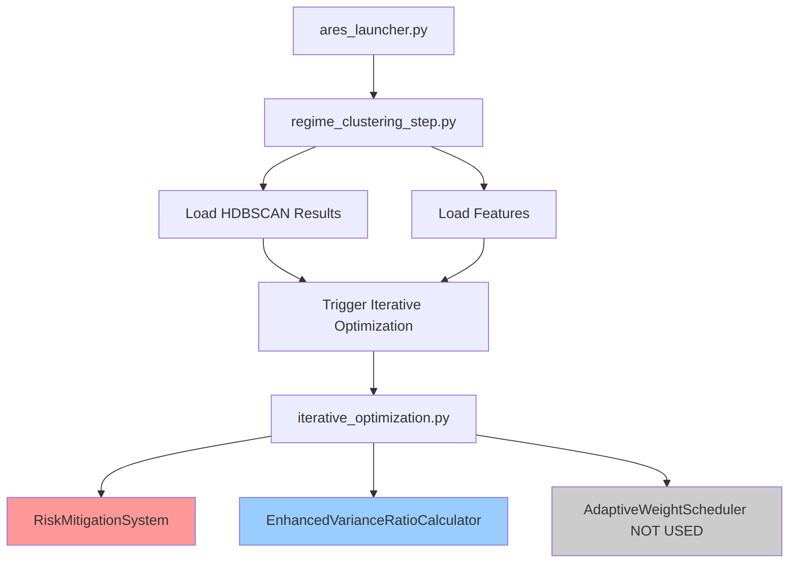

# CV Enhancement & Risk Mitigation - Usage Map 📍

**Created**: 2025-10-28  
**Purpose**: Show exactly where CV enhancement and risk mitigation are called and used

---

## 🗺️ **Complete Usage Flow**



---

## 📂 **1. Risk Mitigation System** ✅ **ACTIVELY USED**

### **Where It's Imported**

```python
# File: src/training/steps/market_analysis/clusters/iterative_optimization.py
# Line: 89

from .risk_mitigation import RiskMitigationSystem, PRODUCTION_RISK_CONFIG
```

### **Where It's Initialized**

#### Location 1: Legacy Test Code (Not Production)
```python
# File: iterative_optimization.py
# Line: 5277
# Function: _legacy_iterative_refinement_with_knn_consensus()

risk_system = RiskMitigationSystem(PRODUCTION_RISK_CONFIG)
```

#### Location 2: **MAIN PRODUCTION USAGE** ⭐
```python
# File: iterative_optimization.py
# Line: 5541-5544
# Function: execute_optimization_loop() - THE MAIN ENTRY POINT

risk_system = None
if enable_risk_mitigation:
    risk_system = RiskMitigationSystem(PRODUCTION_RISK_CONFIG)
    tprint("Risk mitigation system enabled", "INFO")
```

### **How It's Called From regime_clustering_step.py**

```python
# File: regime_clustering_step.py
# Line: 2110, 2186, 2196, 2205
# Function: _run_iterative_optimization_fallback()

iterative_config = {
    'max_iterations': config.get('iterative_max_iterations', 25),
    'convergence_threshold': config.get('iterative_convergence_threshold', 0.001),
    'enable_risk_mitigation': config.get('iterative_enable_risk_mitigation', True),  # ← HERE
    'min_clusters': config.get('min_clusters', 4),
    'max_clusters': config.get('max_clusters', 8)
}

# Later passed to execute_optimization_loop
optimized_context = await optimizer.execute_optimization_loop(
    context, iterative_config,
    max_iterations=iterative_config['max_iterations'],
    enable_risk_mitigation=iterative_config['enable_risk_mitigation']  # ← HERE
)
```

### **Where It's Used Throughout Optimization Loop**

#### 1. **K-Growth Check** (Before Splitting)
```python
# File: iterative_optimization.py
# Line: 5678-5682

if risk_system:
    # Check k growth before splitting
    proposed_k = len(np.unique(stats.assignments))
    if risk_system.check_unbounded_k_growth(current_k, proposed_k, len(features)):
        split_moves = await self._step3_break_large_clusters(...)
```

#### 2. **Operation Count Tracking**
```python
# File: iterative_optimization.py
# Line: 5706-5707

if risk_system:
    risk_system.update_operation_counts(local_moves, global_moves, split_moves)
```

#### 3. **Should Stop Check** (After Each Round)
```python
# File: iterative_optimization.py
# Line: 5622-5627

if risk_system:
    should_stop, stop_reason = risk_system.should_stop_optimization(
        round_num, stats, features, current_assignments
    )
    if should_stop:
        tprint(f"Risk mitigation: {stop_reason}", "WARNING")
        break
```

#### 4. **Cycle Metrics Logging**
```python
# File: iterative_optimization.py
# Line: 5632

if risk_system:
    risk_system.log_cycle_metrics(round_num, stats, features, current_assignments)
```

#### 5. **Metric Drift Check** (Monotonicity)
```python
# File: iterative_optimization.py
# Line: 5748-5760

if risk_system:
    current_objective = stats.get_objective_value(constraints=constraints)
    monotone_ok, monotone_msg = risk_system.check_metric_drift(
        current_objective, risk_system.last_objective
    )
    if not monotone_ok:
        tprint(f"Metric drift detected: {monotone_msg}", "ERROR")
        if risk_system.config.rollback_on_decrease:
            break
    
    risk_system.update_objective_history(current_objective)
```

#### 6. **Incremental Correctness Audit** (Periodic)
```python
# File: iterative_optimization.py
# Line: 5763-5767

if round_num % risk_system.config.incremental_audit_frequency == 0:
    audit_ok = risk_system.audit_incremental_correctness(features, stats)
    if not audit_ok:
        tprint("Incremental correctness audit failed", "ERROR")
        break
```

### **Summary: Risk Mitigation Usage**

| Check Point | Function Called | Purpose |
|-------------|----------------|---------|
| **Before Split** | `check_unbounded_k_growth()` | Prevent excessive clusters |
| **After Operations** | `update_operation_counts()` | Track operations (splits, moves) |
| **Each Round Start** | `should_stop_optimization()` | Check stop conditions |
| **Each Round** | `log_cycle_metrics()` | Log metrics for monitoring |
| **Each Round End** | `check_metric_drift()` | Prevent quality degradation |
| **Periodic** | `audit_incremental_correctness()` | Validate correctness |

✅ **FULLY INTEGRATED AND ACTIVELY USED**

---

## 📂 **2. CV Enhancement - EnhancedVarianceRatioCalculator** ✅ **PARTIALLY USED**

### **Where It's Imported**

```python
# File: src/training/steps/market_analysis/clusters/iterative_optimization.py
# Line: 94-97

try:
    from .cv_enhancement_strategies import (
        AdaptiveWeightScheduler,
        EnhancedVarianceRatioCalculator
    )
    CV_ENHANCEMENT_AVAILABLE = True
except ImportError:
    CV_ENHANCEMENT_AVAILABLE = False
```

### **Where It's Used**

#### **ONLY ONE LOCATION** ⚠️

```python
# File: iterative_optimization.py
# Line: 4756-4761
# Function: _log_metrics_and_trajectory()

if CV_ENHANCEMENT_AVAILABLE:
    try:
        enhanced_cv_metrics = EnhancedVarianceRatioCalculator.calculate_enhanced_cv(
            X, assignments, include_calinski_harabasz=True
        )
        current_metrics['enhanced_cv'] = enhanced_cv_metrics['combined_cv']
    except Exception as e:
        self.logger.warning(f"Enhanced CV calculation failed: {e}")
```

### **What It Does**

```python
# From cv_enhancement_strategies.py
# Line: 242-453

class EnhancedVarianceRatioCalculator:
    @staticmethod
    def calculate_enhanced_cv(features: np.ndarray, assignments: np.ndarray, 
                             include_calinski_harabasz: bool = True) -> Dict[str, float]:
        """
        Calculate enhanced CV metrics:
        1. Standard CV (between/within variance)
        2. Calinski-Harabasz score
        3. Weighted combination
        4. Robustness score
        5. Combined CV (final score)
        """
        # Returns dict with:
        # - 'standard_cv': Traditional CV ratio
        # - 'calinski_harabasz': sklearn CH score
        # - 'weighted_cv': Weighted combination
        # - 'robustness_score': Quality indicator
        # - 'combined_cv': Final enhanced CV
```

✅ **USED BUT LIMITED** - Only used for enhanced logging, not for optimization decisions

---

## 📂 **3. CV Enhancement - AdaptiveWeightScheduler** ❌ **NOT USED**

### **Where It's Imported**

```python
# File: src/training/steps/market_analysis/clusters/iterative_optimization.py
# Line: 94-97

from .cv_enhancement_strategies import (
    AdaptiveWeightScheduler,  # ← IMPORTED BUT NEVER USED
    EnhancedVarianceRatioCalculator
)
```

### **Where It SHOULD Be Used But Isn't**

The `AdaptiveWeightScheduler` is designed to adjust optimization weights dynamically:

```python
# From cv_enhancement_strategies.py
# Line: 175-241

class AdaptiveWeightScheduler:
    """
    Adaptive weight scheduler that adjusts optimization weights based on iteration progress.
    Early iterations: balanced exploration
    Late iterations: aggressive CV optimization
    """
    
    def get_weights(self, iteration: int) -> Dict[str, float]:
        """
        Get adaptive weights for current iteration.
        
        Should return:
        - w_cv: Gradually increase (0.45 → 0.55)
        - w_bal: Gradually decrease (0.05 → 0.02)
        - w_temp: Slightly decrease (0.35 → 0.32)
        - w_sil: Slightly increase (0.15 → 0.16)
        """
```

### **Why It's Not Used**

Looking at `OptConfig` (line 2485-2562 in iterative_optimization.py):

```python
# Current: STATIC WEIGHTS (never change)
@dataclass
class OptConfig:
    # ENHANCED objective weights - AGGRESSIVE CV optimization focus
    w_cv: float = 0.70   # FIXED - never changes during optimization
    w_temp: float = 0.20 # FIXED
    w_sil: float = 0.10  # FIXED
    w_bal: float = 0.05  # FIXED
```

**Problem**: Weights are **HARDCODED** and never updated during optimization loop!

❌ **IMPORTED BUT NEVER INSTANTIATED OR CALLED**

---

## 🔧 **Integration Analysis**

### **Current State**

```python
# What's Actually Happening:

1. regime_clustering_step.py
   ↓
2. Calls iterative_optimization.py → execute_optimization_loop()
   ↓
3. enable_risk_mitigation=True (from config)
   ↓
4. RiskMitigationSystem initialized ✅
   ↓
5. Used throughout optimization loop ✅
   
6. EnhancedVarianceRatioCalculator called ONCE ⚠️
   (Only for logging enhanced CV, not optimization)
   
7. AdaptiveWeightScheduler NEVER USED ❌
   (Imported but weights remain static)
```

### **Config Integration**

```yaml
# config/regime_clustering_config.yaml
# Line: 16

iterative_enable_risk_mitigation: true  # ✅ This works!
```

**Flow**:
```
config.yaml (iterative_enable_risk_mitigation: true)
    ↓
regime_clustering_step.py (reads config)
    ↓
iterative_config['enable_risk_mitigation'] = True
    ↓
execute_optimization_loop(enable_risk_mitigation=True)
    ↓
RiskMitigationSystem initialized and used ✅
```

---

## 🚨 **What's Missing - AdaptiveWeightScheduler Integration**

### **Current Problem**

The `AdaptiveWeightScheduler` exists but is **never instantiated or used**. Weights remain static throughout optimization.

### **How It SHOULD Be Integrated**

```python
# File: iterative_optimization.py
# Function: execute_optimization_loop()
# AFTER Line: 5545

# ADD THIS:
weight_scheduler = None
if enable_cv_enhancement:  # NEW FLAG
    weight_scheduler = AdaptiveWeightScheduler(max_iterations=max_iterations)
    tprint("CV enhancement with adaptive weights enabled", "INFO")

# Then in the optimization loop (around line 5600):
for round_num in range(max_iterations):
    # GET ADAPTIVE WEIGHTS
    if weight_scheduler:
        adaptive_weights = weight_scheduler.get_weights(round_num)
        constraints.w_cv = adaptive_weights['w_cv']
        constraints.w_bal = adaptive_weights['w_bal']
        constraints.w_temp = adaptive_weights['w_temp']
        constraints.w_sil = adaptive_weights['w_sil']
    
    # Continue with optimization using updated weights
    # ...
```

### **Required Changes**

1. **Add config flag**:
```yaml
# config/regime_clustering_config.yaml
iterative_enable_cv_enhancement: true  # NEW
```

2. **Pass to execute_optimization_loop**:
```python
# regime_clustering_step.py
iterative_config = {
    'enable_risk_mitigation': True,
    'enable_cv_enhancement': True,  # NEW
    # ...
}
```

3. **Initialize and use in loop**:
```python
# iterative_optimization.py
async def execute_optimization_loop(self, context, config, 
                                   enable_risk_mitigation=True,
                                   enable_cv_enhancement=False):  # NEW
    
    weight_scheduler = None
    if enable_cv_enhancement:
        weight_scheduler = AdaptiveWeightScheduler(max_iterations)
    
    for round_num in range(max_iterations):
        if weight_scheduler:
            weights = weight_scheduler.get_weights(round_num)
            # Apply weights to constraints
```

---

## 📊 **Usage Summary Table**

| Component | Status | Where Used | How Often | Impact |
|-----------|--------|------------|-----------|--------|
| **RiskMitigationSystem** | ✅ **ACTIVE** | iterative_optimization.py | Every round | **High** - Prevents instability |
| **EnhancedVarianceRatioCalculator** | ⚠️ **PARTIAL** | iterative_optimization.py | Once per iteration (logging only) | **Low** - Just for metrics |
| **AdaptiveWeightScheduler** | ❌ **UNUSED** | Nowhere | Never | **None** - Not integrated |

---

## 🎯 **Quick Integration Test**

### **Test Risk Mitigation (Already Works)**

```bash
# Check if risk mitigation is enabled
grep "iterative_enable_risk_mitigation" config/regime_clustering_config.yaml

# Should show: iterative_enable_risk_mitigation: true

# Run regime clustering
python3 src/launcher/ares_launcher.py \
    --step regime_clustering \
    --symbol ETHUSDT \
    --execution-mode light

# Look for in logs:
# "Risk mitigation system enabled"
# "🎯 Advanced 3-step iterative clustering with comprehensive safeguards"
```

### **Test CV Enhancement (Currently Only Logging)**

```bash
# Run regime clustering and check logs for:
# "Enhanced CV calculation" or "enhanced_cv" in metrics
```

### **Test Adaptive Weights (Currently Not Working)**

```bash
# Currently: NO OUTPUT
# Weights remain static (w_cv=0.70, w_bal=0.05, etc.)
# Would need integration changes to work
```

---

## 🔥 **Call Stack Visualization**

### **Complete Call Flow**

```
1. User runs command:
   python3 src/launcher/ares_launcher.py --step regime_clustering

2. ares_launcher.py
   ↓ calls
   
3. regime_clustering_step.py → execute()
   ↓ loads HDBSCAN results
   ↓ triggers iterative optimization fallback (if needed)
   ↓ calls
   
4. _run_iterative_optimization_fallback()
   ↓ creates config with:
   ↓ enable_risk_mitigation=True
   ↓ calls
   
5. iterative_optimization.py → execute_optimization_loop()
   ↓ if enable_risk_mitigation:
   ↓     risk_system = RiskMitigationSystem(PRODUCTION_RISK_CONFIG)
   ↓
   
6. Optimization Loop (25-40 rounds):
   ├─ Round Start:
   │  ├─ risk_system.should_stop_optimization() ✅
   │  └─ risk_system.log_cycle_metrics() ✅
   │
   ├─ Step 1: Local Moves
   │  └─ (risk system checks in background)
   │
   ├─ Step 2: Global Reallocation  
   │  └─ (risk system checks in background)
   │
   ├─ Step 3: Split Large Clusters
   │  └─ risk_system.check_unbounded_k_growth() ✅
   │
   ├─ Round End:
   │  ├─ risk_system.update_operation_counts() ✅
   │  ├─ risk_system.check_metric_drift() ✅
   │  └─ risk_system.audit_incremental_correctness() (periodic) ✅
   │
   └─ Logging:
       └─ EnhancedVarianceRatioCalculator.calculate_enhanced_cv() ⚠️
          (Only for metrics, not optimization)

7. Return optimized clusters
```

---

## 📝 **Conclusion**

### ✅ **What's Working**

1. **Risk Mitigation**: Fully integrated, actively used, prevents:
   - Unbounded K growth
   - Over-churn
   - Quality degradation
   - Instability events

2. **Enhanced CV Calculation**: Partially used for better metrics logging

### ❌ **What's Not Working**

1. **AdaptiveWeightScheduler**: 
   - Imported but never used
   - Weights remain static
   - No dynamic adjustment during optimization

### 🔧 **What's Needed for Full Integration**

1. Add `enable_cv_enhancement` config flag
2. Instantiate `AdaptiveWeightScheduler` in optimization loop
3. Update weights dynamically each iteration
4. Test and validate improvements

---

## 🚀 **Next Steps**

### **Option 1: Use the Tuners** (Current Implementation)

The tuners we just built (`risk_mitigation_tuner.py`, `cv_enhancement_tuner.py`) can find **optimal static parameters** for:
- Risk mitigation thresholds
- CV enhancement factors (amplifiers, dampeners)

```python
# Run tuning to find best parameters
risk_results = run_risk_mitigation_tuning(...)
cv_results = run_cv_enhancement_tuning(...)

# Apply to config (one-time)
# Then use throughout all optimization runs
```

### **Option 2: Integrate AdaptiveWeightScheduler** (Enhancement)

Integrate dynamic weight adjustment into the optimization loop for **adaptive behavior during optimization**.

Would you like me to implement Option 2 (integrate AdaptiveWeightScheduler into the actual optimization loop)?
