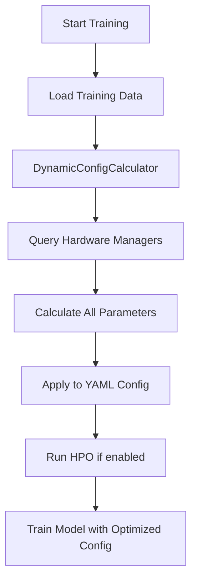

# Dynamic Configuration Integration Guide

## Overview

The training system now uses **comprehensive dynamic configuration** that automatically calculates optimal parameters based on:
- 📊 Dataset size and complexity
- 💻 Available hardware resources (CPU, Memory, GPU)
- ⚙️ Execution mode (light/full/production)
- 🤖 Model type and architecture
- ⏱️ Timeframe and temporal requirements

All calculations use hardware utilities from `src/utils/hardware/` for optimal performance.

---

## ✅ What's Now Dynamic

### **Moved from YAML to Python** (Calculated Automatically):

| Parameter | Previous (Static) | Now (Dynamic) | Benefit |
|-----------|------------------|---------------|---------|
| **Training/Val/Test Samples** | Fixed numbers | % of total (70/15/15) | Scales with data |
| **CV Folds** | 5 fixed | 3-10 adaptive | Scales with samples |
| **Batch Size** | 32-128 fixed | 32-512 adaptive | Optimizes GPU/memory |
| **Epochs** | 50-200 fixed | 50-200 adaptive | Scales with data size |
| **Early Stopping Patience** | 10-20 fixed | 5-30+ adaptive | Scales with training |
| **N Estimators** | 1000-1500 fixed | 500-2000 adaptive | Prevents over/underfit |
| **Sequence Length** | 50 fixed | 20-200 adaptive | Matches timeframe |
| **Learning Rate** | 0.001-0.1 fixed | Dynamic per model | Faster convergence |
| **Memory Limit** | 2GB fixed | 1-16GB adaptive | Uses available RAM |
| **Max Workers** | 4 fixed | 1-8 adaptive | Uses available cores |
| **HPO Trials** | 20 fixed | 5-200 adaptive | Scales with mode |
| **Validation Frequency** | Manual | Auto-calculated | Efficient validation |
| **Checkpoint Frequency** | Manual | Auto-calculated | Regular saves |

---

## 🏗️ Architecture

### Components

```
unified_models_training_step.py
├── DynamicConfigCalculator (from dynamic_config_calculator.py)
│   ├── UnifiedHardwareManager (from src/utils/hardware/)
│   ├── M1MemoryOptimizer (from src/utils/hardware/)
│   ├── M1CPUOptimizer (from src/utils/hardware/)
│   └── M1GPUManager (from src/utils/hardware/)
└── Applies to ALL training types:
    ├── Analyst Base
    ├── Analyst Ensemble
    ├── Tactician Base
    └── Tactician Ensemble
```

### Integration Flow



---

## 🚀 Usage

### Default Usage (Automatic)

```python
# Everything is automatic!
python ares_launcher.py train --training_type analyst_base --symbol ETHUSDT --timeframe 15m
```

**What happens automatically:**
1. ✅ Loads training data
2. ✅ Queries hardware (CPU, RAM, GPU)
3. ✅ Calculates optimal batch size, epochs, estimators, etc.
4. ✅ Applies dynamic config to models
5. ✅ Runs HPO with optimal trial count
6. ✅ Trains with optimized parameters

### Custom Overrides

```python
config = {
    'symbol': 'ETHUSDT',
    'timeframe': '15m',
    'training_type': 'tactician_base',
    
    # Override percentage allocations
    'train_percentage': 0.75,      # 75% training (default: 70%)
    'validation_percentage': 0.15,  # 15% validation (default: 15%)
    'test_percentage': 0.10,        # 10% testing (default: 15%)
    
    # Override execution mode
    'execution_mode': 'production',  # light/full/production
    
    # Override HPO settings (calculated dynamically by default)
    'enable_hpo': True,
    # 'hpo_max_trials': 50  # Commented out - let dynamic config decide
}
```

---

## 📊 Dynamic Calculation Examples

### Example 1: Small Dataset (1,000 samples)
```
🚀 Calculating comprehensive dynamic configuration...
✅ Dynamic configuration calculated:
  Data Splits: Train=700, Val=150, Test=150
  CV Folds: 3
  Batch Size: 32
  Epochs: 150
  Early Stopping Patience: 15
  Estimators: 700
  Sequence Length: 96 (for 15m timeframe)
  Learning Rate: 0.001 (cosine_annealing)
  HPO Trials: 10 (Budget: 300s)
  Memory Limit: 2.80 GB
  Max Workers: 6
  Validation Frequency: Every 10 batches
  Checkpoint Frequency: Every 15 epochs/iterations
```

### Example 2: Large Dataset (100,000 samples)
```
🚀 Calculating comprehensive dynamic configuration...
✅ Dynamic configuration calculated:
  Data Splits: Train=70000, Val=15000, Test=15000
  CV Folds: 10
  Batch Size: 256
  Epochs: 150
  Early Stopping Patience: 45
  Estimators: 2600
  Sequence Length: 96 (for 15m timeframe)
  Learning Rate: 0.002 (cosine_annealing)
  HPO Trials: 50 (Budget: 2700s)
  Memory Limit: 11.20 GB
  Max Workers: 6
  Validation Frequency: Every 10 batches
  Checkpoint Frequency: Every 15 epochs/iterations
```

### Example 3: Production Mode
```
execution_mode: 'production'
  HPO Trials: 100-200 (depends on model complexity)
  Epochs: 200 (for neural networks)
  Estimators: 2000+ (for tree-based)
  Early Stopping Patience: 30+
```

---

## 🔧 Hardware Integration

### Using `src/utils/hardware/` Tools

The dynamic config calculator integrates with:

#### 1. **UnifiedHardwareManager**
```python
self.hardware_manager = get_unified_hardware_manager()
hw_config = self.hardware_manager.get_hardware_config()
# Returns: total_memory_gb, available_memory_gb, cpu_cores, cpu_threads, has_gpu, gpu_memory_gb
```

#### 2. **M1MemoryOptimizer**
```python
self.memory_optimizer = get_m1_memory_optimizer()
memory_stats = self.memory_optimizer.get_memory_stats()
optimal_memory = self.memory_optimizer.calculate_optimal_allocation(
    workload_type='ml_training',
    requested_gb=available_gb * 0.7
)
```

#### 3. **M1CPUOptimizer**
```python
self.cpu_optimizer = get_m1_cpu_optimizer()
optimal_workers = self.cpu_optimizer.get_optimal_worker_count(
    workload_type='ml_training'
)
```

#### 4. **M1GPUManager**
```python
self.gpu_manager = get_m1_gpu_manager()
# Used for GPU availability detection and memory allocation
```

---

## 📝 Model-Specific Configurations

### Neural Networks (GRU, LSTM, TCN)
Dynamically set:
- `batch_size`: 32-512 (based on memory)
- `epochs`: 50-200 (based on data size)
- `sequence_length`: 20-200 (based on timeframe)
- `learning_rate`: 0.001-0.002 (based on data size)
- `learning_rate_schedule`: constant/reduce_on_plateau/cosine_annealing

### Tree-Based Models (LGBM, CatBoost, XGBoost)
Dynamically set:
- `n_estimators`/`iterations`: 500-2000 (based on data & features)
- `learning_rate`: 0.05-0.12 (based on data size)
- `early_stopping_patience`: 100+ (iterations)

---

## 🎯 Configuration Calculation Logic

### Batch Size
```python
if train_samples < 1000:     batch = 32
elif train_samples < 10000:  batch = 64
elif train_samples < 50000:  batch = 128
else:                         batch = 256
# Adjusted for neural networks (min 64)
# Adjusted for available memory
# Ensures power of 2 for GPU
```

### CV Folds
```python
if samples < 1000:    folds = 3
elif samples < 5000:  folds = 5
elif samples < 20000: folds = 7
else:                 folds = 10
```

### Sequence Length (Time Series)
```python
# Analyst: 24-hour lookback
# Tactician: 6-hour lookback
sequences = (lookback_hours * 60) // timeframe_minutes
# Clamped to 20-200 range
```

### HPO Trials
```python
light mode:       low=5,  medium=10,  high=15
full mode:        low=20, medium=50,  high=100
production mode:  low=50, medium=100, high=200
```

---

## 🔄 Training Pipeline Flow

### 1. **Load Data**
```python
training_data, analyst_targets, tactician_targets = await self._retrieve_training_data(config)
```

### 2. **Calculate Dynamic Config**
```python
calculator = DynamicConfigCalculator()  # Uses hardware utilities
dynamic_config = calculator.calculate_all_parameters(
    total_samples=len(training_data),
    n_features=len(training_data.columns),
    timeframe=timeframe,
    execution_mode='full',
    training_type='analyst_base'
)
```

### 3. **Apply to YAML**
```python
yaml_config = self._apply_dynamic_config(yaml_config, dynamic_config, training_type)
# Updates: training samples, batch size, epochs, estimators, memory, workers, etc.
```

### 4. **Run HPO**
```python
if enable_hpo:
    yaml_config = await self._perform_hyperparameter_optimization(
        training_data, targets, yaml_config, config
    )
```

### 5. **Train Models**
```python
result = await self._execute_training_by_type(
    training_type, training_data, analyst_targets, tactician_targets, yaml_config, config
)
```

---

## 🎨 Example Output Logs

```bash
🚀 Starting unified analyst_base training for ETHUSDT 15m long
🚀 Calculating comprehensive dynamic configuration...

✅ Dynamic configuration calculated:
  Data Splits: Train=35000, Val=7500, Test=7500
  CV Folds: 7
  Batch Size: 128
  Epochs: 100
  Early Stopping Patience: 20
  Estimators: 1560
  Sequence Length: 96
  Learning Rate: 0.001 (cosine_annealing)
  HPO Trials: 50 (Budget: 1800s)
  Memory Limit: 5.60 GB
  Max Workers: 6
  Validation Frequency: Every 10 batches
  Checkpoint Frequency: Every 10 epochs/iterations

🔧 Applying dynamic configuration to YAML config...
  Updated lgbm with dynamic parameters
  Updated tcn with dynamic parameters
  Updated catboost with dynamic parameters
✅ Dynamic configuration applied successfully

✅ Configured training with dynamic parameters (samples, epochs, batch size, memory, etc.)

🔍 Performing hyperparameter optimization before training...
Running 50 HPO trials...
✅ Updated lgbm with optimized hyperparameters
✅ Updated tcn with optimized hyperparameters
✅ Updated catboost with optimized hyperparameters
✅ Hyperparameter optimization completed

✅ Unified analyst_base training completed successfully
```

---

## 🧪 Testing

### Verify Dynamic Configuration

```python
# 1. Check calculator initialization
calculator = DynamicConfigCalculator()
print(calculator._hardware_info)
# Should show: CPU cores, memory, GPU status

# 2. Test with different data sizes
small_config = calculator.calculate_all_parameters(1000, 50)
large_config = calculator.calculate_all_parameters(100000, 200)

# 3. Verify scaling
assert small_config.batch_size < large_config.batch_size
assert small_config.cv_folds < large_config.cv_folds
```

---

## 🎁 Benefits Summary

### 1. **No Manual Tuning**
- All parameters calculated automatically
- Based on actual data and hardware
- No need to update YAML files

### 2. **Hardware Optimization**
- Uses `src/utils/hardware/` utilities
- Optimal memory allocation
- Efficient CPU/GPU utilization
- M1 chip optimizations

### 3. **Scalability**
- Works with any dataset size
- Adapts to available resources
- Consistent across environments

### 4. **Performance**
- Optimal batch sizes for GPU
- Appropriate epochs for data size
- Efficient validation frequency

### 5. **Flexibility**
- Can override any parameter
- Execution mode control (light/full/production)
- Custom percentages support

---

## 🔮 Future Enhancements

Potential improvements:
1. **Adaptive Learning Rate Schedules**: Automatically select based on training progress
2. **Multi-GPU Support**: Distribute training across multiple GPUs
3. **AutoML Integration**: Full end-to-end hyperparameter search
4. **Cost-Based Optimization**: Balance performance vs. training time
5. **Historical Tracking**: Learn from previous training runs

---

## 📚 Related Files

### Core Implementation
- `src/training/steps/model_training/dynamic_config_calculator.py` - Dynamic config calculator
- `src/training/steps/model_training/unified_models_training_step.py` - Integration point

### Hardware Utilities
- `src/utils/hardware/unified_hardware_manager.py` - Hardware detection and management
- `src/utils/hardware/m1_memory_optimizer.py` - Memory optimization
- `src/utils/hardware/m1_cpu_optimizer.py` - CPU optimization
- `src/utils/hardware/m1_gpu_utils.py` - GPU utilities

### Configuration Files (Still Used for Architecture)
- `src/training/steps/model_training/analyst_base_config.yaml`
- `src/training/steps/model_training/analyst_ensemble_config.yaml`
- `src/training/steps/model_training/tactician_base_config.yaml`
- `src/training/steps/model_training/tactician_ensemble_config.yaml`

---

## 🆘 Troubleshooting

### Issue: "Failed to initialize hardware managers"
**Solution**: Hardware utilities not available - will fallback to basic detection using psutil

### Issue: Dynamic config seems wrong
**Solution**: Check logs for hardware detection output, may need to override specific parameters

### Issue: Out of memory errors
**Solution**: System underestimated memory needs - set `memory_limit_gb` explicitly in config

### Issue: Training too slow
**Solution**: Lower `execution_mode` to 'light' or reduce `hpo_max_trials`

---

## 📞 Support

For questions or issues:
1. Check logs for detailed calculation output
2. Verify hardware utilities are available
3. Review this guide for configuration options
4. Check `PERCENTAGE_BASED_ALLOCATION_GUIDE.md` for basics

