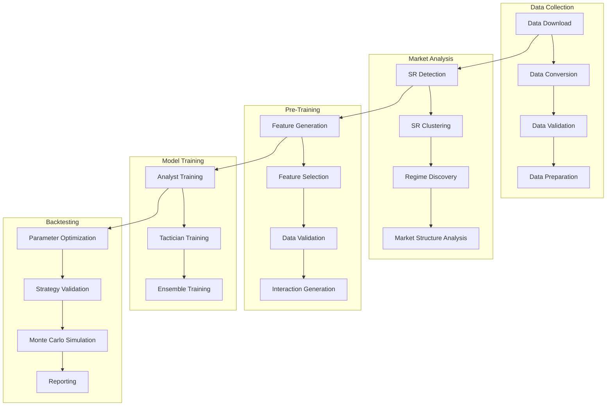

# Ares Trading System

<div align="center">


**Advanced Algorithmic Trading System with Autonomous Step Architecture**

[Features](#-features) • [Quick Start](#-quick-start) • [Architecture](#-architecture) • [Documentation](#-documentation) • [Contributing](#-contributing)

</div>

---

## 🚀 Overview

Ares is a next-generation algorithmic trading system that leverages machine learning, quantitative analysis, and autonomous step-based architecture to identify and execute profitable trading opportunities across cryptocurrency markets. Built with modularity, scalability, and performance in mind, Ares provides a comprehensive framework for systematic trading strategy development and deployment.

### Key Highlights

- **🤖 Autonomous Step Architecture**: Self-contained, independently executable processing steps
- **📊 Multi-Model ML Pipeline**: Separate Analyst (WHAT to trade) and Tactician (WHEN to trade) models
- **⚡ Performance Optimized**: Hardware-accelerated processing for Apple Silicon (M1/M2/M3)
- **🔧 Modular Design**: Easy to extend, maintain, and customize
- **📈 Comprehensive Backtesting**: VectorBT integration with advanced validation methods
- **🛡️ Production Ready**: Robust error handling, monitoring, and artifact management

---

## ✨ Features

### 🏗️ **Autonomous Step Architecture**
- **Modular Design**: Each processing step is self-contained and independently executable
- **Step Registry**: Global registry for automatic step discovery and execution
- **Artifact Management**: Centralized storage with automatic format conversion (Parquet + CSV)
- **Context Awareness**: Automatic context setting for enhanced file naming and data operations
- **Fallback Mechanisms**: Multiple fallback strategies for backward compatibility

### 📊 **Comprehensive Trading Pipeline**
- **Data Collection**: Multi-exchange data downloading with validation and quality checks
- **Market Analysis**: Support/Resistance detection, regime analysis, and market structure analysis
- **Feature Engineering**: Advanced feature generation with 200+ technical indicators
- **Model Training**: Analyst and Tactician models with ensemble methods
- **Backtesting**: Comprehensive parameter optimization and strategy validation

### 🧠 **Advanced ML Capabilities**
- **Multi-Model Architecture**: Separate models for trade selection and timing
- **Regime-Aware Training**: Models trained specifically for different market conditions
- **Ensemble Methods**: Advanced ensemble techniques for improved prediction accuracy
- **Hyperparameter Optimization**: Automated optimization using Bayesian methods
- **Feature Selection**: Advanced feature selection with SHAP, LIME, and Boruta

### ⚡ **Performance & Optimization**
- **Hardware Acceleration**: Optimized for Apple Silicon (M1/M2/M3) and modern CPUs
- **VectorBT Integration**: High-performance vectorized backtesting
- **Memory Management**: Intelligent memory optimization and caching strategies
- **Parallel Processing**: Multi-core processing for optimization steps
- **Compression**: Automatic data compression for storage efficiency

### 🔧 **Developer Experience**
- **Clean CLI Interface**: Simple command-line interface for all operations
- **Comprehensive Logging**: Multi-level logging with performance metrics
- **Type Hints**: Full type annotation support for better IDE experience
- **Documentation**: Extensive documentation and examples
- **Testing**: Comprehensive test suite with validation utilities

---

## 🏗️ Architecture

### Step-Based System Overview



### Core Components

1. **BaseStep**: Abstract base class for all processing steps
2. **Artifact Manager**: Centralized data storage and retrieval system
3. **Step Registry**: Global step discovery and execution framework
4. **Ares Launcher**: Command-line interface for system operation
5. **Klines Manager**: Specialized klines data storage and retrieval

### Step Categories

- **DATA_COLLECTION**: Data downloading, conversion, and validation
- **MARKET_ANALYSIS**: Support/resistance detection, regime analysis
- **PRE_TRAINING**: Feature engineering and data preparation
- **MODEL_TRAINING**: ML model training and ensemble methods
- **BACKTESTING**: Strategy validation and optimization

---

## 🚀 Quick Start

### Prerequisites

- Python 3.8 or higher
- 8GB+ RAM (16GB recommended for full mode)
- 10GB+ free disk space
- macOS (optimized for Apple Silicon) or Linux

### Installation

1. **Clone the repository**
   ```bash
   git clone https://github.com/your-org/ares-trading-system.git
   cd ares-trading-system
   ```

2. **Create virtual environment**
   ```bash
   python -m venv venv
   source venv/bin/activate  # On Windows: venv\Scripts\activate
   ```

3. **Install dependencies**
   ```bash
   pip install -r requirements.txt
   ```

4. **Set up configuration**
   ```bash
   cp config/environments/development.json.example config/environments/development.json
   # Edit the configuration file with your settings
   ```

### Basic Usage

#### Run a Single Step
```bash
python src/launcher/ares_launcher.py data_download --symbol ETHUSDT --timeframe 15m --direction longs
```

#### Run Multiple Steps
```bash
python src/launcher/ares_launcher.py --steps sr_detection,sr_clustering --symbol ETHUSDT --timeframe 15m
```

#### Run an Entire Stage
```bash
python src/launcher/ares_launcher.py --stage DATA_COLLECTION --symbol ETHUSDT --timeframe 15m
```

#### Run Complete Pipeline
```bash
python src/launcher/ares_launcher.py --stage DATA_COLLECTION --symbol ETHUSDT --timeframe 15m --execution-mode full
```

#### Model Training
```bash
# Train Analyst models
python src/launcher/ares_launcher.py --train-analyst-base --symbol ETHUSDT --timeframe 15m

# Train Tactician models
python src/launcher/ares_launcher.py --train-tactician-ensemble --symbol ETHUSDT --timeframe 15m
```

### Configuration

The system uses YAML and JSON configuration files:

```yaml
# config/training_config.json
{
  "symbol": "ETHUSDT",
  "exchange": "binance",
  "timeframe": "15m",
  "direction": "longs",
  "execution_mode": "full"
}
```

---

## 📚 Available Steps

### Data Collection
- `data_download`: Download raw market data from exchanges
- `data_conversion`: Convert and standardize data formats
- `data_validation`: Validate data quality and integrity
- `data_preparation`: Prepare data for analysis

### Market Analysis
- `sr_detection`: Detect Support/Resistance levels
- `sr_clustering`: Group S/R levels into clusters
- `hdbscan_regime_discovery`: Advanced regime discovery using HDBSCAN
- `regime_clustering`: Regime clustering and classification

### Pre-Training
- `feature_generation_feature_generation_step`: Generate trading features
- `feature_generation_feature_selection_step`: Select optimal features
- `feature_generation_period_lookback_optimization_step`: Optimize time periods
- `feature_generation_interaction_generation_step_analyst`: Generate feature interactions

### Model Training
- `analyst_base_training`: Train base Analyst models
- `analyst_ensemble_training`: Train Analyst ensemble models
- `tactician_base_training`: Train base Tactician models
- `tactician_ensemble_training`: Train Tactician ensemble models

### Backtesting
- `final_parameters_optimization`: Optimize final system parameters
- `basic_backtesting_pre`: Pre-optimization backtesting
- `basic_backtesting_post`: Post-optimization backtesting
- `monte_carlo_simulation`: Monte Carlo validation

---

## 🔧 Development

### Creating New Steps

1. **Create a new step class**
   ```python
   from src.training.steps.base_step import BaseStep
   
   class MyCustomStep(BaseStep):
       async def execute(self, config: Dict[str, Any]) -> Dict[str, Any]:
           # Set context for enhanced operations
           self._set_context(
               symbol=config.get('symbol'),
               exchange=config.get('exchange'),
               direction=config.get('direction', 'longs')
           )
           
           # Load data
           data = self._load_klines_with_context('15m')
           
           # Process data
           result = process_data(data)
           
           # Save results
           self._save_dataframe(result, 'processed_data')
           
           return {
               'success': True,
               'artifacts': ['processed_data'],
               'metrics': {'processed_rows': len(result)}
           }
   ```

2. **Register the step**
   ```python
   # In the appropriate __init__.py file
   from src.training.steps.base_step import step_registry
   from .my_custom_step import MyCustomStep
   
   step_registry.register("my_custom_step", MyCustomStep)
   ```

3. **Run the step**
   ```bash
   python src/launcher/ares_launcher.py my_custom_step --symbol ETHUSDT --timeframe 15m
   ```

### Project Structure

```
ares-trading-system/
├── src/                          # Main source code
│   ├── launcher/                 # Command-line interface
│   ├── training/                 # Training pipeline
│   │   └── steps/               # Processing steps
│   │       ├── data_collection/ # Data collection steps
│   │       ├── market_analysis/ # Market analysis steps
│   │       ├── pre_training/    # Pre-training steps
│   │       ├── model_training/  # Model training steps
│   │       └── backtesting/     # Backtesting steps
│   ├── analyst/                 # Analyst model components
│   ├── tactician/               # Tactician model components
│   ├── feature_generation/      # Feature engineering
│   ├── utils/                   # Utility functions
│   └── core/                    # Core system components
├── config/                      # Configuration files
├── docs/                        # Documentation
├── tests/                       # Test suite
└── artifacts/                   # Generated artifacts
```

### Code Quality

The project includes comprehensive code quality tools:

```bash
# Run code quality analysis
python -m code_quality.cli --path src/

# Run specific analyzers
python -m code_quality.analyzers.dead_code_analyzer --path src/
python -m code_quality.analyzers.complexity_analyzer --path src/
```

---

## 📊 Performance

### Execution Modes

#### Light Mode (Default)
- Reduced dataset sizes for faster execution
- Simplified algorithms for quick testing
- Lower memory usage
- Suitable for development and testing

#### Full Mode
- Complete dataset processing
- Full algorithm complexity
- Maximum accuracy
- Production-ready results

### Resource Requirements

| Component | Light Mode | Full Mode |
|-----------|------------|-----------|
| RAM | 2-4GB | 8-16GB |
| Storage | 1-5GB | 10-50GB |
| CPU | 2-4 cores | 8+ cores |
| GPU | Optional | Recommended |

### Optimization Features

- **Memory Management**: Intelligent memory optimization and caching
- **Parallel Processing**: Multi-core processing for optimization steps
- **Compression**: Automatic data compression for storage efficiency
- **Hardware Acceleration**: Optimized for Apple Silicon and modern CPUs

---

## 📈 Monitoring & Logging

### Logging Levels

```bash
# Enable debug logging
python src/launcher/ares_launcher.py <step_name> --symbol ETHUSDT --verbose

# Check step information
python src/launcher/ares_launcher.py --list-steps
python src/launcher/ares_launcher.py --list-stages
```

### Artifact Management

```python
# Check artifact statistics
stats = self.artifact_manager.get_artifact_stats()

# Clean up old artifacts
self.artifact_manager.cleanup_old_artifacts(days=30)

# Get performance metrics
metrics = self._get_performance_metrics()
```

---

## 🛠️ Troubleshooting

### Common Issues

#### Step Not Found
```bash
# List available steps
python src/launcher/ares_launcher.py --list-steps

# Check step information
python src/launcher/ares_launcher.py step-info <step_name>
```

#### Insufficient Data
```bash
# Check data availability
python src/launcher/ares_launcher.py --check-data --symbol ETHUSDT --timeframe 15m

# Run data collection first
python src/launcher/ares_launcher.py data_download --symbol ETHUSDT --timeframe 15m
```

#### Memory Issues
```bash
# Use light mode for large datasets
python src/launcher/ares_launcher.py <step_name> --symbol ETHUSDT --execution-mode light
```

#### Dependency Issues
```bash
# Install missing dependencies
pip install -r requirements.txt

# For enhanced features
pip install -r code_quality/requirements_enhanced.txt
```

---

## 📖 Documentation

- [Step Development Guide](docs/step_development_guide.md)
- [Artifact Management Guide](docs/artifact_management.md)
- [Step Reference Guide](docs/step_reference.md)
- [Migration Guide](docs/migration_guide.md)
- [CMI Enhancement Guide](docs/CMI_ENHANCEMENTS_GUIDE.md)

---

## 🤝 Contributing

We welcome contributions! Please see our [Contributing Guidelines](CONTRIBUTING.md) for details.

### Development Setup

1. Fork the repository
2. Create a feature branch: `git checkout -b feature/amazing-feature`
3. Make your changes
4. Add tests for new functionality
5. Run the test suite: `python -m pytest tests/`
6. Commit your changes: `git commit -m 'Add amazing feature'`
7. Push to the branch: `git push origin feature/amazing-feature`
8. Open a Pull Request

### Code Style

- Follow PEP 8 guidelines
- Use type hints for all functions
- Add comprehensive docstrings
- Write tests for new functionality
- Update documentation as needed

---

## 📄 License

This project is licensed under the MIT License - see the [LICENSE](LICENSE) file for details.

---

## 🆘 Support

- 📚 **Documentation**: Check the `docs/` directory
- 🐛 **Issues**: Report bugs via GitHub Issues
- 💬 **Discussions**: Join our GitHub Discussions
- 📧 **Contact**: [Your Contact Information]

---

## 🗺️ Roadmap

### Version 3.0 (Planned)
- [ ] Real-time trading integration
- [ ] Advanced portfolio management
- [ ] Enhanced risk management
- [ ] Web-based dashboard
- [ ] API for external integrations

### Version 2.1 (In Progress)
- [ ] Additional exchange integrations
- [ ] Enhanced feature engineering
- [ ] Improved model performance
- [ ] Better documentation

---

## ⚠️ Disclaimer

**This software is for educational and research purposes only. Trading cryptocurrencies involves substantial risk of loss and is not suitable for all investors. Past performance does not guarantee future results. Always test thoroughly before using with real money.**

---

<div align="center">

**Built with ❤️ by the Ares Team**

[⭐ Star this repo](https://github.com/your-org/ares-trading-system) • [🐛 Report Bug](https://github.com/your-org/ares-trading-system/issues) • [💡 Request Feature](https://github.com/your-org/ares-trading-system/issues)

</div>