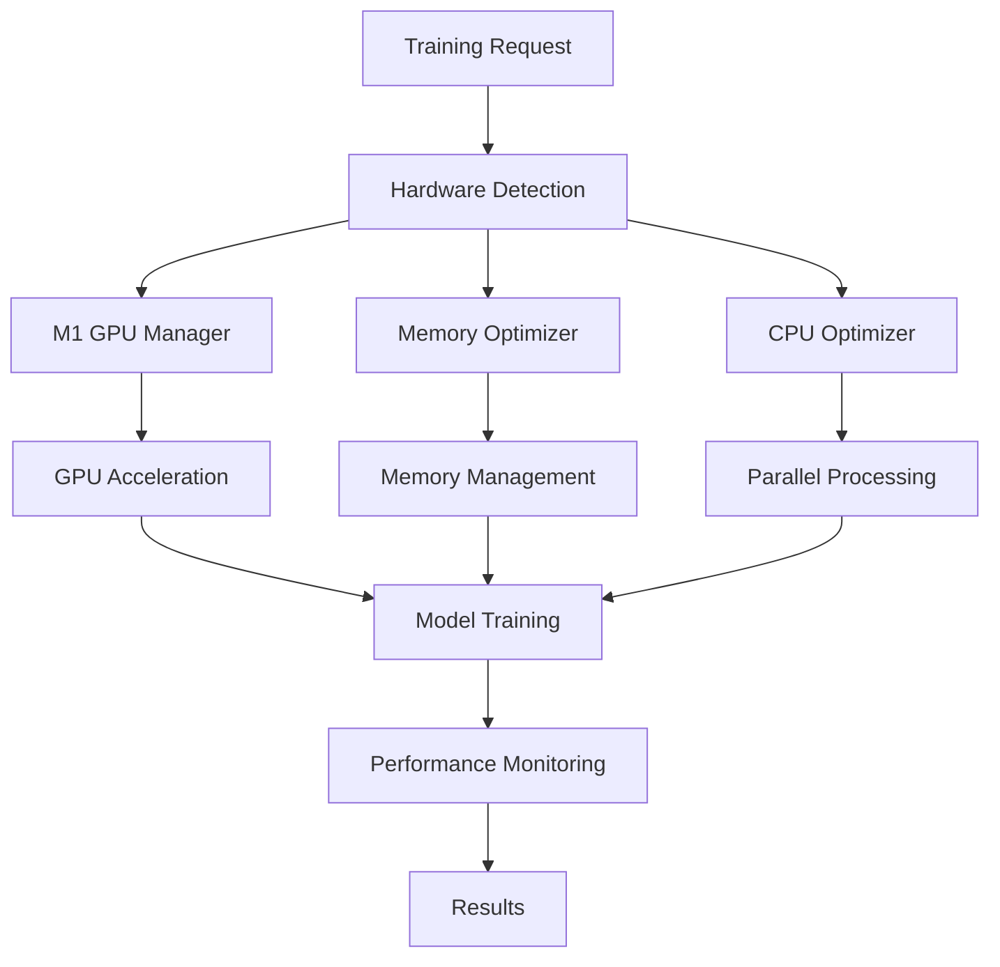

# OptimizedTrainer - Apple Silicon Hardware Acceleration

A comprehensive machine learning training framework optimized for Apple Silicon M1/M2/M3 chips, featuring hardware acceleration, memory optimization, and advanced ML utilities.

## 🚀 Features

### Hardware Acceleration
- **M1 GPU Acceleration**: Leverages Metal Performance Shaders (MPS) for GPU-accelerated training
- **Memory Optimization**: Unified memory architecture optimization with automatic memory management
- **CPU Optimization**: Performance and efficiency core utilization
- **Matrix Operations**: Unified matrix operations with hardware acceleration

### Machine Learning Capabilities
- **Hyperparameter Optimization**: Grid Search, Random Search, and Bayesian Optimization (TPE)
- **Cross-Validation**: Standard and time-series cross-validation
- **Lookahead Validation**: Advanced time-series validation techniques
- **Model Serialization**: Support for multiple formats (Pickle, PyTorch, ONNX)

### Monitoring and Logging
- **Performance Tracking**: Comprehensive performance metrics and statistics
- **Memory Monitoring**: Real-time memory usage tracking and optimization
- **Checkpointing**: Automatic model checkpointing and recovery
- **Structured Logging**: Integration with existing logging frameworks

## 📦 Dependencies

### Core Dependencies
```bash
numpy>=1.21.0
pandas>=1.3.0
scikit-learn>=1.0.0
```

### Optional Dependencies
```bash
torch>=1.12.0          # For PyTorch model support
optuna>=3.0.0          # For Bayesian optimization
psutil>=5.8.0          # For system monitoring
```

### Apple Silicon Specific
- macOS 12.0+ (for MPS support)
- Apple Silicon Mac (M1/M2/M3)

## 🔧 Installation

1. **Clone or download the files**:
   ```bash
   # Ensure you have the required utility files in src/utils/
   ```

2. **Install dependencies**:
   ```bash
   pip install numpy pandas scikit-learn
   pip install torch optuna psutil  # Optional
   ```

3. **Verify Apple Silicon optimization**:
   ```python
   from hardware_acceleration import OptimizedTrainer
   trainer = OptimizedTrainer()
   print(trainer.get_performance_report())
   ```

## 📚 Quick Start

### Basic Usage

```python
from hardware_acceleration import OptimizedTrainer, TrainingConfig
import numpy as np

# Create configuration
config = TrainingConfig(
    max_epochs=100,
    batch_size=32,
    learning_rate=0.001,
    enable_gpu=True,
    enable_memory_optimization=True,
    output_dir="training_outputs"
)

# Create trainer
trainer = OptimizedTrainer(config)

# Prepare data
X = np.random.randn(1000, 20)
y = np.random.randint(0, 2, 1000)

X_train, X_val, X_test, y_train, y_val, y_test = trainer.prepare_data(X, y)

# Train model
results = trainer.train(X_train, y_train, X_val, y_val)

print(f"Training completed! Best metric: {results['best_metric']:.4f}")
```

### Hyperparameter Optimization

```python
# Define parameter grid
param_grid = {
    'n_estimators': [50, 100, 200],
    'max_depth': [3, 5, 7, None],
    'min_samples_split': [2, 5, 10]
}

# Grid Search
grid_results = trainer.hyperparameter_optimization(
    X, y, param_grid, method='grid', cv_folds=5
)

# Random Search
random_results = trainer.hyperparameter_optimization(
    X, y, param_grid, method='random', n_trials=50
)

# Bayesian Optimization (requires Optuna)
bayesian_results = trainer.hyperparameter_optimization(
    X, y, param_grid, method='bayesian', n_trials=100
)
```

### Cross-Validation

```python
# Standard cross-validation
cv_results = trainer.cross_validate(X, y, cv_folds=5)

# Time-series lookahead validation
lookahead_results = trainer.lookahead_validation(
    X, y, lookahead_steps=10
)
```

### PyTorch Integration

```python
import torch
import torch.nn as nn
import torch.optim as optim

# Define neural network
class SimpleNN(nn.Module):
    def __init__(self, input_size=20, hidden_size=64, output_size=2):
        super(SimpleNN, self).__init__()
        self.fc1 = nn.Linear(input_size, hidden_size)
        self.fc2 = nn.Linear(hidden_size, output_size)
        self.relu = nn.ReLU()
    
    def forward(self, x):
        x = self.relu(self.fc1(x))
        x = self.fc2(x)
        return x

# Setup model with trainer
model = SimpleNN()
trainer.setup_model(
    model=model,
    optimizer_class=optim.Adam,
    scheduler_class=optim.lr_scheduler.StepLR,
    lr=0.001
)

# Train with GPU acceleration
results = trainer.train(X_train, y_train, X_val, y_val)
```

## ⚙️ Configuration

### TrainingConfig Parameters

```python
config = TrainingConfig(
    # Hardware settings
    enable_gpu=True,                    # Enable M1 GPU acceleration
    enable_memory_optimization=True,    # Enable memory optimization
    enable_parallel=True,               # Enable parallel processing
    memory_limit_gb=8.0,               # Memory limit in GB
    
    # Training settings
    max_epochs=100,                     # Maximum training epochs
    batch_size=32,                      # Batch size
    learning_rate=0.001,                # Learning rate
    patience=10,                        # Early stopping patience
    min_delta=1e-6,                     # Minimum improvement threshold
    
    # Optimization settings
    enable_hyperparameter_optimization=False,
    optimization_trials=50,             # Number of optimization trials
    optimization_timeout=3600,          # Optimization timeout (seconds)
    
    # Validation settings
    enable_cross_validation=True,
    cv_folds=5,                         # Cross-validation folds
    enable_lookahead_validation=False,
    lookahead_steps=10,                 # Lookahead validation steps
    
    # Monitoring settings
    enable_monitoring=True,
    log_interval=10,                    # Logging interval
    checkpoint_interval=50,             # Checkpoint interval
    
    # Output settings
    output_dir="training_outputs",      # Output directory
    model_save_format="auto",           # Model save format
    
    # Performance settings
    chunk_size_mb=256,                  # Chunk size for large datasets
    max_memory_percent=0.8,             # Maximum memory usage
)
```

## 🏗️ Architecture

### Core Components

1. **OptimizedTrainer**: Main training class
2. **TrainingConfig**: Configuration management
3. **TrainingMetrics**: Metrics tracking
4. **Hardware Integration**: M1 GPU, Memory, and CPU optimizers

### Utility Integration

The OptimizedTrainer integrates with existing utility frameworks:

- **Common Operations**: Data processing and file operations
- **Math Validation**: Safe mathematical operations
- **Serialization**: Model and data persistence
- **Matrix Operations**: Hardware-accelerated matrix computations
- **TPrint**: Enhanced logging and monitoring

### Hardware Acceleration Flow



## 📊 Performance Monitoring

### Metrics Tracked

- **Training Metrics**: Loss, accuracy, learning rate
- **Hardware Metrics**: Memory usage, GPU utilization, CPU usage
- **Performance Metrics**: Execution time, throughput, efficiency
- **Model Metrics**: Best model state, convergence, validation scores

### Performance Report

```python
# Get comprehensive performance report
report = trainer.get_performance_report()

print(f"Hardware Info: {report['hardware_info']}")
print(f"Training Stats: {report['training_stats']}")
print(f"Latest Metrics: {report['latest_metrics']}")
```

## 🔧 Advanced Usage

### Memory Optimization

```python
# Configure memory limits
config = TrainingConfig(
    memory_limit_gb=4.0,
    chunk_size_mb=128,
    max_memory_percent=0.6
)

trainer = OptimizedTrainer(config)

# Monitor memory usage
if trainer.memory_optimizer:
    memory_stats = trainer.memory_optimizer.get_memory_stats()
    print(f"Memory usage: {memory_stats['memory_percent']:.1f}%")
```

### Custom Training Loop

```python
# Custom training with manual control
for epoch in range(config.max_epochs):
    metrics = trainer.train_epoch(X_train, y_train, X_val, y_val, epoch)
    
    # Custom logic
    if metrics.val_loss < best_loss:
        best_loss = metrics.val_loss
        trainer.save_checkpoint(epoch)
    
    # Custom monitoring
    if epoch % 10 == 0:
        print(f"Epoch {epoch}: {metrics}")
```

### Model Serialization

```python
# Save model in different formats
trainer.save_model("model.pkl", format="pickle")      # Pickle format
trainer.save_model("model.pth", format="torch")       # PyTorch format
trainer.save_model("model.onnx", format="onnx")       # ONNX format

# Load model
trainer.load_model("model.pkl", format="pickle")
```

## 🐛 Troubleshooting

### Common Issues

1. **MPS not available**:
   ```python
   # Check MPS availability
   if trainer.gpu_manager:
       print(f"MPS available: {trainer.gpu_manager.mps_available}")
   ```

2. **Memory issues**:
   ```python
   # Reduce memory usage
   config = TrainingConfig(
       memory_limit_gb=2.0,
       chunk_size_mb=64,
       max_memory_percent=0.5
   )
   ```

3. **Import errors**:
   ```python
   # Check utility availability
   from hardware_acceleration import UTILITIES_AVAILABLE, TORCH_AVAILABLE
   print(f"Utilities: {UTILITIES_AVAILABLE}, PyTorch: {TORCH_AVAILABLE}")
   ```

### Debug Mode

```python
import logging
logging.basicConfig(level=logging.DEBUG)

# Enable verbose logging
config = TrainingConfig(
    log_interval=1,
    enable_monitoring=True
)
```

## 📈 Examples

See `optimized_trainer_examples.py` for comprehensive examples:

1. **Basic Training**: Simple training workflow
2. **Hyperparameter Optimization**: All optimization methods
3. **Cross-Validation**: Standard and time-series CV
4. **Memory Optimization**: Large dataset handling
5. **PyTorch Integration**: Neural network training
6. **Comprehensive Workflow**: Complete ML pipeline

Run examples:
```bash
python optimized_trainer_examples.py
```

## 🤝 Contributing

1. Fork the repository
2. Create a feature branch
3. Add tests for new functionality
4. Ensure Apple Silicon compatibility
5. Submit a pull request

## 📄 License

This project is part of the larger utility framework and follows the same licensing terms.

## 🙏 Acknowledgments

- Apple Silicon optimization techniques
- M1 GPU acceleration via Metal Performance Shaders
- Integration with existing utility frameworks
- Community contributions and feedback

---

**Note**: This OptimizedTrainer is specifically designed for Apple Silicon Macs and leverages hardware-specific optimizations. For best performance, ensure you're running on an M1/M2/M3 Mac with macOS 12.0+.