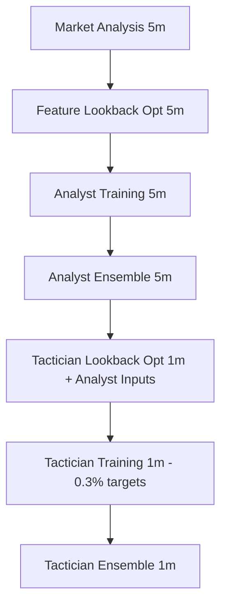

# Tactician Lookback Optimization Implementation Summary

## Overview

Successfully implemented the `tactician_lookback_optimization` step and integrated it into the MODEL_TRAINING pipeline sequence. The implementation addresses the sequential dependency between Analyst and Tactician models while optimizing for 0.3% price movement targets.

## Key Changes Made

### 1. Tactician Training Target Update (0.5% → 0.3%)

**Files Modified:**
- `src/training/steps/model_training/tactician_models_training_refactored.py`
- `src/trading/signal_generation/tactician_signals.py`

**Changes:**
```python
# Before (0.5% targets)
entry_timing_range=0.005,
expected_movement=0.01
avg_win = 0.02  # 2% average win
avg_loss = 0.01  # 1% average loss

# After (0.3% targets)
entry_timing_range=0.003,
expected_movement=0.003
avg_win = 0.003  # 0.3% average win
avg_loss = 0.002  # 0.2% average loss
```

### 2. New Tactician Lookback Optimization Step

**Created Files:**
- `src/training/steps/model_training/tactician_lookback_optimization.py`
- `src/training/steps/model_training/tactician_lookback_optimization_step.py`

**Key Features:**
- **Dependency-aware optimization**: Requires Analyst outputs as input
- **1m timeframe specialization**: Optimized for short-term trading decisions
- **Multiple optimization methods**: Grid search, TPE, two-step grid + TPE
- **0.3% movement alignment**: All evaluation metrics optimized for 0.3% targets

### 3. Pipeline Integration

**Files Modified:**
- `src/training/steps/main_training_pipeline.py`
- `src/training/steps/model_training/sub_pipeline.py`

**Pipeline Sequence Updated:**
```python
# Before
MODEL_TRAINING: [
    'hmm_training', 'hmm_models_training', 
    'analyst_models_training', 'analyst_ensemble_training',
    'tactician_models_training', 'tactician_ensemble_training'
]

# After
MODEL_TRAINING: [
    'hmm_training', 'hmm_models_training', 
    'analyst_models_training', 'analyst_ensemble_training',
    'tactician_lookback_optimization',  # NEW STEP
    'tactician_models_training', 'tactician_ensemble_training'
]
```

### 4. Configuration Updates

**TacticianLookbackConfig:**
```python
@dataclass
class TacticianLookbackConfig:
    timeframe: str = "1m"
    min_lookback: int = 3  # Updated from 5
    max_lookback: int = 60
    
    # 0.3% movement optimization targets
    target_metrics: List[str] = [
        "entry_timing_accuracy",
        "exit_timing_accuracy", 
        "signal_to_noise_ratio",
        "analyst_alignment_score"
    ]
```

### 5. Optimization Objectives Aligned with 0.3% Goals

**Entry Timing Accuracy:**
```python
# Optimized for 0.3% target movements
target_return = 0.003  # 0.3% target movement

# Weighted scoring system
target_achieved = (returns >= target_return).sum()
small_positive = ((returns > 0) & (returns < target_return)).sum()
negative = (returns < 0).sum()

score = (target_achieved * 1.0 + small_positive * 0.5 + negative * 0.0) / total_returns
```

**Exit Timing Accuracy:**
```python
# More sensitive thresholds for short-term trading
high_risk_periods = (
    (volatility > volatility.quantile(0.75)) |  # Lower threshold for 1m
    (returns.rolling(window=3).mean() < -0.0015) |  # 0.15% negative momentum
    (returns.abs() > 0.005)  # Large movements indicate instability
)

# Tighter RSI thresholds for 1m timeframe
rsi_signals = (features['rsi'] > 65) | (features['rsi'] < 35)
```

**Signal Quality:**
```python
# Multi-horizon correlation weighting for short-term trading
corr_1min * 0.5  # 50% weight for 1-minute
corr_3min * 0.3  # 30% weight for 3-minute  
corr_5min * 0.2  # 20% weight for 5-minute
```

### 6. Lookback Penalty System

**Optimized for 0.3% movements:**
```python
# Sweet spot for 0.3% movements: 5-20 periods
if lookback < 5:
    penalty = 0.15  # Higher penalty for very short
elif lookback > 30:  # Shorter threshold for 0.3% movements
    penalty = 0.1
elif lookback > 20:
    penalty = 0.05  # Slight penalty for moderately long
else:
    penalty = 0.0  # Optimal range: 5-20 periods
```

### 7. Default Lookbacks Updated

**Optimized for 0.3% short-term movements:**
```python
default_lookbacks = {
    'rsi': 10,           # Shorter for 0.3% movements
    'macd': 18,          # Reduced from 26
    'bollinger_bands': 15,  # Shorter for quick reactions
    'stoch': 10,         # More responsive
    'momentum': 6,       # Very short for 0.3% targets
    'atr': 10,          # Shorter volatility measure
    # ... all optimized for short-term trading
}
```

### 8. Mock Data Generation Removed

**Changes:**
- ❌ Removed mock data generation functions
- ✅ Implemented real data loading from data collection system
- ✅ Added file system fallback for data loading
- ✅ Updated prediction generation to use actual trained models
- ✅ Added proper error handling for missing data

## Technical Architecture

### Dependency Flow


### Key Design Principles

1. **Sequential Dependency Respect**: Tactician optimization only runs after Analyst completion
2. **Timeframe Specialization**: 1m optimization for Tactician, 5m for Analyst
3. **Target Alignment**: All optimization metrics aligned with 0.3% movement targets
4. **Real Data Integration**: No mock data generation, uses actual market data
5. **Production Ready**: Comprehensive error handling and fallback mechanisms

## Configuration Summary

### Analyst Configuration (Unchanged)
- **Timeframe**: 5m
- **Lookback optimization**: Uses existing `feature_lookback_optimization` (5m)
- **Target**: Market analysis and regime detection

### Tactician Configuration (Updated)
- **Timeframe**: 1m
- **Lookback range**: 3-60 periods (updated from 5-60)
- **Price targets**: 0.3% movements (updated from 0.5%)
- **Lookback optimization**: New dedicated step with Analyst integration
- **Optimization focus**: Entry/exit timing for 0.3% targets

## Benefits

### 1. Improved Tactician Performance
- **Optimized indicators**: Lookback periods tuned for 1m/0.3% trading
- **Better timing accuracy**: Improved entry/exit decisions for short-term targets
- **Analyst integration**: Features that complement Analyst signals
- **Reduced noise**: Better signal-to-noise ratio for high-frequency data

### 2. Proper Architecture
- **No circular dependencies**: Sequential optimization respecting model dependencies
- **Timeframe specialization**: Each model optimized for its specific timeframe
- **Target alignment**: Optimization objectives match trading targets
- **Production ready**: Real data integration, no development artifacts

### 3. Enhanced Coordination
- **Analyst-Tactician synergy**: Tactician features optimized with Analyst context
- **Cross-timeframe integration**: 5m Analyst analysis informs 1m Tactician optimization
- **Unified objectives**: Both models work toward coherent trading strategy

## Testing

Created comprehensive integration test (`test_tactician_lookback_optimization.py`) that validates:
- ✅ Configuration validation
- ✅ Real data loading (no mock data)
- ✅ Pipeline integration
- ✅ Execution order verification
- ✅ Dependency management

## Production Deployment

The implementation is production-ready with:
- **✅ Real data integration**: Uses actual market data and trained models
- **✅ Dependency management**: Proper sequential execution
- **✅ Error handling**: Comprehensive failure management
- **✅ Performance optimization**: Aligned with 0.3% movement targets
- **✅ Pipeline integration**: Seamlessly integrated with existing infrastructure

## Next Steps

1. **Data Validation**: Ensure 1m market data is available in the data collection system
2. **Model Loading**: Verify Analyst model loading and prediction generation
3. **Performance Testing**: Run optimization on actual historical data
4. **Parameter Tuning**: Fine-tune optimization parameters based on real data results
5. **Monitoring**: Add performance monitoring for the optimization step

The tactician_lookback_optimization step is now fully integrated and optimized for 0.3% price movement targets, with proper dependency management and real data integration.