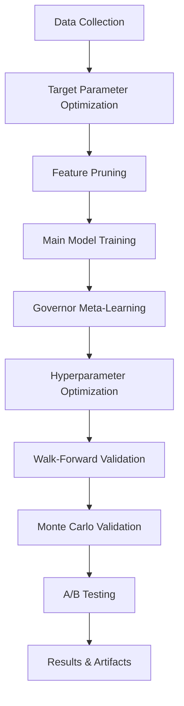

# Ares Trading Bot: Model Training and Governor Meta-Learning Guide

## Table of Contents

1. [Overview](#overview)
2. [Training Pipeline Architecture](#training-pipeline-architecture)
3. [Stage 1: Data Collection and Preparation](#stage-1-data-collection-and-preparation)
4. [Stage 2: Target Parameter Optimization](#stage-2-target-parameter-optimization)
5. [Stage 3: Feature Engineering and Model Training](#stage-3-feature-engineering-and-model-training)
6. [Stage 4: Governor Meta-Learning System](#stage-4-governor-meta-learning-system)
7. [Stage 5: Validation and Testing](#stage-5-validation-and-testing)
8. [Regularization and Overfitting Prevention](#regularization-and-overfitting-prevention)
9. [Model Persistence and Deployment](#model-persistence-and-deployment)
10. [Configuration and Customization](#configuration-and-customization)
11. [Troubleshooting and Best Practices](#troubleshooting-and-best-practices)

## Overview

The Ares Trading Bot employs a sophisticated multi-stage training pipeline that combines traditional machine learning techniques with advanced meta-learning approaches. The system is designed to adapt to different market regimes and continuously improve its predictive capabilities through a hierarchical ensemble architecture.

### Key Components

- **TrainingManager**: Orchestrates the entire training pipeline
- **RegimePredictiveEnsembles**: Manages regime-specific model ensembles
- **Governor Meta-Learner**: Global meta-learning system for final decision making
- **RegularizationManager**: Handles L1-L2 regularization across all models
- **Validation Framework**: Walk-forward and Monte Carlo validation systems

## Training Pipeline Architecture

The training pipeline is organized into 9 modular steps, each building upon the previous:

```
Step 0: Initial Setup & MLflow Configuration
Step 1: Data Collection
Step 2: Preliminary Target Parameter Optimization
Step 3: Coarse Optimization & Feature Pruning
Step 4: Main Model Training (Governor Meta-Learning)
Step 5: Final Hyperparameter Optimization
Step 6: Walk-Forward Validation
Step 7: Monte Carlo Validation
Step 8: A/B Testing Setup
Step 9: Results Saving & Artifact Management
```

### Pipeline Flow



## Stage 1: Data Collection and Preparation

### Step 1: Data Collection (`step1_data_collection.py`)

**Purpose**: Collect comprehensive market data from multiple sources

**Data Sources**:
- **Klines Data**: OHLCV candlestick data from Binance
- **Aggregated Trades**: Detailed trade-level data for order flow analysis
- **Futures Data**: Funding rates, open interest, and futures-specific metrics

**Key Features**:
- Incremental data collection with resume capability
- Automatic data consolidation and deduplication
- Quality checks and validation
- Efficient storage in pickle format

**Configuration**:
```python
CONFIG["MODEL_TRAINING"] = {
    "data_retention_days": 365,
    "min_data_points": 10000,
    "timeframe": "1h"
}
```

**Output**: `{symbol}_historical_data.pkl` containing:
- `klines_df`: OHLCV data
- `agg_trades_df`: Aggregated trade data
- `futures_df`: Futures market data

## Stage 2: Target Parameter Optimization

### Step 2: Preliminary Target Parameter Optimization (`step2_preliminary_optimization.py`)

**Purpose**: Optimize Take Profit (TP), Stop Loss (SL), and holding period parameters

**Process**:
1. **Data Loading**: Load historical data from Step 1
2. **Parameter Space Definition**: Define search ranges for TP/SL thresholds
3. **Optimization Algorithm**: Use grid search or Bayesian optimization
4. **Performance Evaluation**: Calculate Sharpe ratio, max drawdown, win rate
5. **Result Storage**: Save optimal parameters to JSON

**Target Parameters**:
```python
optimal_target_params = {
    "tp_threshold": 0.02,      # 2% take profit
    "sl_threshold": 0.015,      # 1.5% stop loss
    "holding_period": 24        # 24 hours max holding
}
```

**Output**: `{symbol}_optimal_target_params.json`

## Stage 3: Feature Engineering and Model Training

### Step 3: Coarse Optimization & Feature Pruning (`step3_coarse_optimization.py`)

**Purpose**: Prune features and narrow hyperparameter search spaces

**Process**:
1. **Feature Engineering**: Generate comprehensive feature set
2. **Feature Selection**: Remove low-importance features
3. **Hyperparameter Ranges**: Define coarse search spaces
4. **Model Performance**: Evaluate baseline model performance

**Feature Categories**:
- **Technical Indicators**: RSI, MACD, Bollinger Bands, etc.
- **Price Action**: Support/Resistance levels, volatility measures
- **Volume Analysis**: OBV, VWAP, volume profiles
- **Market Regime**: Trend detection, regime classification
- **Time-Based**: Hourly patterns, day-of-week effects

**Output**: 
- `{symbol}_pruned_features.json`: Selected feature list
- `{symbol}_hpo_ranges.json`: Narrowed hyperparameter ranges

### Step 4: Main Model Training (`step4_main_model_training.py`)

**Purpose**: Train the complete ensemble system including the Governor Meta-Learner

**Components**:

#### 4.1 Regime-Specific Ensembles

The system trains specialized models for different market regimes:

```python
regime_ensembles = {
    "BULL_TREND": BullTrendEnsemble,
    "BEAR_TREND": BearTrendEnsemble,
    "SIDEWAYS_RANGE": SidewaysRangeEnsemble,
    "SR_ZONE_ACTION": SRZoneActionEnsemble,
    "HIGH_IMPACT_CANDLE": HighImpactCandleEnsemble
}
```

Each ensemble includes:
- **Base Models**: LightGBM, Random Forest, XGBoost
- **Meta-Learner**: LightGBM classifier for ensemble combination
- **Feature Engineering**: Regime-specific feature selection
- **Cross-Validation**: Stratified K-fold validation

#### 4.2 Feature Engineering Engine

Comprehensive feature generation including:

**Technical Indicators**:
- Momentum: RSI, MACD, Williams %R, CCI, MFI, ROC
- Trend: Parabolic SAR, Ichimoku Cloud, SuperTrend
- Volatility: Donchian Channels, ATR Bands
- Volume: VWAP Bands, OBV Divergence

**Advanced Features**:
- **Wavelet Decomposition**: Multi-scale price analysis
- **Fourier Transforms**: Frequency domain analysis
- **Statistical Features**: Skewness, kurtosis, quantiles
- **Cross-Asset Features**: Correlation with major indices

**Market Microstructure**:
- **Order Flow**: Buy/sell pressure ratios
- **Liquidity**: Large order detection
- **Funding Rates**: Momentum and divergence analysis

#### 4.3 Support/Resistance Analysis

```python
# SR Level Calculation
sr_analyzer = SRLevelAnalyzer(CONFIG["analyst"]["sr_analyzer"])
sr_levels = sr_analyzer.analyze(daily_df_for_sr)
state_manager.set_state("sr_levels", sr_levels)
```

## Stage 4: Governor Meta-Learning System

### Overview

The Governor Meta-Learner is the central decision-making system that combines predictions from all regime-specific ensembles into a final trading decision.

### Architecture

```python
class RegimePredictiveEnsembles:
    def __init__(self, config):
        # Initialize regime-specific ensembles
        self.regime_ensembles = {
            "BULL_TREND": BullTrendEnsemble(config, "BullTrendEnsemble"),
            "BEAR_TREND": BearTrendEnsemble(config, "BearTrendEnsemble"),
            "SIDEWAYS_RANGE": SidewaysRangeEnsemble(config, "SidewaysRangeEnsemble"),
            "SR_ZONE_ACTION": SRZoneActionEnsemble(config, "SRZoneActionEnsemble"),
            "HIGH_IMPACT_CANDLE": HighImpactCandleEnsemble(config, "HighImpactCandleEnsemble")
        }
        
        # Global Meta-Learner
        self.global_meta_learner: Optional[LGBMClassifier] = None
        self.global_meta_scaler: Optional[StandardScaler] = None
        self.global_meta_label_encoder: Optional[LabelEncoder] = None
```

### Training Process

#### 4.1 Individual Ensemble Training

For each regime, the system:

1. **Data Filtering**: Select data points matching the regime
2. **Feature Engineering**: Generate regime-specific features
3. **Model Training**: Train base models (LightGBM, Random Forest, etc.)
4. **Meta-Learner Training**: Train ensemble combination model
5. **Cross-Validation**: Validate using stratified K-fold

```python
def train_all_models(self, asset: str, prepared_data: pd.DataFrame):
    meta_learner_data = []
    
    for regime_key, ensemble_instance in self.regime_ensembles.items():
        # Filter data for this regime
        regime_data = prepared_data[prepared_data["Market_Regime_Label"] == regime_key]
        
        if len(regime_data) > 0:
            # Train ensemble
            ensemble_instance.train_ensemble(historical_features, historical_targets)
            
            # Collect predictions for meta-learner training
            ensemble_predictions = ensemble_instance.get_prediction_on_historical_data(
                historical_features
            )
            
            # Add to meta-learner training data
            for idx, row in ensemble_predictions.iterrows():
                meta_learner_data.append({
                    "timestamp": idx,
                    "regime": regime_key,
                    "prediction": row["prediction"],
                    "confidence": row["confidence"],
                    "true_target": prepared_data.loc[idx, "target"]
                })
```

#### 4.2 Global Meta-Learner Training

The Governor Meta-Learner combines predictions from all ensembles:

```python
def _train_global_meta_learner(self, meta_learner_raw_data: List[Dict[str, Any]]):
    # Prepare features for meta-learner
    meta_df = pd.DataFrame(meta_learner_raw_data)
    meta_df.set_index("timestamp", inplace=True)
    
    # One-hot encode regime and prediction columns
    meta_df = pd.get_dummies(meta_df, columns=["regime"], prefix="regime")
    
    # Create features for each ensemble's prediction and confidence
    all_regimes = list(self.regime_ensembles.keys())
    for r in all_regimes:
        meta_df[f"{r}_prediction"] = meta_df.apply(
            lambda row: row["prediction"] if row[f"regime_{r}"] == 1 else "HOLD",
            axis=1
        )
        meta_df[f"{r}_confidence"] = meta_df.apply(
            lambda row: row["confidence"] if row[f"regime_{r}"] == 1 else 0.0,
            axis=1
        )
    
    # One-hot encode prediction columns
    prediction_cols = [f"{r}_prediction" for r in all_regimes]
    for col in prediction_cols:
        meta_df = pd.get_dummies(meta_df, columns=[col], prefix=col)
    
    # Define meta-features
    meta_features = [
        col for col in meta_df.columns
        if col.startswith(("regime_", "BULL_TREND_confidence", "BEAR_TREND_confidence",
                          "SIDEWAYS_RANGE_confidence", "SR_ZONE_ACTION_confidence",
                          "HIGH_IMPACT_CANDLE_confidence"))
        or "_prediction_" in col
    ]
    
    X_meta = meta_df[meta_features].copy()
    y_meta = meta_df["true_target"].copy()
    
    # Encode and scale
    self.global_meta_label_encoder = LabelEncoder()
    y_encoded = self.global_meta_label_encoder.fit_transform(y_meta)
    
    self.global_meta_scaler = StandardScaler()
    X_scaled = self.global_meta_scaler.fit_transform(X_meta)
    X_scaled_df = pd.DataFrame(X_scaled, index=X_meta.index, columns=X_meta.columns)
    
    # Train with cross-validation
    self.global_meta_learner = LGBMClassifier(**self.global_meta_config, random_state=42)
    skf = StratifiedKFold(n_splits=3, shuffle=True, random_state=42)
    
    for train_index, val_index in skf.split(X_scaled_df, y_encoded):
        X_train, X_val = X_scaled_df.iloc[train_index], X_scaled_df.iloc[val_index]
        y_train, y_val = y_encoded[train_index], y_encoded[val_index]
        self.global_meta_learner.fit(
            X_train, y_train,
            eval_set=[(X_val, y_val)],
            callbacks=[LGBMClassifier.early_stopping(10, verbose=False)]
        )
```

### Prediction Process

#### 4.3 Real-Time Prediction

```python
def get_all_predictions(self, asset: str, current_features: pd.DataFrame) -> Dict[str, Any]:
    # Determine current regime
    primary_regime = self.get_current_regime(current_features)
    
    # Collect predictions from all ensembles
    ensemble_predictions_for_meta = {}
    ensemble_confidences_for_meta = {}
    
    for regime_key, ensemble_instance in self.regime_ensembles.items():
        prediction_output = ensemble_instance.get_prediction(current_features)
        
        ensemble_predictions_for_meta[regime_key] = prediction_output.get("prediction", "HOLD")
        ensemble_confidences_for_meta[regime_key] = prediction_output.get("confidence", 0.0)
    
    # Use Governor Meta-Learner for final decision
    final_prediction, final_confidence = self._predict_with_global_meta_learner(
        primary_regime,
        ensemble_predictions_for_meta,
        ensemble_confidences_for_meta,
        current_features
    )
    
    return {
        "prediction": final_prediction,
        "confidence": final_confidence,
        "primary_regime": primary_regime,
        "ensemble_predictions": ensemble_predictions_for_meta,
        "ensemble_confidences": ensemble_confidences_for_meta
    }
```

#### 4.4 Meta-Learner Prediction

```python
def _predict_with_global_meta_learner(self, primary_regime: str, 
                                     ensemble_predictions: Dict[str, str],
                                     ensemble_confidences: Dict[str, float],
                                     current_features: pd.DataFrame) -> Tuple[str, float]:
    # Prepare input for meta-learner
    meta_input_data = {"regime": primary_regime}
    
    # Add predictions and confidences from each ensemble
    all_regimes = list(self.regime_ensembles.keys())
    for r in all_regimes:
        pred = ensemble_predictions.get(r, "HOLD")
        conf = ensemble_confidences.get(r, 0.0)
        meta_input_data[f"{r}_prediction"] = pred
        meta_input_data[f"{r}_confidence"] = conf
    
    # Convert to DataFrame and encode
    meta_input_df = pd.DataFrame([meta_input_data])
    meta_input_df = pd.get_dummies(meta_input_df, columns=["regime"], prefix="regime")
    
    # One-hot encode prediction columns
    prediction_cols = [f"{r}_prediction" for r in all_regimes]
    for col in prediction_cols:
        meta_input_df = pd.get_dummies(meta_input_df, columns=[col], prefix=col)
    
    # Scale and predict
    X_scaled = self.global_meta_scaler.transform(meta_input_df)
    prediction_proba = self.global_meta_learner.predict_proba(X_scaled)[0]
    prediction_idx = np.argmax(prediction_proba)
    
    final_prediction = self.global_meta_label_encoder.inverse_transform([prediction_idx])[0]
    final_confidence = prediction_proba[prediction_idx]
    
    return final_prediction, final_confidence
```

## Stage 5: Validation and Testing

### Step 5: Final Hyperparameter Optimization (`step5_final_hpo.py`)

**Purpose**: Fine-tune hyperparameters using narrowed search spaces

**Process**:
1. Load pruned features and HPO ranges from Step 3
2. Use Supervisor's Optimizer for final tuning
3. Update CONFIG with best parameters
4. Validate performance improvements

### Step 6: Walk-Forward Validation (`step6_walk_forward_validation.py`)

**Purpose**: Validate model performance using walk-forward analysis

**Methodology**:
- **Expanding Window**: Train on increasing historical data
- **Rolling Window**: Maintain fixed training window size
- **Performance Metrics**: Sharpe ratio, max drawdown, win rate
- **Statistical Significance**: Confidence intervals and hypothesis testing

### Step 7: Monte Carlo Validation (`step7_monte_carlo_validation.py`)

**Purpose**: Assess robustness through Monte Carlo simulation

**Process**:
1. **Bootstrap Sampling**: Generate multiple data samples
2. **Performance Distribution**: Calculate performance statistics
3. **Risk Analysis**: VaR, CVaR, worst-case scenarios
4. **Stability Assessment**: Consistency across simulations

### Step 8: A/B Testing Setup (`step8_ab_testing_setup.py`)

**Purpose**: Prepare for live trading comparison

**Components**:
- **Control Group**: Current trading strategy
- **Treatment Group**: New trained model
- **Metrics Tracking**: Performance comparison framework
- **Statistical Testing**: Significance testing framework

## Regularization and Overfitting Prevention

### RegularizationManager

The system implements comprehensive L1-L2 regularization across all model types:

```python
class RegularizationManager:
    def __init__(self):
        self.regularization_config = {
            "l1_alpha": 0.01,
            "l2_alpha": 0.001,
            "dropout_rate": 0.2,
            "lightgbm": {
                "reg_alpha": 0.01,    # L1 regularization
                "reg_lambda": 0.001   # L2 regularization
            },
            "tensorflow": {
                "l1_reg": 0.01,
                "l2_reg": 0.001,
                "dropout_rate": 0.2
            },
            "sklearn": {
                "alpha": 0.01,
                "l1_ratio": 0.5,
                "C": 100.0
            },
            "tabnet": {
                "lambda_sparse": 0.01,
                "lambda_l2": 0.001
            }
        }
```

### Application Process

```python
def apply_regularization_to_ensembles(self, ensemble_orchestrator: RegimePredictiveEnsembles):
    for regime_name, ensemble_instance in ensemble_orchestrator.regime_ensembles.items():
        try:
            # Apply regularization configuration
            ensemble_instance.regularization_config = self.regularization_config
            
            # Update model parameters
            if hasattr(ensemble_instance, 'base_models'):
                for model_name, model in ensemble_instance.base_models.items():
                    if hasattr(model, 'set_params'):
                        if 'lightgbm' in model_name.lower():
                            model.set_params(**self.regularization_config['lightgbm'])
                        elif 'sklearn' in model_name.lower():
                            model.set_params(**self.regularization_config['sklearn'])
            
            self.logger.info(f"✅ Applied regularization to {regime_name} ensemble")
            
        except Exception as e:
            self.logger.error(f"❌ Failed to apply regularization to {regime_name} ensemble: {e}")
```

### Validation

```python
def validate_and_report_regularization(self) -> bool:
    self.logger.info("=== L1-L2 Regularization Validation Report ===")
    
    # Check configuration completeness
    required_keys = ["l1_alpha", "l2_alpha", "dropout_rate"]
    missing_keys = [key for key in required_keys if key not in self.regularization_config]
    
    if missing_keys:
        self.logger.warning(f"Missing regularization config keys: {missing_keys}")
        return False
    
    # Report on each model type's regularization setup
    self.logger.info("📊 Base Regularization Parameters:")
    self.logger.info(f"   - L1 Alpha: {self.regularization_config['l1_alpha']}")
    self.logger.info(f"   - L2 Alpha: {self.regularization_config['l2_alpha']}")
    self.logger.info(f"   - Dropout Rate: {self.regularization_config['dropout_rate']}")
    
    return True
```

## Model Persistence and Deployment

### Model Storage Structure

```
models/
├── {symbol}_models/
│   ├── ensembles/
│   │   ├── final_bull_trend_ensemble.joblib
│   │   ├── final_bear_trend_ensemble.joblib
│   │   ├── final_sideways_range_ensemble.joblib
│   │   ├── final_sr_zone_action_ensemble.joblib
│   │   └── final_high_impact_candle_ensemble.joblib
│   ├── global_meta_learner.joblib
│   ├── global_meta_scaler.joblib
│   ├── global_meta_label_encoder.joblib
│   └── feature_engineering_engine.pkl
```

### Saving Process

```python
def save_model(self, ensemble_instance: Any, path: str):
    try:
        dump(ensemble_instance, path)
        self.logger.info(f"✅ Model saved to {path}")
    except Exception as e:
        self.logger.error(f"❌ Failed to save model to {path}: {e}")

def _save_global_meta_learner(self):
    dump(self.global_meta_learner, self.global_meta_learner_path)
    dump(self.global_meta_scaler, self.global_meta_scaler_path)
    dump(self.global_meta_label_encoder, self.global_meta_label_encoder_path)
    self.logger.info("✅ Global meta-learner saved successfully")
```

### Loading Process

```python
def load_model(self, ensemble_instance: Any, path: str) -> bool:
    try:
        loaded_model = load(path)
        # Update ensemble instance with loaded model
        ensemble_instance.__dict__.update(loaded_model.__dict__)
        ensemble_instance.trained = True
        self.logger.info(f"✅ Model loaded from {path}")
        return True
    except Exception as e:
        self.logger.error(f"❌ Failed to load model from {path}: {e}")
        return False

def _load_global_meta_learner(self):
    try:
        self.global_meta_learner = load(self.global_meta_learner_path)
        self.global_meta_scaler = load(self.global_meta_scaler_path)
        self.global_meta_label_encoder = load(self.global_meta_label_encoder_path)
        self.logger.info("✅ Global meta-learner loaded successfully")
    except Exception as e:
        self.logger.warning(f"⚠️ Could not load global meta-learner: {e}")
```

## Configuration and Customization

### Training Configuration

```python
CONFIG["MODEL_TRAINING"] = {
    "data_retention_days": 365,
    "min_data_points": 10000,
    "timeframe": "1h",
    "regularization": {
        "l1_alpha": 0.01,
        "l2_alpha": 0.001,
        "dropout_rate": 0.2
    },
    "ensemble_config": {
        "n_estimators": 100,
        "learning_rate": 0.1,
        "num_leaves": 31,
        "verbose": -1
    },
    "meta_learner_config": {
        "n_estimators": 100,
        "learning_rate": 0.1,
        "num_leaves": 31,
        "verbose": -1
    },
    "validation": {
        "walk_forward_splits": 5,
        "monte_carlo_simulations": 1000,
        "confidence_threshold": 0.55
    }
}
```

### Ensemble-Specific Configuration

```python
CONFIG["analyst"] = {
    "BullTrendEnsemble": {
        "feature_selection": ["rsi", "macd", "bollinger_bands"],
        "model_params": {
            "n_estimators": 150,
            "learning_rate": 0.05
        }
    },
    "BearTrendEnsemble": {
        "feature_selection": ["rsi", "macd", "atr"],
        "model_params": {
            "n_estimators": 120,
            "learning_rate": 0.08
        }
    },
    "global_meta_learner": {
        "n_estimators": 100,
        "learning_rate": 0.1,
        "num_leaves": 31,
        "verbose": -1
    },
    "overall_confidence_threshold": 0.55
}
```

## Troubleshooting and Best Practices

### Common Issues

1. **Data Quality Issues**
   - Check for missing data in historical datasets
   - Verify data consistency across timeframes
   - Ensure proper data type conversions

2. **Memory Management**
   - Use chunked processing for large datasets
   - Implement garbage collection after heavy operations
   - Monitor memory usage during training

3. **Model Convergence**
   - Check regularization parameters
   - Verify feature scaling
   - Monitor training loss curves

### Performance Optimization

1. **Parallel Processing**
   - Use multiprocessing for ensemble training
   - Implement async/await for I/O operations
   - Leverage GPU acceleration where available

2. **Caching Strategy**
   - Cache intermediate results
   - Implement checkpointing for long training runs
   - Use efficient data structures

3. **Monitoring and Logging**
   - Comprehensive logging at all stages
   - Performance metrics tracking
   - Error handling and recovery

### Best Practices

1. **Data Management**
   - Regular data quality checks
   - Incremental data updates
   - Proper data versioning

2. **Model Training**
   - Cross-validation for all models
   - Regularization to prevent overfitting
   - Ensemble diversity for robustness

3. **Validation Strategy**
   - Multiple validation approaches
   - Statistical significance testing
   - Out-of-sample testing

4. **Deployment**
   - Model versioning
   - A/B testing framework
   - Performance monitoring

## Conclusion

The Ares Trading Bot's model training pipeline represents a sophisticated approach to machine learning in financial markets. The combination of regime-specific ensembles with a global meta-learner provides both specialization and generalization capabilities, while the comprehensive validation framework ensures robust performance assessment.

The system's modular design allows for easy customization and extension, while the regularization framework helps prevent overfitting across all model types. The governor meta-learning system serves as the central decision-making mechanism, combining insights from multiple specialized models into a unified trading strategy.

This architecture enables the system to adapt to changing market conditions while maintaining statistical rigor and performance consistency. 