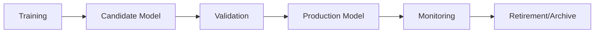

# Ares Trading Bot: Production Deployment Guide

## Overview

The Ares Trading Bot's production deployment system supports live model hot-swapping, comprehensive monitoring, and automated model promotion workflows.

## Model Versioning and Promotion

### Model Lifecycle



### Model Promotion System

The system uses MLflow for model versioning and promotion:

```python
class ModularSupervisor:
    def _check_and_promote_model(self):
        """Checks for candidate models and promotes them to production if superior."""
        client = mlflow.tracking.MlflowClient()
        
        # Find best performing candidate model
        candidate_runs = client.search_runs(
            experiment_ids=[experiment.experiment_id],
            filter_string="tags.model_status = 'candidate'",
            order_by=["metrics.accuracy DESC"],
            max_results=1,
        )
        
        if candidate_runs:
            best_candidate = candidate_runs[0]
            candidate_accuracy = best_candidate.data.metrics.get("accuracy", 0)
            
            # Compare with current production model
            prod_run_id = self.state_manager.get_state("production_model_run_id")
            if candidate_accuracy > prod_accuracy:
                # Promote new model
                self.state_manager.set_state("production_model_run_id", best_candidate.info.run_id)
                client.set_tag(best_candidate.info.run_id, "model_status", "production")
```

### Model Status Tracking

- **candidate**: Newly trained model awaiting validation
- **production**: Currently active model in production
- **archived**: Previous production model
- **evaluated_inferior**: Candidate that failed promotion criteria

## Hot-Swapping and Live Updates

### Model Hot-Swapping

```python
class HotSwapManager:
    async def hot_swap_model(self, new_model_id: str):
        """Perform a hot-swap of the current model."""
        try:
            # Load new model in background
            new_model = await self._load_model_async(new_model_id)
            
            # Validate new model
            if not await self._validate_model(new_model):
                raise ValueError(f"Model {new_model_id} validation failed")
            
            # Perform atomic swap
            old_model = self.current_model
            self.current_model = new_model
            
            # Update state manager
            self.state_manager.set_state("current_model_id", new_model_id)
            
            self.logger.info(f"Hot-swap completed successfully to model {new_model_id}")
            
        except Exception as e:
            self.logger.error(f"Hot-swap failed: {e}")
            await self._rollback_swap()
```

### Live Configuration Updates

```python
class LiveConfigManager:
    async def update_config_live(self, config_updates: Dict[str, Any]):
        """Update configuration without restart."""
        # Validate configuration updates
        validated_updates = self._validate_config_updates(config_updates)
        
        # Apply updates atomically
        for key, value in validated_updates.items():
            CONFIG[key] = value
        
        # Notify components of config changes
        await self._notify_config_change(validated_updates)
```

## MLflow Integration

### Experiment Tracking

```python
class MLflowManager:
    def start_experiment_run(self, run_name: str, tags: Dict[str, str] = None):
        """Start a new MLflow experiment run."""
        mlflow.set_experiment(self.experiment_name)
        
        with mlflow.start_run(run_name=run_name) as run:
            # Log parameters
            mlflow.log_params(CONFIG.get("MODEL_TRAINING", {}))
            
            # Log tags
            if tags:
                for key, value in tags.items():
                    mlflow.set_tag(key, value)
            
            return run.info.run_id
    
    def log_model_metrics(self, run_id: str, metrics: Dict[str, float]):
        """Log model performance metrics."""
        for metric_name, value in metrics.items():
            mlflow.log_metric(metric_name, value)
```

### Model Registry

```python
class ModelRegistry:
    def list_model_versions(self, model_name: str):
        """List all versions of a registered model."""
        return self.client.search_model_versions(f"name='{model_name}'")
    
    def transition_model_stage(self, model_name: str, version: int, stage: str):
        """Transition a model to a specific stage."""
        self.client.transition_model_version_stage(
            name=model_name,
            version=version,
            stage=stage
        )
```

## Monitoring and Alerting

### System Monitoring

```python
class SystemMonitor:
    async def start_monitoring(self):
        """Start continuous system monitoring."""
        while True:
            # Collect system metrics
            metrics = await self._collect_system_metrics()
            
            # Check for alerts
            await self._check_alerts(metrics)
            
            # Store metrics
            await self._store_metrics(metrics)
            
            await asyncio.sleep(60)  # Check every minute
    
    async def _collect_system_metrics(self):
        """Collect comprehensive system metrics."""
        return {
            "cpu_usage": await self._get_cpu_usage(),
            "memory_usage": await self._get_memory_usage(),
            "model_performance": await self._get_model_performance(),
            "trading_metrics": await self._get_trading_metrics(),
            "error_rate": await self._get_error_rate()
        }
```

### Performance Tracking

```python
class PerformanceTracker:
    def track_model_performance(self, model_id: str, metrics: Dict[str, float]):
        """Track model performance over time."""
        if model_id not in self.metrics_history:
            self.metrics_history[model_id] = []
        
        self.metrics_history[model_id].append({
            "timestamp": datetime.now(),
            "metrics": metrics
        })
        
        # Check for performance alerts
        self._check_performance_alerts(model_id, metrics)
```

## Security and Compliance

### API Key Management

```python
class SecureKeyManager:
    def store_api_key(self, exchange: str, key_type: str, key_value: str):
        """Securely store API key."""
        encrypted_key = self._encrypt_key(key_value)
        self.encrypted_keys[f"{exchange}_{key_type}"] = encrypted_key
    
    def get_api_key(self, exchange: str, key_type: str) -> str:
        """Retrieve and decrypt API key."""
        key_id = f"{exchange}_{key_type}"
        if key_id in self.encrypted_keys:
            encrypted_key = self.encrypted_keys[key_id]
            return self._decrypt_key(encrypted_key)
        return None
```

### Audit Trail

```python
class AuditLogger:
    def log_audit_event(self, event_type: str, user: str, action: str, details: Dict[str, Any]):
        """Log an audit event."""
        audit_entry = {
            "timestamp": datetime.now().isoformat(),
            "event_type": event_type,
            "user": user,
            "action": action,
            "details": details
        }
        
        # Write to audit file
        with open(self.audit_file, "a") as f:
            f.write(json.dumps(audit_entry) + "\n")
```

## Performance Optimization

### Parallel Processing

```python
class ParallelProcessor:
    async def parallel_feature_engineering(self, data_chunks: List[pd.DataFrame]):
        """Process feature engineering in parallel."""
        loop = asyncio.get_event_loop()
        
        # Submit tasks to thread pool
        tasks = [
            loop.run_in_executor(self.thread_pool, self._engineer_features, chunk)
            for chunk in data_chunks
        ]
        
        # Wait for all tasks to complete
        results = await asyncio.gather(*tasks)
        return results
```

### Memory Management

```python
class MemoryManager:
    async def monitor_memory_usage(self):
        """Monitor memory usage and trigger cleanup if needed."""
        while True:
            memory_usage = psutil.virtual_memory().percent / 100
            
            if memory_usage > self.memory_threshold:
                await self._trigger_memory_cleanup()
            
            await asyncio.sleep(30)
    
    async def _trigger_memory_cleanup(self):
        """Trigger memory cleanup procedures."""
        # Clear caches
        for cache_name, cache in self.cache_manager.items():
            cache.clear()
        
        # Force garbage collection
        import gc
        gc.collect()
```

## Troubleshooting Production Issues

### Common Issues and Solutions

1. **Model Performance Degradation**
   - Monitor accuracy, Sharpe ratio, and drawdown
   - Check for data drift or regime changes
   - Trigger retraining if performance drops below thresholds

2. **Memory Leaks**
   - Monitor memory usage patterns
   - Implement proper cleanup procedures
   - Use memory profiling tools

3. **Network Connectivity Issues**
   - Implement connection pooling
   - Add retry mechanisms with exponential backoff
   - Monitor exchange API response times

### Recovery Procedures

```python
class RecoveryManager:
    async def execute_recovery_procedure(self, issue_type: str):
        """Execute recovery procedure for specific issue type."""
        if issue_type in self.recovery_procedures:
            try:
                await self.recovery_procedures[issue_type]()
                self.logger.info(f"Recovery procedure for {issue_type} completed")
            except Exception as e:
                self.logger.error(f"Recovery procedure for {issue_type} failed: {e}")
                await self._execute_backup_strategy(issue_type)
```

This production deployment guide covers the key missing components from the original training guide, focusing on live system operation, model management, and production considerations. 