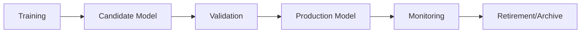

# Ares Trading Bot: Production Deployment and Model Management Guide

## Table of Contents

1. [Overview](#overview)
2. [Model Versioning and Promotion](#model-versioning-and-promotion)
3. [Production Architecture](#production-architecture)
4. [MLflow Integration and Experiment Tracking](#mlflow-integration-and-experiment-tracking)
5. [Hot-Swapping and Live Updates](#hot-swapping-and-live-updates)
6. [Monitoring and Alerting](#monitoring-and-alerting)
7. [Security and Compliance](#security-and-compliance)
8. [Performance Optimization](#performance-optimization)
9. [Troubleshooting Production Issues](#troubleshooting-production-issues)

## Overview

The Ares Trading Bot's production deployment system is designed for high availability, fault tolerance, and seamless model updates. The system supports live model hot-swapping, comprehensive monitoring, and automated model promotion workflows.

### Key Components

- **ModelManager**: Handles model loading, serving, and hot-swapping
- **ModularSupervisor**: Production supervisor with model promotion capabilities
- **ModularAnalyst**: Production analyst with MLflow model integration
- **MLflow Registry**: Model versioning and experiment tracking
- **Event Bus**: Asynchronous communication between components

## Model Versioning and Promotion

### Model Lifecycle



### Model Promotion System

The system uses a sophisticated model promotion mechanism via MLflow:

```python
class ModularSupervisor:
    def _check_and_promote_model(self):
        """
        Checks for candidate models and promotes them to production if superior.
        """
        try:
            client = mlflow.tracking.MlflowClient()
            experiment = client.get_experiment_by_name(
                CONFIG.get("MLFLOW_EXPERIMENT_NAME")
            )
            
            # Find the best performing candidate model
            candidate_runs = client.search_runs(
                experiment_ids=[experiment.experiment_id],
                filter_string="tags.model_status = 'candidate'",
                order_by=["metrics.accuracy DESC"],
                max_results=1,
            )
            
            if candidate_runs:
                best_candidate_run = candidate_runs[0]
                candidate_run_id = best_candidate_run.info.run_id
                candidate_accuracy = best_candidate_run.data.metrics.get("accuracy", 0)
                
                # Get current production model's performance
                prod_run_id = self.state_manager.get_state("production_model_run_id")
                prod_accuracy = 0
                
                if prod_run_id:
                    prod_run = client.get_run(prod_run_id)
                    prod_accuracy = prod_run.data.metrics.get("accuracy", 0)
                
                # Promote if candidate is better
                if candidate_accuracy > prod_accuracy:
                    self.logger.warning(
                        f"Promoting new model {candidate_run_id} to production."
                    )
                    self.state_manager.set_state(
                        "production_model_run_id", candidate_run_id
                    )
                    client.set_tag(candidate_run_id, "model_status", "production")
                    
                    if prod_run_id:
                        client.set_tag(prod_run_id, "model_status", "archived")
                        
        except Exception as e:
            self.logger.error(f"Failed during model promotion check: {e}", exc_info=True)
```

### Model Status Tracking

```python
# Model status tags in MLflow
model_statuses = {
    "candidate": "Newly trained model awaiting validation",
    "production": "Currently active model in production",
    "archived": "Previous production model",
    "evaluated_inferior": "Candidate that failed promotion criteria"
}
```

### Model Rollback Procedures

```python
async def rollback_to_previous_model(self, target_run_id: str):
    """
    Rollback to a specific model version.
    """
    try:
        client = mlflow.tracking.MlflowClient()
        
        # Validate the target model exists
        target_run = client.get_run(target_run_id)
        if not target_run:
            raise ValueError(f"Model run {target_run_id} not found")
        
        # Update production model reference
        self.state_manager.set_state("production_model_run_id", target_run_id)
        
        # Update MLflow tags
        client.set_tag(target_run_id, "model_status", "production")
        
        # Archive current production model
        current_prod_id = self.state_manager.get_state("production_model_run_id")
        if current_prod_id and current_prod_id != target_run_id:
            client.set_tag(current_prod_id, "model_status", "archived")
        
        self.logger.info(f"Successfully rolled back to model {target_run_id}")
        
    except Exception as e:
        self.logger.error(f"Rollback failed: {e}", exc_info=True)
        raise
```

## Production Architecture

### Component Architecture

```python
class ProductionSystem:
    def __init__(self):
        # Core components
        self.model_manager = ModelManager()
        self.modular_supervisor = ModularSupervisor()
        self.modular_analyst = ModularAnalyst()
        
        # Event bus for component communication
        self.event_bus = EventBus()
        
        # State management
        self.state_manager = StateManager()
        
        # Performance monitoring
        self.performance_reporter = PerformanceReporter()
```

### Event-Driven Architecture

```python
class EventBus:
    """
    Asynchronous event bus for component communication.
    """
    
    async def publish(self, event_type: EventType, data: Dict[str, Any]):
        """Publish an event to all subscribers."""
        for subscriber in self.subscribers.get(event_type, []):
            await subscriber(event_type, data)
    
    async def subscribe(self, event_type: EventType, handler: Callable):
        """Subscribe to an event type."""
        if event_type not in self.subscribers:
            self.subscribers[event_type] = []
        self.subscribers[event_type].append(handler)

# Event types
class EventType(Enum):
    TRADE_EXECUTED = "trade_executed"
    MODEL_UPDATED = "model_updated"
    SYSTEM_ERROR = "system_error"
    COMPONENT_STARTED = "component_started"
    COMPONENT_STOPPED = "component_stopped"
    PERFORMANCE_ALERT = "performance_alert"
```

### Fault Tolerance

```python
class FaultTolerantSystem:
    def __init__(self):
        self.health_checks = {}
        self.fallback_strategies = {}
        self.recovery_procedures = {}
    
    async def health_check(self):
        """Comprehensive system health check."""
        health_status = {
            "model_manager": await self._check_model_manager(),
            "analyst": await self._check_analyst(),
            "supervisor": await self._check_supervisor(),
            "database": await self._check_database(),
            "exchange_connection": await self._check_exchange()
        }
        
        return health_status
    
    async def handle_component_failure(self, component: str, error: Exception):
        """Handle component failures with automatic recovery."""
        self.logger.error(f"Component {component} failed: {error}")
        
        # Execute recovery procedure
        if component in self.recovery_procedures:
            await self.recovery_procedures[component](error)
        
        # Activate fallback strategy
        if component in self.fallback_strategies:
            await self.fallback_strategies[component]()
```

## MLflow Integration and Experiment Tracking

### Experiment Management

```python
class MLflowManager:
    def __init__(self):
        self.client = mlflow.tracking.MlflowClient()
        self.experiment_name = CONFIG.get("MLFLOW_EXPERIMENT_NAME", "Ares_Trading")
        
    def start_experiment_run(self, run_name: str, tags: Dict[str, str] = None):
        """Start a new MLflow experiment run."""
        mlflow.set_experiment(self.experiment_name)
        
        with mlflow.start_run(run_name=run_name) as run:
            # Log parameters
            mlflow.log_params(CONFIG.get("MODEL_TRAINING", {}))
            
            # Log tags
            if tags:
                for key, value in tags.items():
                    mlflow.set_tag(key, value)
            
            return run.info.run_id
    
    def log_model_metrics(self, run_id: str, metrics: Dict[str, float]):
        """Log model performance metrics."""
        for metric_name, value in metrics.items():
            mlflow.log_metric(metric_name, value)
    
    def log_model_artifacts(self, run_id: str, artifacts: Dict[str, str]):
        """Log model artifacts (files, plots, etc.)."""
        for artifact_name, file_path in artifacts.items():
            mlflow.log_artifact(file_path, artifact_path=artifact_name)
    
    def register_model(self, run_id: str, model_name: str, model_path: str):
        """Register a model in the MLflow model registry."""
        model_uri = f"runs:/{run_id}/{model_path}"
        mlflow.register_model(model_uri, model_name)
```

### Model Registry Operations

```python
class ModelRegistry:
    def __init__(self):
        self.client = mlflow.tracking.MlflowClient()
    
    def list_model_versions(self, model_name: str):
        """List all versions of a registered model."""
        return self.client.search_model_versions(f"name='{model_name}'")
    
    def get_latest_model_version(self, model_name: str):
        """Get the latest version of a model."""
        versions = self.list_model_versions(model_name)
        if versions:
            return max(versions, key=lambda v: v.version)
        return None
    
    def transition_model_stage(self, model_name: str, version: int, stage: str):
        """Transition a model to a specific stage (Staging, Production, Archived)."""
        self.client.transition_model_version_stage(
            name=model_name,
            version=version,
            stage=stage
        )
    
    def load_model_from_registry(self, model_name: str, stage: str = "Production"):
        """Load a model from the registry."""
        model_uri = f"models:/{model_name}/{stage}"
        return mlflow.pyfunc.load_model(model_uri)
```

### Performance Tracking

```python
class PerformanceTracker:
    def __init__(self):
        self.metrics_history = {}
        self.alert_thresholds = {
            "accuracy": 0.6,
            "sharpe_ratio": 1.0,
            "max_drawdown": -0.1
        }
    
    def track_model_performance(self, model_id: str, metrics: Dict[str, float]):
        """Track model performance over time."""
        if model_id not in self.metrics_history:
            self.metrics_history[model_id] = []
        
        self.metrics_history[model_id].append({
            "timestamp": datetime.now(),
            "metrics": metrics
        })
        
        # Check for performance alerts
        self._check_performance_alerts(model_id, metrics)
    
    def _check_performance_alerts(self, model_id: str, metrics: Dict[str, float]):
        """Check if performance metrics trigger alerts."""
        for metric_name, threshold in self.alert_thresholds.items():
            if metric_name in metrics:
                value = metrics[metric_name]
                if self._is_alert_condition(metric_name, value, threshold):
                    self._trigger_alert(model_id, metric_name, value, threshold)
    
    def _trigger_alert(self, model_id: str, metric_name: str, value: float, threshold: float):
        """Trigger a performance alert."""
        alert_message = f"Model {model_id} {metric_name}: {value} (threshold: {threshold})"
        self.logger.warning(f"PERFORMANCE ALERT: {alert_message}")
        
        # Publish alert event
        asyncio.create_task(self.event_bus.publish(
            EventType.PERFORMANCE_ALERT,
            {
                "model_id": model_id,
                "metric": metric_name,
                "value": value,
                "threshold": threshold,
                "message": alert_message
            }
        ))
```

## Hot-Swapping and Live Updates

### Model Hot-Swapping

```python
class HotSwapManager:
    def __init__(self):
        self.current_model = None
        self.pending_model = None
        self.swap_in_progress = False
    
    async def hot_swap_model(self, new_model_id: str):
        """Perform a hot-swap of the current model."""
        try:
            self.swap_in_progress = True
            self.logger.info(f"Starting hot-swap to model {new_model_id}")
            
            # Load new model in background
            new_model = await self._load_model_async(new_model_id)
            
            # Validate new model
            if not await self._validate_model(new_model):
                raise ValueError(f"Model {new_model_id} validation failed")
            
            # Perform atomic swap
            old_model = self.current_model
            self.current_model = new_model
            
            # Update state manager
            self.state_manager.set_state("current_model_id", new_model_id)
            
            # Cleanup old model
            if old_model:
                await self._cleanup_model(old_model)
            
            self.logger.info(f"Hot-swap completed successfully to model {new_model_id}")
            
        except Exception as e:
            self.logger.error(f"Hot-swap failed: {e}")
            # Rollback if necessary
            await self._rollback_swap()
            raise
        finally:
            self.swap_in_progress = False
    
    async def _load_model_async(self, model_id: str):
        """Load model asynchronously."""
        # Load model from MLflow or local storage
        model_path = await self._get_model_path(model_id)
        return await self._load_model_from_path(model_path)
    
    async def _validate_model(self, model):
        """Validate model before deployment."""
        # Perform basic validation
        if not hasattr(model, 'predict'):
            return False
        
        # Test prediction on sample data
        try:
            sample_data = self._generate_sample_data()
            prediction = model.predict(sample_data)
            return prediction is not None
        except Exception:
            return False
```

### Live Configuration Updates

```python
class LiveConfigManager:
    def __init__(self):
        self.config_watchers = {}
        self.config_cache = {}
    
    async def update_config_live(self, config_updates: Dict[str, Any]):
        """Update configuration without restart."""
        try:
            # Validate configuration updates
            validated_updates = self._validate_config_updates(config_updates)
            
            # Apply updates atomically
            for key, value in validated_updates.items():
                CONFIG[key] = value
                self.config_cache[key] = value
            
            # Notify components of config changes
            await self._notify_config_change(validated_updates)
            
            self.logger.info(f"Live config update applied: {list(validated_updates.keys())}")
            
        except Exception as e:
            self.logger.error(f"Live config update failed: {e}")
            raise
    
    async def _notify_config_change(self, updates: Dict[str, Any]):
        """Notify components of configuration changes."""
        for component_name, watcher in self.config_watchers.items():
            try:
                await watcher(updates)
            except Exception as e:
                self.logger.error(f"Config watcher {component_name} failed: {e}")
```

## Monitoring and Alerting

### System Monitoring

```python
class SystemMonitor:
    def __init__(self):
        self.metrics_collectors = {}
        self.alert_handlers = {}
        self.monitoring_interval = 60  # seconds
    
    async def start_monitoring(self):
        """Start continuous system monitoring."""
        while True:
            try:
                # Collect system metrics
                metrics = await self._collect_system_metrics()
                
                # Check for alerts
                await self._check_alerts(metrics)
                
                # Store metrics
                await self._store_metrics(metrics)
                
                await asyncio.sleep(self.monitoring_interval)
                
            except Exception as e:
                self.logger.error(f"Monitoring error: {e}")
                await asyncio.sleep(10)  # Short delay on error
    
    async def _collect_system_metrics(self):
        """Collect comprehensive system metrics."""
        return {
            "cpu_usage": await self._get_cpu_usage(),
            "memory_usage": await self._get_memory_usage(),
            "disk_usage": await self._get_disk_usage(),
            "network_latency": await self._get_network_latency(),
            "model_performance": await self._get_model_performance(),
            "trading_metrics": await self._get_trading_metrics(),
            "error_rate": await self._get_error_rate()
        }
    
    async def _check_alerts(self, metrics: Dict[str, Any]):
        """Check metrics against alert thresholds."""
        alert_configs = CONFIG.get("monitoring", {}).get("alerts", {})
        
        for metric_name, threshold in alert_configs.items():
            if metric_name in metrics:
                value = metrics[metric_name]
                if self._is_alert_condition(metric_name, value, threshold):
                    await self._trigger_alert(metric_name, value, threshold)
    
    async def _trigger_alert(self, metric_name: str, value: Any, threshold: Any):
        """Trigger an alert."""
        alert_message = f"ALERT: {metric_name} = {value} (threshold: {threshold})"
        
        # Log alert
        self.logger.warning(alert_message)
        
        # Send to alert handlers
        for handler in self.alert_handlers.values():
            try:
                await handler(metric_name, value, threshold, alert_message)
            except Exception as e:
                self.logger.error(f"Alert handler failed: {e}")
```

### Performance Dashboards

```python
class DashboardManager:
    def __init__(self):
        self.dashboard_data = {}
        self.update_handlers = {}
    
    async def update_dashboard(self, data: Dict[str, Any]):
        """Update dashboard with new data."""
        self.dashboard_data.update(data)
        
        # Notify dashboard update handlers
        for handler in self.update_handlers.values():
            try:
                await handler(self.dashboard_data)
            except Exception as e:
                self.logger.error(f"Dashboard update handler failed: {e}")
    
    def get_dashboard_data(self) -> Dict[str, Any]:
        """Get current dashboard data."""
        return self.dashboard_data.copy()
    
    async def generate_performance_report(self) -> Dict[str, Any]:
        """Generate comprehensive performance report."""
        return {
            "system_health": await self._get_system_health(),
            "model_performance": await self._get_model_performance_summary(),
            "trading_performance": await self._get_trading_performance_summary(),
            "risk_metrics": await self._get_risk_metrics(),
            "alerts": await self._get_recent_alerts()
        }
```

## Security and Compliance

### API Key Management

```python
class SecureKeyManager:
    def __init__(self):
        self.encrypted_keys = {}
        self.key_rotation_schedule = {}
    
    def store_api_key(self, exchange: str, key_type: str, key_value: str):
        """Securely store API key."""
        encrypted_key = self._encrypt_key(key_value)
        self.encrypted_keys[f"{exchange}_{key_type}"] = encrypted_key
    
    def get_api_key(self, exchange: str, key_type: str) -> str:
        """Retrieve and decrypt API key."""
        key_id = f"{exchange}_{key_type}"
        if key_id in self.encrypted_keys:
            encrypted_key = self.encrypted_keys[key_id]
            return self._decrypt_key(encrypted_key)
        return None
    
    def rotate_api_key(self, exchange: str, key_type: str, new_key: str):
        """Rotate API key with new value."""
        self.store_api_key(exchange, key_type, new_key)
        self.key_rotation_schedule[f"{exchange}_{key_type}"] = datetime.now()
    
    def _encrypt_key(self, key_value: str) -> str:
        """Encrypt API key."""
        # Implementation using cryptography library
        pass
    
    def _decrypt_key(self, encrypted_key: str) -> str:
        """Decrypt API key."""
        # Implementation using cryptography library
        pass
```

### Audit Trail

```python
class AuditLogger:
    def __init__(self):
        self.audit_events = []
        self.audit_file = "audit_trail.jsonl"
    
    def log_audit_event(self, event_type: str, user: str, action: str, details: Dict[str, Any]):
        """Log an audit event."""
        audit_entry = {
            "timestamp": datetime.now().isoformat(),
            "event_type": event_type,
            "user": user,
            "action": action,
            "details": details,
            "session_id": self._get_session_id()
        }
        
        self.audit_events.append(audit_entry)
        
        # Write to audit file
        with open(self.audit_file, "a") as f:
            f.write(json.dumps(audit_entry) + "\n")
    
    def get_audit_trail(self, start_date: datetime = None, end_date: datetime = None) -> List[Dict]:
        """Retrieve audit trail with optional date filtering."""
        if not start_date and not end_date:
            return self.audit_events
        
        filtered_events = []
        for event in self.audit_events:
            event_time = datetime.fromisoformat(event["timestamp"])
            if start_date and event_time < start_date:
                continue
            if end_date and event_time > end_date:
                continue
            filtered_events.append(event)
        
        return filtered_events
```

### Data Privacy

```python
class DataPrivacyManager:
    def __init__(self):
        self.data_retention_policies = {}
        self.encryption_enabled = True
    
    def apply_data_retention_policy(self, data_type: str, retention_days: int):
        """Apply data retention policy."""
        cutoff_date = datetime.now() - timedelta(days=retention_days)
        
        # Clean up old data
        await self._cleanup_old_data(data_type, cutoff_date)
    
    async def _cleanup_old_data(self, data_type: str, cutoff_date: datetime):
        """Remove data older than cutoff date."""
        # Implementation for data cleanup
        pass
    
    def encrypt_sensitive_data(self, data: Dict[str, Any]) -> Dict[str, Any]:
        """Encrypt sensitive data fields."""
        encrypted_data = data.copy()
        
        sensitive_fields = ["api_key", "secret_key", "passphrase"]
        for field in sensitive_fields:
            if field in encrypted_data:
                encrypted_data[field] = self._encrypt_value(encrypted_data[field])
        
        return encrypted_data
```

## Performance Optimization

### Parallel Processing

```python
class ParallelProcessor:
    def __init__(self):
        self.thread_pool = ThreadPoolExecutor(max_workers=4)
        self.process_pool = ProcessPoolExecutor(max_workers=2)
    
    async def parallel_feature_engineering(self, data_chunks: List[pd.DataFrame]) -> List[pd.DataFrame]:
        """Process feature engineering in parallel."""
        loop = asyncio.get_event_loop()
        
        # Submit tasks to thread pool
        tasks = [
            loop.run_in_executor(self.thread_pool, self._engineer_features, chunk)
            for chunk in data_chunks
        ]
        
        # Wait for all tasks to complete
        results = await asyncio.gather(*tasks)
        return results
    
    def _engineer_features(self, data_chunk: pd.DataFrame) -> pd.DataFrame:
        """Engineer features for a data chunk."""
        # Feature engineering implementation
        return data_chunk
    
    async def parallel_model_training(self, models: List[str], data: pd.DataFrame):
        """Train multiple models in parallel."""
        loop = asyncio.get_event_loop()
        
        tasks = [
            loop.run_in_executor(self.process_pool, self._train_model, model, data)
            for model in models
        ]
        
        results = await asyncio.gather(*tasks)
        return results
```

### Memory Management

```python
class MemoryManager:
    def __init__(self):
        self.memory_threshold = 0.8  # 80% memory usage threshold
        self.cache_manager = {}
    
    async def monitor_memory_usage(self):
        """Monitor memory usage and trigger cleanup if needed."""
        while True:
            memory_usage = psutil.virtual_memory().percent / 100
            
            if memory_usage > self.memory_threshold:
                await self._trigger_memory_cleanup()
            
            await asyncio.sleep(30)  # Check every 30 seconds
    
    async def _trigger_memory_cleanup(self):
        """Trigger memory cleanup procedures."""
        self.logger.warning("Memory usage high, triggering cleanup")
        
        # Clear caches
        for cache_name, cache in self.cache_manager.items():
            cache.clear()
        
        # Force garbage collection
        import gc
        gc.collect()
        
        # Log memory usage after cleanup
        memory_usage = psutil.virtual_memory().percent
        self.logger.info(f"Memory usage after cleanup: {memory_usage}%")
    
    def cache_data(self, key: str, data: Any, ttl: int = 3600):
        """Cache data with time-to-live."""
        self.cache_manager[key] = {
            "data": data,
            "expires": datetime.now() + timedelta(seconds=ttl)
        }
    
    def get_cached_data(self, key: str) -> Any:
        """Retrieve cached data if not expired."""
        if key in self.cache_manager:
            cache_entry = self.cache_manager[key]
            if datetime.now() < cache_entry["expires"]:
                return cache_entry["data"]
            else:
                del self.cache_manager[key]
        return None
```

## Troubleshooting Production Issues

### Common Production Issues

1. **Model Performance Degradation**
   - Monitor accuracy, Sharpe ratio, and drawdown
   - Check for data drift or regime changes
   - Trigger retraining if performance drops below thresholds

2. **Memory Leaks**
   - Monitor memory usage patterns
   - Implement proper cleanup procedures
   - Use memory profiling tools

3. **Network Connectivity Issues**
   - Implement connection pooling
   - Add retry mechanisms with exponential backoff
   - Monitor exchange API response times

4. **Database Performance**
   - Monitor query performance
   - Implement connection pooling
   - Add database indexing for frequently queried data

### Debugging Tools

```python
class ProductionDebugger:
    def __init__(self):
        self.debug_mode = False
        self.debug_logs = []
    
    def enable_debug_mode(self):
        """Enable detailed debugging."""
        self.debug_mode = True
        self.logger.setLevel(logging.DEBUG)
    
    def capture_debug_info(self, context: str, data: Dict[str, Any]):
        """Capture debug information."""
        if self.debug_mode:
            debug_entry = {
                "timestamp": datetime.now().isoformat(),
                "context": context,
                "data": data
            }
            self.debug_logs.append(debug_entry)
    
    def get_debug_report(self) -> Dict[str, Any]:
        """Generate debug report."""
        return {
            "debug_mode": self.debug_mode,
            "debug_logs": self.debug_logs,
            "system_info": self._get_system_info(),
            "performance_metrics": self._get_performance_metrics()
        }
    
    def _get_system_info(self) -> Dict[str, Any]:
        """Get system information."""
        return {
            "cpu_count": psutil.cpu_count(),
            "memory_total": psutil.virtual_memory().total,
            "disk_usage": psutil.disk_usage('/').percent,
            "python_version": sys.version
        }
```

### Recovery Procedures

```python
class RecoveryManager:
    def __init__(self):
        self.recovery_procedures = {}
        self.backup_strategies = {}
    
    async def execute_recovery_procedure(self, issue_type: str):
        """Execute recovery procedure for specific issue type."""
        if issue_type in self.recovery_procedures:
            try:
                await self.recovery_procedures[issue_type]()
                self.logger.info(f"Recovery procedure for {issue_type} completed successfully")
            except Exception as e:
                self.logger.error(f"Recovery procedure for {issue_type} failed: {e}")
                await self._execute_backup_strategy(issue_type)
    
    async def _execute_backup_strategy(self, issue_type: str):
        """Execute backup strategy if recovery fails."""
        if issue_type in self.backup_strategies:
            try:
                await self.backup_strategies[issue_type]()
                self.logger.info(f"Backup strategy for {issue_type} executed")
            except Exception as e:
                self.logger.error(f"Backup strategy for {issue_type} failed: {e}")
                # Trigger emergency shutdown
                await self._emergency_shutdown()
    
    async def _emergency_shutdown(self):
        """Emergency shutdown procedure."""
        self.logger.critical("EMERGENCY SHUTDOWN INITIATED")
        
        # Stop all trading activities
        await self._stop_trading()
        
        # Save current state
        await self._save_emergency_state()
        
        # Notify administrators
        await self._send_emergency_notification()
```

This production deployment guide provides comprehensive coverage of the live trading system architecture, model management, monitoring, and operational procedures. It complements the training guide by focusing on the production aspects of the Ares Trading Bot system. 