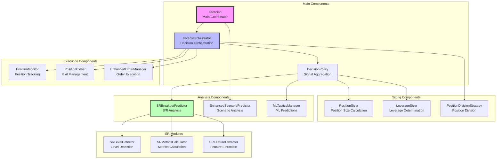
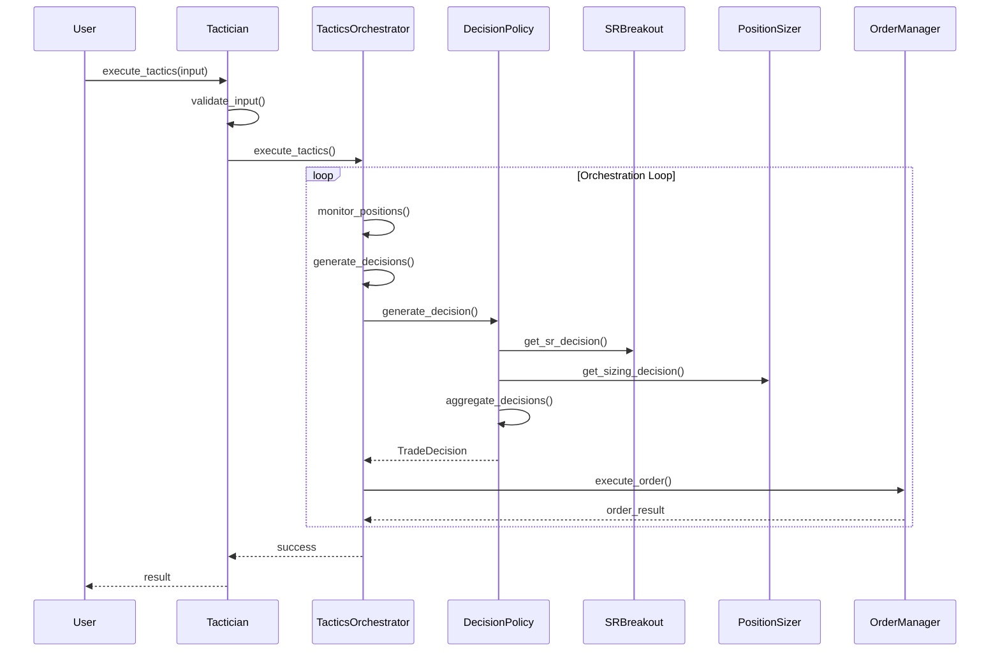

# Tactician Architecture Documentation

## Overview

The Tactician module is responsible for executing trading tactics based on market analysis, ML predictions, and support/resistance levels. It follows a modular architecture with clear separation of concerns.

## Component Architecture



## Data Flow



## Component Responsibilities

### 1. **Tactician** (Main Coordinator)
- Entry point for tactics execution
- Component initialization and lifecycle management
- Configuration management
- Performance tracking

### 2. **TacticsOrchestrator**
- Orchestrates the tactics execution loop
- Monitors existing positions
- Generates new trade decisions
- Coordinates order execution

### 3. **DecisionPolicy**
- Aggregates signals from multiple sources
- Applies decision thresholds
- Creates unified trade decisions
- Provides audit metadata

### 4. **SRBreakoutPredictor** (Refactored)
- Detects support/resistance levels
- Predicts breakout probabilities
- Extracts ML features
- Now uses modular sub-components:
  - **SRLevelDetector**: Detects S/R levels using multiple methods
  - **SRMetricsCalculator**: Calculates comprehensive metrics
  - **SRFeatureExtractor**: Extracts ML features

### 5. **PositionSizer**
- Calculates appropriate position sizes
- Considers confidence levels
- Applies risk management rules
- Handles portfolio constraints

### 6. **LeverageSizer**
- Determines optimal leverage
- Considers market volatility
- Applies safety limits
- Adjusts for confidence

### 7. **EnhancedScenarioPredictor**
- Predicts multiple market scenarios
- Calculates probabilities
- Provides confidence scores
- Uses fractal analysis

## Configuration Structure

```yaml
tactician:
  tactics_interval: 30
  max_history: 100
  enable_enhanced_predictions: true

tactics_orchestrator:
  decision_interval: 30
  confidence_threshold: 0.6
  risk_threshold: 0.1

sr_breakout_predictor:
  sr_proximity_threshold: 0.02
  breakout_confidence_threshold: 0.6
  sr_detection_method: "fractal"
  min_sr_strength: 0.3
  max_sr_levels: 10
  
position_sizer:
  base_position_size: 0.1
  max_position_size: 0.3
  confidence_multiplier: 1.5
  
leverage_sizer:
  max_leverage: 3.0
  base_leverage: 1.0
  confidence_threshold: 0.7
```

## Key Features

### 1. **Modular Architecture**
- Each component has a single responsibility
- Easy to test and maintain
- Components can be developed independently

### 2. **Async Design**
- Supports concurrent operations
- Non-blocking execution
- Better performance for I/O operations

### 3. **Error Handling**
- Comprehensive error decorators
- Graceful degradation
- Detailed logging

### 4. **Configuration-Driven**
- Behavior controlled by configuration
- Easy to tune without code changes
- Supports A/B testing

### 5. **Performance Tracking**
- Metrics collection
- Decision history
- Performance analysis

## Usage Example

```python
# Initialize tactician
config = load_config()
tactician = await setup_tactician(config)

# Prepare input
tactics_input = {
    "symbol": "BTC/USDT",
    "exchange": "binance",
    "timeframe": "1h",
    "current_price": 50000.0,
    "market_data": market_data_df,
    "analyst_predictions": {
        "confidence": 0.75,
        "barriers": {
            "upper": 51000.0,
            "lower": 49000.0
        }
    }
}

# Execute tactics
success = await tactician.execute_tactics(tactics_input)

# Get results
if success:
    results = tactician.tactics_results
    print(f"Decision: {results['decision']}")
    print(f"Position Size: {results['position_size']}")
    print(f"Leverage: {results['leverage']}")
```

## Best Practices

1. **Always initialize components** before use
2. **Validate input data** before processing
3. **Handle errors gracefully** - the system should degrade gracefully
4. **Use configuration** for tunable parameters
5. **Monitor performance** and adjust thresholds
6. **Test components** both individually and integrated
7. **Document changes** to maintain clarity

## Recent Improvements

### 1. **Code Cleanup**
- Fixed duplicate code blocks
- Completed TODO exception handlers
- Improved code organization

### 2. **Modularization**
- Broke up large files (sr_breakout_predictor.py)
- Created focused modules
- Improved maintainability

### 3. **Testing**
- Added comprehensive integration tests
- Cover edge cases
- Test concurrent operations

### 4. **Documentation**
- Created visual diagrams
- Documented component interactions
- Added usage examples

## Future Enhancements

1. **Machine Learning Integration**
   - Enhance ML model predictions
   - Add online learning capabilities
   - Improve feature engineering

2. **Performance Optimization**
   - Implement caching for S/R levels
   - Optimize computation-heavy operations
   - Add performance profiling

3. **Risk Management**
   - Enhanced portfolio-level risk controls
   - Dynamic position sizing based on volatility
   - Correlation-based adjustments

4. **Monitoring & Alerting**
   - Real-time performance dashboards
   - Alert system for anomalies
   - Detailed execution reports

## Troubleshooting

### Common Issues

1. **Component not initialized**
   - Ensure `initialize()` is called before use
   - Check configuration validity

2. **No S/R levels detected**
   - Verify market data quality
   - Check detection parameters
   - Ensure sufficient historical data

3. **Low confidence decisions**
   - Review threshold settings
   - Check data quality
   - Verify ML model performance

### Debug Tips

1. Enable detailed logging:
```python
import logging
logging.getLogger("Tactician").setLevel(logging.DEBUG)
```

2. Check component status:
```python
status = tactician.get_status()
print(json.dumps(status, indent=2))
```

3. Validate configuration:
```python
is_valid = tactician._validate_configuration()
```

## Conclusion

The Tactician module provides a robust, modular architecture for executing trading tactics. Its design emphasizes:
- **Separation of concerns** for maintainability
- **Flexibility** through configuration
- **Reliability** through error handling
- **Performance** through async operations
- **Clarity** through comprehensive documentation

The recent improvements have made the codebase more maintainable and easier to understand, setting a solid foundation for future enhancements.