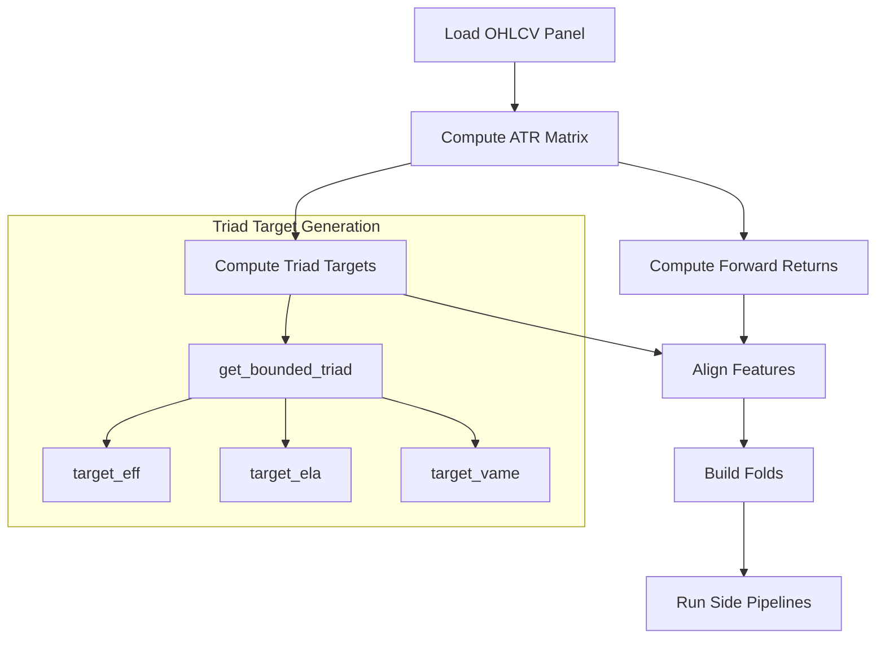
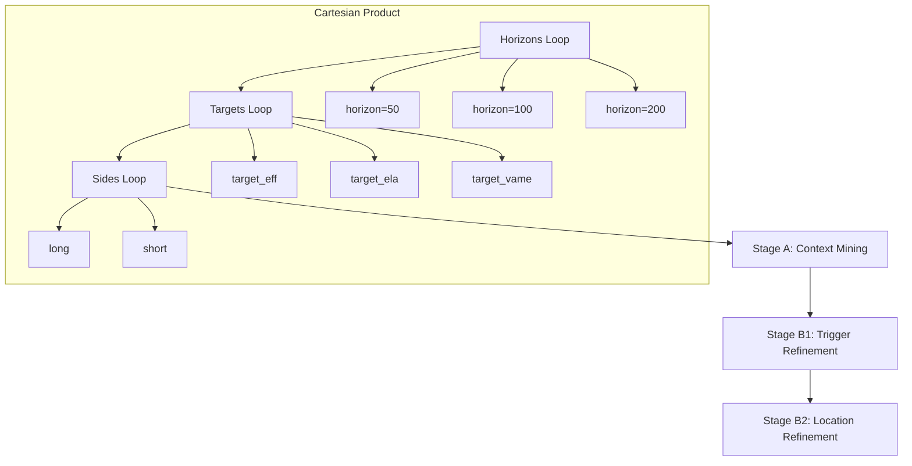

# Triad Target Integration Architecture

## Overview

This document describes the architecture for integrating the triad target system (`target_eff`, `target_ela`, `target_vame`) into [`lgbm_based_mask_generation.py`](lgbm_based_mask_generation.py).

The triad targets are bounded [0,1] metrics that capture different aspects of extreme price movements:
- **target_eff**: Efficiency - how efficiently price reaches extreme levels
- **target_ela**: Elasticity - price behavior elasticity at extremes  
- **target_vame**: Volume-adjusted momentum efficiency

---

## 1. Target Generation Module

### 1.1 Function Placement

Create a new module [`extreme_price_movements/triad_targets.py`](triad_targets.py) with the following functions:

```python
# triad_targets.py

from typing import Dict, Tuple
import numpy as np
import pandas as pd

@dataclass
class TriadTargetConfig:
    """Configuration for triad target generation."""
    horizon: int  # Forward horizon in bars
    atr_period: int = 14  # ATR lookback period
    
def get_bounded_triad(
    close: np.ndarray,      # Shape: (n_times, n_symbols)
    high: np.ndarray,       # Shape: (n_times, n_symbols)
    low: np.ndarray,        # Shape: (n_times, n_symbols)
    volume: np.ndarray,     # Shape: (n_times, n_symbols)
    atr: np.ndarray,        # Shape: (n_times, n_symbols)
    horizon: int,
    side: str = "long",     # "long" or "short"
) -> Dict[str, np.ndarray]:
    """
    Compute bounded triad targets in [0, 1] range.
    
    Returns:
        Dict with keys: 'target_eff', 'target_ela', 'target_vame'
        Each value is np.ndarray of shape (n_times, n_symbols) with dtype float32
    """
    ...

def compute_efficiency_target(
    close: np.ndarray,
    high: np.ndarray,
    low: np.ndarray,
    atr: np.ndarray,
    horizon: int,
    side: str,
) -> np.ndarray:
    """
    Efficiency: ratio of direct path to actual path traveled.
    For longs: close[t] to high[t+horizon], scaled by ATR.
    Bounded [0, 1] via sigmoid transformation.
    """
    ...

def compute_elasticity_target(
    close: np.ndarray,
    high: np.ndarray,
    low: np.ndarray,
    atr: np.ndarray,
    horizon: int,
    side: str,
) -> np.ndarray:
    """
    Elasticity: measure of price reversion tendency at extremes.
    Computed as 1 - (reversion_ratio), bounded [0, 1].
    """
    ...

def compute_vame_target(
    close: np.ndarray,
    volume: np.ndarray,
    atr: np.ndarray,
    horizon: int,
    side: str,
) -> np.ndarray:
    """
    Volume-Adjusted Momentum Efficiency.
    Combines price momentum with volume confirmation.
    Bounded [0, 1] via rank transformation.
    """
    ...
```

### 1.2 Integration with Existing Data Flow

The triad targets integrate at the same point as the current single vol-normalized return target in [`run_two_stage_lgbm_mask_generation()`](lgbm_based_mask_generation.py:5946):



**Modification Point**: Lines 8170-8190 in [`lgbm_based_mask_generation.py`](lgbm_based_mask_generation.py:8170)

```python
# EXISTING CODE (lines 8170-8181)
fwd_ret_start = time.perf_counter()
fwd_ret_matrix = fwd_ret_wide.reindex(
    index=common_idx, columns=common_syms
).to_numpy(dtype=np.float32)
target_signal = fwd_ret_matrix / np.maximum(np.sqrt(atr_pct_matrix), 1e-9)
fwd_ret_norm_matrix = fwd_ret_matrix / np.maximum(atr_pct_matrix, 1e-9)
fwd_ret_final = fwd_ret_matrix[time_idx, sym_idx]
fwd_ret_norm_final = fwd_ret_norm_matrix[time_idx, sym_idx]

# NEW CODE TO ADD
triad_targets = get_bounded_triad(
    close=close_wide,
    high=high_wide,
    low=low_wide,
    volume=volume_wide,  # Need to add volume extraction
    atr=atr_wide,
    horizon=int(cfg.get("triad_horizon", 100)),
    side="both",  # Compute for both sides
)
triad_targets_final = {
    k: v[time_idx, sym_idx] for k, v in triad_targets.items()
}
```

### 1.3 ATR Requirement Handling

ATR is already computed at lines 8144-8168. The triad targets will reuse this ATR matrix:

| Requirement | Current Implementation | Triad Integration |
|-------------|----------------------|-------------------|
| ATR Period | 14 (hardcoded) | Configurable via `cfg.get("atr_period", 14)` |
| ATR % Matrix | `atr_wide / close_wide` | Reuse for efficiency normalization |
| Per-Symbol | Yes | Yes, same shape |

---

## 2. Training Loop Modifications

### 2.1 New Outer Loop Structure

The main orchestrator [`run_two_stage_lgbm_mask_generation()`](lgbm_based_mask_generation.py:5946) needs a new outer loop:



**New Function Signature**:

```python
def run_two_stage_lgbm_mask_generation_triad(
    cfg: Dict[str, Any],
    root_output_dir: Path,
    horizons: List[int] = None,  # NEW: Default [50, 100, 200]
    targets: List[str] = None,   # NEW: Default ["target_eff", "target_ela", "target_vame"]
) -> Dict[str, Any]:
    """
    Main orchestrator with triad target support.
    
    Runs Cartesian product: horizons × targets × sides
    """
    horizons = horizons or cfg.get("triad_horizons", [50, 100, 200])
    targets = targets or cfg.get("triad_target_names", ["target_eff", "target_ela", "target_vame"])
    
    all_results = {}
    
    for horizon in horizons:
        for target_name in targets:
            # Extract target array for this horizon
            target_arr = triad_targets_final[f"{target_name}_h{horizon}"]
            
            for side in ["long", "short"]:
                side_target = target_arr if side == "long" else (1.0 - target_arr)
                
                result = run_side_pipeline_triad(
                    side=side,
                    target_name=target_name,
                    horizon=horizon,
                    data=data_final,
                    feature_dict=feat_final,
                    target=side_target,
                    cfg=cfg,
                    folds=folds,
                    root_output_dir=root_output_dir / f"h{horizon}" / target_name,
                )
                all_results[(horizon, target_name, side)] = result
    
    return merge_discovery_results(all_results)
```

### 2.2 Changes to `run_side_pipeline()` Signature

**Current Signature** (line 5578):
```python
def run_side_pipeline(
    side: str,
    data: pd.DataFrame,
    feature_dict: Dict[str, np.ndarray],
    fwd_ret: np.ndarray,
    fwd_ret_norm: np.ndarray,
    cfg: Dict[str, Any],
    folds: List[Tuple[np.ndarray, np.ndarray]],
    root_output_dir: Path,
) -> Dict[str, pd.DataFrame]:
```

**New Signature** (add optional triad parameters):
```python
def run_side_pipeline(
    side: str,
    data: pd.DataFrame,
    feature_dict: Dict[str, np.ndarray],
    fwd_ret: np.ndarray,
    fwd_ret_norm: np.ndarray,
    cfg: Dict[str, Any],
    folds: List[Tuple[np.ndarray, np.ndarray]],
    root_output_dir: Path,
    # NEW PARAMETERS
    target_name: str = "fwd_ret_norm",  # For provenance tracking
    horizon: int = 0,                    # For provenance tracking
    target_bounded: Optional[np.ndarray] = None,  # Triad target [0,1]
) -> Dict[str, pd.DataFrame]:
```

**Logic Change**:
```python
# Inside run_side_pipeline, use bounded target if provided
if target_bounded is not None:
    # For bounded targets, no need to negate for short side
    # The negation is handled at the orchestrator level
    y_train = target_bounded
    use_quantile_loss = False  # Switch to MSE/Huber for bounded targets
else:
    # Existing logic for vol-normalized returns
    side_fwd_ret = fwd_ret if side == "long" else -fwd_ret
    y_train = side_fwd_ret
    use_quantile_loss = True
```

### 2.3 HPO Integration Per Target/Horizon

The HPO module [`hpo_lgbm_regime_miner.py`](hpo_lgbm_regime_miner.py) needs target-aware extensions:

```python
# In hpo_lgbm_regime_miner.py

@dataclass
class TriadHPOConfig:
    """HPO config specific to triad targets."""
    target_name: str
    horizon: int
    alpha: float  # For quantile, or huber_alpha for huber loss
    min_gain_to_split: float
    min_leaf_frac: float

def run_triad_hpo_for_target_horizon(
    X: np.ndarray,
    y: np.ndarray,  # Bounded [0, 1]
    target_name: str,
    horizon: int,
    main_params: Dict[str, Any],
    seed: int = 42,
) -> Dict[str, Any]:
    """
    Run HPO for a specific target/horizon combination.
    
    For bounded targets, uses:
    - Huber loss instead of quantile loss
    - Different alpha grid (huber_alpha)
    - Target-specific early stopping
    """
    # Different search grids for different targets
    if target_name == "target_eff":
        huber_alpha_grid = (0.1, 0.5, 1.0, 2.0)
    elif target_name == "target_ela":
        huber_alpha_grid = (0.5, 1.0, 2.0, 5.0)
    else:  # target_vame
        huber_alpha_grid = (0.1, 0.3, 0.5, 1.0)
    
    # ... rest of HPO logic
```

**HPO Call Site** (in `run_side_pipeline`, around line 5622):
```python
if cfg.get("use_dynamic_hpo", False):
    tprint(f"--- DYNAMIC HPO: Tuning for {target_name} h{horizon} {side.upper()} ---")
    
    if target_bounded is not None:
        # Triad target HPO
        hpo_results = run_triad_hpo_for_target_horizon(
            X=X_a,
            y=target_bounded,
            target_name=target_name,
            horizon=horizon,
            main_params=hpo_main_params,
            seed=cfg.get("random_state", 42)
        )
    else:
        # Existing HPO for vol-normalized returns
        hpo_results = run_short_hpo_for_target_horizon(
            X=X_a,
            y=side_fwd_ret,
            main_params=hpo_main_params,
            seed=cfg.get("random_state", 42)
        )
```

---

## 3. Model Configuration

### 3.1 LightGBM Parameter Updates

For bounded [0,1] targets, the model configuration changes:

| Parameter | Vol-Normalized Returns | Triad Targets [0,1] |
|-----------|----------------------|---------------------|
| `objective` | `"quantile"` | `"huber"` or `"mse"` |
| `alpha` | 0.95 (long) / 0.05 (short) | N/A (use huber_alpha) |
| `huber_alpha` | N/A | 1.0 (configurable per target) |
| `metric` | `"quantile"` | `"mae"` or `"huber"` |
| `extra_trees` | `True` | `True` (unchanged) |
| `learning_rate` | 0.01-0.03 | 0.02-0.05 (slightly higher) |

**Implementation in [`InteractionModel.train_fold()`](lgbm_based_mask_generation.py:964)**:

```python
def train_fold(self, X_tr, y_tr, X_va, y_va, fold_id: int, seed: int):
    # ... existing validation code ...
    
    # NEW: Detect target type
    is_bounded_target = self.cfg.get("use_bounded_target", False)
    
    if is_bounded_target:
        # Huber loss for bounded [0,1] targets
        params = {
            "objective": "huber",
            "alpha": float(self.cfg.get("huber_alpha", 1.0)),
            "metric": "mae",
            "boosting_type": "gbdt",
            "max_depth": max_depth,
            "num_leaves": num_leaves,
            # ... rest of params
        }
    else:
        # Existing quantile loss for vol-normalized returns
        params = {
            "objective": "quantile",
            "alpha": alpha,
            "metric": "quantile",
            # ... existing params
        }
```

### 3.2 Per-Target Config Storage

Store per-target configurations in a structured format:

```python
# In config.py or as a new config file

TRIAD_TARGET_CONFIGS = {
    "target_eff": {
        "huber_alpha": 1.0,
        "learning_rate": 0.03,
        "min_support_pct": 0.05,
        "ic_hurdle": 0.02,
        "description": "Efficiency: direct vs actual path ratio",
    },
    "target_ela": {
        "huber_alpha": 2.0,
        "learning_rate": 0.02,
        "min_support_pct": 0.04,
        "ic_hurdle": 0.015,
        "description": "Elasticity: reversion tendency at extremes",
    },
    "target_vame": {
        "huber_alpha": 0.5,
        "learning_rate": 0.04,
        "min_support_pct": 0.06,
        "ic_hurdle": 0.025,
        "description": "Volume-adjusted momentum efficiency",
    },
}

HORIZON_CONFIGS = {
    50: {"min_data_in_leaf_multiplier": 1.0, "description": "Short-term"},
    100: {"min_data_in_leaf_multiplier": 1.5, "description": "Medium-term"},
    200: {"min_data_in_leaf_multiplier": 2.0, "description": "Long-term"},
}
```

---

## 4. Metrics System Extensions

### 4.1 New Metrics

Add the following metrics to [`RuleScorer`](lgbm_based_mask_generation.py:1791):

| Metric | Description | Computation |
|--------|-------------|-------------|
| `within_mask_ic` | IC computed only on masked samples | Spearman(mask, target) on mask=True samples |
| `delta_within_mask_ic` | Improvement over parent context | within_mask_ic - parent_within_mask_ic |
| `entropy_reduction` | Target entropy reduction in mask | H(global) - H(masked) / H(global) |
| `target_mean` | Mean target value in mask | np.mean(target[mask]) |
| `target_std` | Std target value in mask | np.std(target[mask]) |
| `target_calibration` | Predicted vs actual target | corr(pred, target) in mask |

### 4.2 Implementation in RuleScorer

**Extend [`score_key_oos()`](lgbm_based_mask_generation.py:1813)**:

```python
def score_key_oos(
    self,
    canonical_key: str,
    fwd_ret: np.ndarray,
    folds: List[Tuple[np.ndarray, np.ndarray]],
    resolver: Optional[Union[CanonicalRuleMaskResolver, DictionaryMaskResolver]] = None,
    require_uplift: bool = False,
    parent_context_key: Optional[str] = None,
    discovery_count: int = 0,
    n_instances: Optional[int] = None,
    pipeline_stage: Optional[str] = None,
    explicit_side: Optional[str] = None,
    # NEW PARAMETERS
    target_bounded: Optional[np.ndarray] = None,  # Triad target [0,1]
    target_name: str = "fwd_ret_norm",
    horizon: int = 0,
) -> Tuple[Dict[str, Any], List[Dict[str, Any]]]:
    # ... existing code ...
    
    # NEW: Compute within-mask metrics for bounded targets
    if target_bounded is not None:
        within_mask_ic = np.nan
        entropy_reduction = np.nan
        
        for fold_id, (_, va_idx) in enumerate(folds):
            y_va = target_bounded[va_idx]
            mask = resolver.get_mask(canonical_key, va_idx)
            
            if mask.sum() >= 10:
                # Within-mask IC
                y_masked = y_va[mask]
                pred_masked = y_va  # Or use model predictions if available
                
                # Entropy reduction
                global_entropy = self._compute_entropy(y_va[np.isfinite(y_va)])
                mask_entropy = self._compute_entropy(y_masked[np.isfinite(y_masked)])
                entropy_reduction = 1.0 - (mask_entropy / max(global_entropy, 1e-9))
                
                # Within-mask IC (correlation of mask indicator with target)
                mask_indicator = mask.astype(np.float32)
                valid_idx = np.isfinite(y_va)
                if valid_idx.sum() >= 10:
                    within_mask_ic = _safe_spearman(mask_indicator[valid_idx], y_va[valid_idx])
                
                fold_records[-1]["within_mask_ic"] = within_mask_ic
                fold_records[-1]["entropy_reduction"] = entropy_reduction
                fold_records[-1]["target_mean"] = float(np.nanmean(y_masked))
                fold_records[-1]["target_std"] = float(np.nanstd(y_masked))
```

### 4.3 Target-Quality Summary Table Schema

```python
# New schema for target quality summary

TARGET_QUALITY_SUMMARY_COLUMNS = [
    # Identification
    "target_name",
    "horizon",
    "side",
    
    # IC Distribution
    "mean_oos_ic",
    "std_oos_ic",
    "p25_oos_ic",
    "p50_oos_ic",
    "p75_oos_ic",
    "positive_ic_fraction",
    
    # Within-Mask Metrics
    "mean_within_mask_ic",
    "std_within_mask_ic",
    "mean_delta_within_mask_ic",
    
    # Entropy
    "mean_entropy_reduction",
    "std_entropy_reduction",
    
    # Support
    "mean_support_pct",
    "total_rules_discovered",
    "accepted_rules",
    
    # Calibration
    "mean_target_calibration",
    
    # Timestamps
    "run_timestamp",
]

def compute_target_quality_summary(
    all_results: Dict[Tuple[int, str, str], Dict[str, Any]],
) -> pd.DataFrame:
    """
    Aggregate metrics across all target/horizon/side combinations.
    """
    rows = []
    for (horizon, target_name, side), result in all_results.items():
        registry = result.get("accepted_registry", pd.DataFrame())
        if registry.empty:
            continue
            
        row = {
            "target_name": target_name,
            "horizon": horizon,
            "side": side,
            "mean_oos_ic": registry["mean_oos_ic"].mean(),
            "std_oos_ic": registry["mean_oos_ic"].std(),
            "p25_oos_ic": registry["p25_oos_ic"].mean(),
            "p50_oos_ic": registry["p50_oos_ic"].mean(),
            "p75_oos_ic": registry["p75_oos_ic"].mean(),
            "positive_ic_fraction": (registry["mean_oos_ic"] > 0).mean(),
            "mean_within_mask_ic": registry.get("within_mask_ic", pd.Series([np.nan])).mean(),
            "mean_entropy_reduction": registry.get("entropy_reduction", pd.Series([np.nan])).mean(),
            "mean_support_pct": registry["mean_support_pct"].mean(),
            "total_rules_discovered": len(registry),
            "accepted_rules": (registry["accepted"] == True).sum(),
            "run_timestamp": pd.Timestamp.now().isoformat(),
        }
        rows.append(row)
    
    return pd.DataFrame(rows)
```

---

## 5. Output Structure

### 5.1 New Directory Layout

```
{root_output_dir}/
├── run_metadata.json
├── target_quality_summary.csv          # NEW: Cross-target comparison
├── merged_discovery_table.csv          # NEW: All rules with provenance
│
├── h50/                                # NEW: Horizon directory
│   ├── target_eff/
│   │   ├── long/
│   │   │   ├── stage_a_context/
│   │   │   │   ├── accepted_registry.csv
│   │   │   │   ├── fold_*.json
│   │   │   │   └── interaction_constraint_summary.json
│   │   │   ├── stage_b_trigger_refinement/
│   │   │   ├── stage_b_location_refinement/
│   │   │   └── side_metrics.json
│   │   └── short/
│   │       └── ...
│   ├── target_ela/
│   │   └── ...
│   └── target_vame/
│       └── ...
│
├── h100/                               # Horizon 100
│   └── ...
│
├── h200/                               # Horizon 200
│   └── ...
│
└── legacy/                             # Backward compat: single target mode
    ├── long/
    └── short/
```

### 5.2 Merged Discovery Table Schema

```python
MERGED_DISCOVERY_TABLE_COLUMNS = [
    # Existing SCORER_REGISTRY_COLUMNS
    *SCORER_REGISTRY_COLUMNS,
    
    # NEW: Provenance fields
    "target_name",       # "target_eff", "target_ela", "target_vame", or "fwd_ret_norm"
    "horizon",           # 50, 100, 200, etc.
    "target_type",       # "triad" or "legacy"
    
    # NEW: Target-specific metrics
    "within_mask_ic",
    "delta_within_mask_ic",
    "entropy_reduction",
    "target_mean",
    "target_std",
    
    # NEW: Composite scoring
    "triad_composite_score",  # Weighted combination across targets
]

def merge_discovery_results(
    all_results: Dict[Tuple[int, str, str], Dict[str, Any]],
) -> pd.DataFrame:
    """
    Merge all discovery results into a single table with provenance.
    """
    merged_dfs = []
    
    for (horizon, target_name, side), result in all_results.items():
        registry = result.get("accepted_registry", pd.DataFrame()).copy()
        if registry.empty:
            continue
        
        # Add provenance columns
        registry["target_name"] = target_name
        registry["horizon"] = horizon
        registry["target_type"] = "triad" if target_name.startswith("target_") else "legacy"
        
        merged_dfs.append(registry)
    
    if not merged_dfs:
        return pd.DataFrame(columns=MERGED_DISCOVERY_TABLE_COLUMNS)
    
    merged = pd.concat(merged_dfs, ignore_index=True)
    
    # Compute triad composite score if multiple targets present
    if merged["target_name"].nunique() > 1:
        merged = compute_triad_composite_score(merged)
    
    return merged
```

### 5.3 Target-Quality Summary Table Schema

Stored at `{root_output_dir}/target_quality_summary.csv`:

| Column | Type | Description |
|--------|------|-------------|
| `target_name` | str | Target identifier |
| `horizon` | int | Forward horizon in bars |
| `side` | str | "long" or "short" |
| `mean_oos_ic` | float | Mean OOS IC across rules |
| `std_oos_ic` | float | Std of OOS IC |
| `p25_oos_ic` | float | 25th percentile IC |
| `p50_oos_ic` | float | Median IC |
| `p75_oos_ic` | float | 75th percentile IC |
| `positive_ic_fraction` | float | Fraction of rules with IC > 0 |
| `mean_within_mask_ic` | float | Mean within-mask IC |
| `mean_delta_within_mask_ic` | float | Mean improvement over parent |
| `mean_entropy_reduction` | float | Mean entropy reduction |
| `mean_support_pct` | float | Mean support percentage |
| `total_rules_discovered` | int | Total rules before filtering |
| `accepted_rules` | int | Rules passing all hurdles |
| `mean_target_calibration` | float | Predicted vs actual correlation |
| `run_timestamp` | str | ISO timestamp |

---

## 6. Implementation Phases

### Phase 1: Target Generation (Foundation)

**Deliverables**:
- [ ] Create [`extreme_price_movements/triad_targets.py`](triad_targets.py)
- [ ] Implement `get_bounded_triad()` with all three targets
- [ ] Add unit tests for target generation
- [ ] Validate targets are bounded [0, 1]

**Dependencies**: None

**Risk Areas**:
- ATR computation edge cases (NaN handling)
- Volume data availability
- Horizon alignment with existing features

**Mitigation**:
- Reuse existing ATR computation from lines 8144-8168
- Add volume extraction to data loading
- Comprehensive NaN/edge case testing

### Phase 2: Orchestrator Extension (Core Loop)

**Deliverables**:
- [ ] Add `run_two_stage_lgbm_mask_generation_triad()` function
- [ ] Implement horizon × target × side loop
- [ ] Add triad target extraction in data preparation
- [ ] Create output directory structure

**Dependencies**: Phase 1

**Risk Areas**:
- Memory usage with multiple target arrays
- Fold consistency across targets
- Output directory conflicts

**Mitigation**:
- Compute targets on-demand per horizon
- Reuse same fold structure across all targets
- Use hierarchical directory structure

### Phase 3: Model Configuration (Training)

**Deliverables**:
- [ ] Update `InteractionModel.train_fold()` for huber loss
- [ ] Add per-target config lookup
- [ ] Update HPO for bounded targets
- [ ] Store model configs per target/horizon

**Dependencies**: Phase 2

**Risk Areas**:
- Huber loss sensitivity to alpha parameter
- Different optimal parameters per target
- Early stopping behavior changes

**Mitigation**:
- Target-specific alpha grids in HPO
- Store best params per target from HPO runs
- Monitor early stopping rounds distribution

### Phase 4: Metrics Extensions (Evaluation)

**Deliverables**:
- [ ] Extend `RuleScorer.score_key_oos()` with new metrics
- [ ] Implement `within_mask_ic` computation
- [ ] Implement `entropy_reduction` computation
- [ ] Add target-quality summary aggregation

**Dependencies**: Phase 2, Phase 3

**Risk Areas**:
- Metric computation performance
- NaN propagation in aggregations
- Metric correlation with economic outcomes

**Mitigation**:
- Use numba for hot loops
- Explicit NaN handling at each aggregation
- Backtest metrics against TBM outcomes

### Phase 5: Output & Merging (Integration)

**Deliverables**:
- [ ] Implement merged discovery table generation
- [ ] Add provenance fields to all outputs
- [ ] Create target-quality summary table
- [ ] Update `MaskAssessor` for triad targets

**Dependencies**: Phase 4

**Risk Areas**:
- Rule deduplication across targets
- Provenance tracking consistency
- Backward compatibility

**Mitigation**:
- Use canonical keys with target prefix for dedup
- Centralized provenance helper functions
- Legacy mode flag for single-target runs

### Phase 6: Testing & Validation

**Deliverables**:
- [ ] Integration tests for full pipeline
- [ ] Validate target boundedness
- [ ] Cross-target correlation analysis
- [ ] Economic outcome validation

**Dependencies**: Phase 5

**Risk Areas**:
- Target correlation (triad collapse)
- Overfitting to specific targets
- Computational cost

**Mitigation**:
- Monitor cross-target IC correlation
- Hold-out validation for target selection
- Parallel execution where possible

---

## 7. Backward Compatibility

### 7.1 Legacy Mode

To maintain backward compatibility, add a configuration flag:

```python
# In config
cfg["use_triad_targets"] = False  # Default: legacy mode

# In orchestrator
if cfg.get("use_triad_targets", False):
    return run_two_stage_lgbm_mask_generation_triad(cfg, ...)
else:
    return run_two_stage_lgbm_mask_generation(cfg, ...)  # Existing function
```

### 7.2 Output Compatibility

Legacy mode outputs remain unchanged:
- Same directory structure
- Same CSV schemas
- Same metric names

Triad mode adds new directories and columns without modifying existing outputs.

---

## 8. Configuration Summary

```yaml
# triad_config.yaml

triad_targets:
  enabled: true
  names: ["target_eff", "target_ela", "target_vame"]
  horizons: [50, 100, 200]
  
  target_eff:
    huber_alpha: 1.0
    learning_rate: 0.03
    min_support_pct: 0.05
    ic_hurdle: 0.02
    
  target_ela:
    huber_alpha: 2.0
    learning_rate: 0.02
    min_support_pct: 0.04
    ic_hurdle: 0.015
    
  target_vame:
    huber_alpha: 0.5
    learning_rate: 0.04
    min_support_pct: 0.06
    ic_hurdle: 0.025

hpo:
  enabled: true
  subsample_frac: 0.30
  max_boost_rounds: 200
  
metrics:
  compute_within_mask_ic: true
  compute_entropy_reduction: true
  compute_target_calibration: true
  
output:
  merge_discovery_table: true
  target_quality_summary: true
  provenance_tracking: true
```

---

## 9. Summary

This architecture provides:

1. **Minimal Invasive Changes**: New functions and optional parameters rather than rewrites
2. **Preserved Semantics**: Rule generation logic unchanged, only targets differ
3. **Backward Compatibility**: Legacy mode flag maintains existing behavior
4. **No 4th Target**: Strictly three targets: `target_eff`, `target_ela`, `target_vame`
5. **Per-Target HPO**: Cartesian product of horizons × targets with independent optimization
6. **Rich Metrics**: New target-quality metrics for better rule evaluation
7. **Merged Output**: Unified discovery table with full provenance

The implementation follows a phased approach with clear dependencies and risk mitigation strategies.
