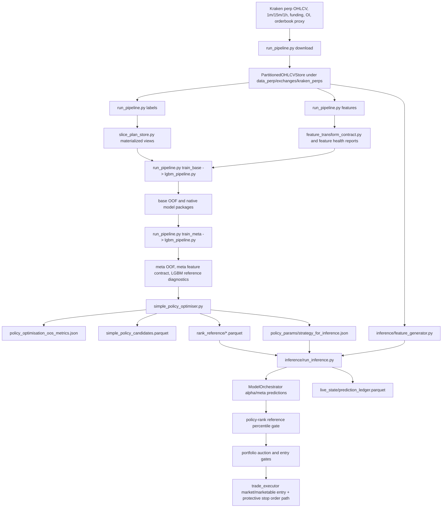

# Extreme Price Movements Pipeline Map

Status: initial repository-verified map, 2026-06-01.

## Active Scope

Current target run family:

- Market/exchange: Kraken perps.
- Data root: `data_perp`.
- Training artifact source: `20260523_015947`.
- Live/policy run: `20260525_010004_nopenalty`.
- Model backend: `lgbm_pipeline`.
- Regime adaptors are intentionally disabled for the monitored run.

## Data Flow

## Training And OOS Contract

`run_pipeline.py` is the principal CLI entrypoint. For the current run, the relevant modes are:

- `download`: populates scoped exchange data and can be parallelized by symbol partition.
- `labels`: creates label artifacts for the active runtime horizons.
- `features`: writes feature frames and feature health metadata.
- `train_base`: runs base model training. With `EPM_MODEL_BACKEND=lgbm_pipeline`, this calls the LGBM stack.
- `train_meta`: trains meta heads, writes `meta_oof`, `meta_feature_contract.json`, and LGBM reference diagnostics.
- `policy_optimiser`: legacy policy optimiser path.
- `optimise`: older TPSL/optimise path.

The simple policy deployment path is implemented separately by `simple_policy_optimiser.py`. It consumes meta OOF or full-fit inference predictions on the policy slice, builds delayed-entry execution paths, discovers rank thresholds, runs Stage B policy CV, persists per-strategy policy rank reference distributions, writes the portfolio candidate table, and exports deployment policy contracts.

## Rank-Normalization Contract

The live deployment gate is not a raw probability threshold. The intended contract is:

1. `simple_policy_optimiser.py` obtains the meta head score in column `clf`.
2. It passes the score through the legacy score-transform helper, but the downstream decision is based on score rank percentiles.
3. It computes `rank_pct` from the transformed score over the full policy OOS population.
4. It persists the exact policy-rank population in `simple_policy_optimiser/rank_reference/*.parquet`.
5. Live inference maps each current score into that saved policy-rank CDF using `PolicyRankReferenceStore`.
6. The live gate uses `policy_rank_reference_percentile`, then the cross-strategy auction can use `normalized_rank_score` / `auction_rank_pct`.

Important naming note: the code still contains legacy score-transform identifiers. The investigation must treat these as implementation details and verify the actual artifact behavior before renaming runtime columns.

## Live Inference Contract

`extreme_price_movements/inference/run_inference.py` is the live loop. Key stages:

- Load trained symbol universe and model bundle.
- Load selected deployment strategies and rank thresholds from policy artifacts.
- Compute candidate masks on the latest closed hourly bar.
- Compute the shared feature matrix through `inference/feature_generator.py`.
- Score candidates with `ModelOrchestrator`.
- Attach policy-rank percentile and auction rank fields from saved references.
- Apply rank, EV, liquidity, stale-data, adverse-hourly-close, and portfolio gates.
- Log candidate and execution diagnostics to `live_state/prediction_ledger.parquet`.
- Enter using the live execution path and maintain protective stop orders.

The code contains marketable limit-price handling (`marketable_limit_price`, `entry_limit_price`) as an execution safety wrapper. The investigation should reconcile this with the operating assumption that the strategy uses market/stop execution semantics, not passive limit-order assumptions.

## Existing Parity/Replay Assets

Useful existing guardrails:

- `tests/test_policy_rank_reference.py`: verifies live gate uses saved policy rank percentiles and fails closed when rank references are missing.
- `tests/test_live_feature_universe_parity.py`: verifies model features are computed on the full tradable universe and stale live-sensitive orderbook features are not forward-filled.
- `tests/test_replay_live_signal_predictions.py`: verifies replay helpers can filter ledger decisions by rank source and detect prediction/rank mismatches.
- `scripts/historical_inference_parity.py`: samples historical OOS rows and replays inference feature/model scoring against training artifacts.
- `scripts/replay_live_signal_predictions.py`: replays recent live decisions from the ledger.

## First Verification Targets

1. Confirm whether any legacy score-transform artifact is absent or behaviorally bypassed for the active run. If present, quantify whether it materially changes score ordering before rank-normalization.
2. Re-run historical inference parity on sampled policy rank-reference rows for all four deployed strategies.
3. Compare live ledger `policy_rank_pct`, `auction_rank_pct`, raw/meta predictions, and saved feature dumps against recomputation at identical symbol/timestamp rows.
4. Reconcile simple policy OOS delayed-entry assumptions against live `decision_to_entry_seconds`, `signal_to_entry_seconds`, `expected_total_entry_friction_bps`, and realized entry/exit logs.
5. Check whether live market/stop execution data is rich enough to tune spread, slippage, and stop-fill assumptions.
