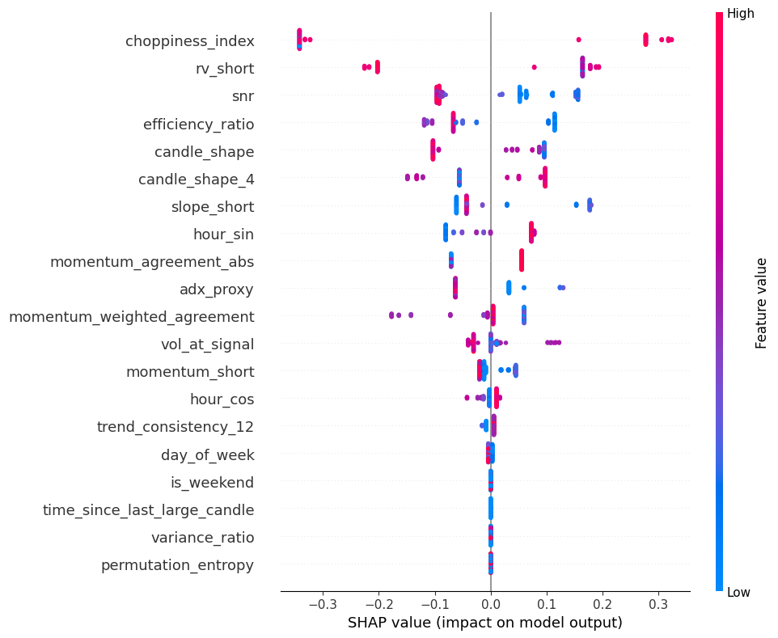

# Layer3 Report
- timestamp: 20251219_163704
- symbol:
- timeframe:
- n_rows_input: 100
- n_rows_after_target_dropna: 100
- n_base_models: 0
- winner_scheme: S1_L1
- winner_score: -999.0
- winning_target: standard
- winning_objective: classifier

## Winner Metrics (OOF)
- Log Loss: nan
- AUC: nan
- PR AUC: nan
- IC: nan
- ECE: nan
- MCE: nan
- Brier: nan

## Honest Holdout Metrics (Forward Tail)
- n_train: 0
- n_holdout: 0
- honest_auc: nan
- honest_pr_auc: nan
- honest_logloss: nan
- honest_ece: nan
- honest_brier: nan
- honest_temperature: nan
- honest_prob_clip_low: nan
- honest_prob_clip_high: nan

## Weighting Scheme Comparison
| Scheme | Score | AUC | PR_AUC | LogLoss | ECE | Top30_TPD | Top30_Win | Rating |
| --- | --- | --- | --- | --- | --- | --- | --- | --- |
| S1_L1 | -999 | 0 | nan | 99 | 99 | nan | nan | Failed |
| S2_L1_L2 | -999 | 0 | nan | 99 | 99 | nan | nan | Failed |
| S3_L2 | -999 | 0 | nan | 99 | 99 | nan | nan | Failed |

## SHAP Feature Importance (Global)

### Top 20 Features
| Feature | Mean |SHAP| |
| --- | --- |
| choppiness_index | 0.314450 |
| rv_short | 0.180713 |
| snr | 0.092102 |
| efficiency_ratio | 0.090712 |
| candle_shape | 0.090494 |
| candle_shape_4 | 0.086242 |
| slope_short | 0.080928 |
| hour_sin | 0.066545 |
| momentum_agreement_abs | 0.061732 |
| adx_proxy | 0.057302 |
| momentum_weighted_agreement | 0.047592 |
| vol_at_signal | 0.027883 |
| momentum_short | 0.023034 |
| hour_cos | 0.010032 |
| trend_consistency_12 | 0.006841 |
| day_of_week | 0.003603 |
| ensemble_prob | 0.000000 |
| volatility_risk_ratio | 0.000000 |
| logit_momentum_1 | 0.000000 |
| logit_momentum_5 | 0.000000 |
