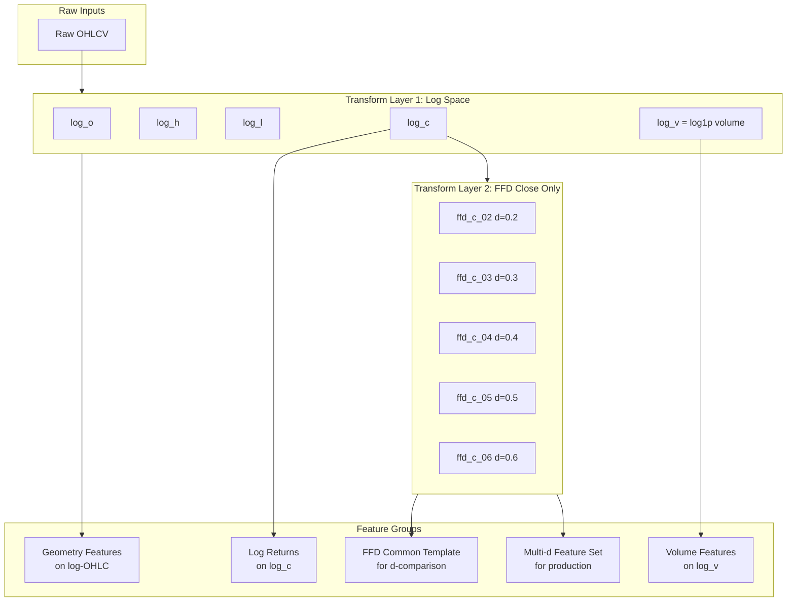

# Complete Feature Transformation Remediation Plan

## Executive Summary

This plan addresses three critical (P0) issues in the current feature transformation pipeline:

1. **FFD on OHLC geometry** - FFD destroys bar geometry; range/gap/ATR must be computed on log-OHLC
2. **ADF-based d selection leakage** - ADF test on full history leaks future information
3. **Misnamed returns** - FFD values are not returns; need proper naming conventions

The remediation introduces a multi-d FFD approach with a **lightweight d comparison protocol** (no full pipeline retrain), memory management, and computation optimizations.

---

## Architecture Overview



---

## P0 Fixes: Core Transformations

| Fix | Current (Broken) | Proposed (Fixed) |
|-----|------------------|------------------|
| **FFD scope** | FFD on O, H, L, C | FFD only on close |
| **FFD d selection** | ADF per symbol on full history (leakage) | Fixed d values: 0.2, 0.3, 0.4, 0.5, 0.6 |
| **ATR** | `atr_pct` on FFD prices | `atr_ln` on log-OHLC |
| **Range** | `range_pct = FFD_H - FFD_L` | `range_ln = log_H - log_L` |
| **Gap** | `gap_pct = FFD_O - FFD_C_prev` | `gap_ln = log_O - log_C.shift(1)` |
| **Returns** | `ret1h = FFD_C` (wrong) | `lr_1h = log_C.diff(1)` |

---

## Lightweight d Comparison Protocol (No Full Pipeline)

### Goal

Compare d values **without running the whole pipeline**. This is a diagnostic tool to understand which d helps for your strategy regime.

### Corrected Implementation

```python
from sklearn.linear_model import Ridge

def lightweight_d_comparison(
    panel, 
    target, 
    d_values=[0.2, 0.3, 0.4, 0.5, 0.6], 
    n_folds=5, 
    label_horizon=24,
    ridge_alpha=1.0
):
    """
    Lightweight d comparison without running the full pipeline.
    
    Uses a 2-feature Ridge probe on the template features to get a single
    "template-as-a-block" signal per d, which is more stable than averaging
    per-feature ICs.
    
    Args:
        panel: Dict with 'high', 'low', 'close' DataFrames
        target: DataFrame of labels (forward returns)
        d_values: List of FFD d values to compare
        n_folds: Number of CV folds
        label_horizon: Label horizon H (used for purge gap)
        ridge_alpha: Ridge regularization strength
    
    Returns:
        DataFrame with columns: asset, d, ic_overall, ic_overall_std, 
                                ic_event, ic_event_std, ic_ir_event,
                                ic_non_event, ic_non_event_std
    """
    results = []
    purge_gap = label_horizon  # Minimum safe purge = label horizon
    
    # 1. Compute atr_ln for event flag (on log-OHLC)
    log_h = safe_log(panel['high'])
    log_l = safe_log(panel['low'])
    log_c = safe_log(panel['close'])
    
    # True Range on log-OHLC (using pandas ops, not np.maximum)
    tr = (log_h - log_l).combine(
        (log_h - log_c.shift(1)).abs(), np.maximum
    ).combine(
        (log_l - log_c.shift(1)).abs(), np.maximum
    )
    atr_ln = ema(tr, span=14).clip(lower=1e-6)
    
    # 2. Compute max warmup across all d (use once for all d)
    warmup_max = max(len(get_weights_ffd(d, 1e-5)) - 1 for d in d_values)
    
    # 3. For each asset
    for asset in panel['close'].columns:
        # Event flag per asset (corrected formula)
        range_over_atr = (log_h[asset] - log_l[asset]) / atr_ln[asset]
        event_flag = (
            (atr_ln[asset] > atr_ln[asset].quantile(0.8)) | 
            (range_over_atr > range_over_atr.quantile(0.9))
        )
        
        # Drop warmup region once (same for all d)
        log_c_asset = log_c[asset].iloc[warmup_max:]
        target_asset = target[asset].iloc[warmup_max:]
        event_flag_clean = event_flag.iloc[warmup_max:]
        
        # Drop NaN targets (forward horizon creates NaNs at end)
        mask = ~target_asset.isna()
        target_asset = target_asset[mask]
        event_flag_clean = event_flag_clean[mask]
        
        # 4. For each d, compute template features and measure IC
        for d in d_values:
            # Compute FFD on log close
            ffd_c = frac_diff_ffd(log_c_asset, d=d)
            
            # Template features (minimal set)
            template = {
                f'ffd_diff_1_d{d}': ffd_c.diff(1),
                f'ffd_diff_4_d{d}': ffd_c.diff(4),
            }
            template_df = pd.DataFrame(template)
            
            # Align with target (drop NaNs from diff)
            template_df = template_df.loc[target_asset.index]
            
            # Purged CV with Ridge probe
            (ic_overall, ic_overall_std, 
             ic_event, ic_event_std, 
             ic_non_event, ic_non_event_std) = purged_cv_ridge_probe(
                template_df, target_asset, event_flag_clean, 
                n_folds, purge_gap, ridge_alpha
            )
            
            results.append({
                'asset': asset,
                'd': d,
                'ic_overall': ic_overall,
                'ic_overall_std': ic_overall_std,
                'ic_event': ic_event,
                'ic_event_std': ic_event_std,
                'ic_ir_event': ic_event / (ic_event_std + 1e-9),
                'ic_non_event': ic_non_event,
                'ic_non_event_std': ic_non_event_std,
            })
    
    return pd.DataFrame(results)

import numpy as np
import pandas as pd
from scipy.stats import spearmanr
from sklearn.linear_model import Ridge

# You provide these (from your codebase)
# - frac_diff_ffd(series: pd.Series, d: float) -> pd.Series
# - get_weights_ffd(d: float, thres: float) -> np.ndarray
# - ema(series: pd.Series, span: int) -> pd.Series

def safe_log_df(df: pd.DataFrame, eps: float = 1e-9) -> pd.DataFrame:
    """Safe log for strictly-positive series (prices). Clips to eps."""
    return np.log(df.clip(lower=eps))

def compute_atr_ln_from_log_ohlc(log_h: pd.DataFrame, log_l: pd.DataFrame, log_c: pd.DataFrame, span: int = 14) -> pd.DataFrame:
    """ATR on log-OHLC (true range in log units)."""
    hl = log_h - log_l
    hc = (log_h - log_c.shift(1)).abs()
    lc = (log_l - log_c.shift(1)).abs()
    tr = hl.combine(hc, np.maximum).combine(lc, np.maximum)
    atr_ln = tr.apply(lambda s: ema(s, span=span), axis=0)
    return atr_ln

def _zscore_train_apply(train_X: pd.DataFrame, val_X: pd.DataFrame) -> tuple[pd.DataFrame, pd.DataFrame]:
    mu = train_X.mean(axis=0)
    sd = train_X.std(axis=0).replace(0.0, 1.0)
    return (train_X - mu) / sd, (val_X - mu) / sd

def purged_cv_ridge_probe(
    X: pd.DataFrame,
    y: pd.Series,
    event_score: pd.Series,
    n_folds: int,
    purge_gap: int,
    ridge_alpha: float,
    event_q_atr: float = 0.8,
    event_q_range_over_atr: float = 0.9,
    # event_score is a 2-col dataframe packed into a series via MultiIndex? no.
    # We will pass a dict in wrapper. Here event_score is already a boolean mask per fold via thresholds.
) -> dict:
    """
    Past-only, purged CV.
    Returns fold arrays + aggregates for overall/event/non-event.
    X,y,event_score must be aligned on the same index.
    """
    assert X.index.equals(y.index)
    assert X.index.equals(event_score.index)

    n = len(X)
    fold_size = n // n_folds

    ic_overall, ic_event, ic_nonevent = [], [], []

    for fold in range(n_folds):
        val_start = fold * fold_size
        val_end = n if fold == n_folds - 1 else min(val_start + fold_size, n)

        train_end = val_start - purge_gap
        if train_end <= 50:
            continue

        train_idx = slice(0, train_end)
        val_idx = slice(val_start, val_end)

        X_tr, y_tr = X.iloc[train_idx], y.iloc[train_idx]
        X_va, y_va = X.iloc[val_idx], y.iloc[val_idx]
        e_va = event_score.iloc[val_idx]

        # Drop NaNs in train
        tr_valid = ~X_tr.isna().any(axis=1) & ~y_tr.isna()
        X_tr, y_tr = X_tr.loc[tr_valid], y_tr.loc[tr_valid]
        if len(X_tr) < 50:
            continue

        # Standardize using train-only stats
        X_tr_z, X_va_z = _zscore_train_apply(X_tr, X_va)

        # Predict only on valid val rows (no NaNs)
        va_valid = ~X_va_z.isna().any(axis=1) & ~y_va.isna()
        if va_valid.sum() < 20:
            continue

        model = Ridge(alpha=ridge_alpha)
        model.fit(X_tr_z, y_tr)

        pred = pd.Series(np.nan, index=X_va_z.index, dtype=float)
        pred.loc[va_valid] = model.predict(X_va_z.loc[va_valid])

        # Overall IC
        m_all = va_valid & pred.notna()
        if m_all.sum() >= 20:
            ic_overall.append(spearmanr(pred[m_all], y_va[m_all])[0])

        # Event IC
        m_evt = m_all & e_va.astype(bool)
        if m_evt.sum() >= 20:
            ic_event.append(spearmanr(pred[m_evt], y_va[m_evt])[0])

        # Non-event IC
        m_ne = m_all & (~e_va.astype(bool))
        if m_ne.sum() >= 20:
            ic_nonevent.append(spearmanr(pred[m_ne], y_va[m_ne])[0])

    def _agg(arr):
        arr = np.asarray(arr, dtype=float)
        if arr.size == 0:
            return 0.0, 0.0
        return float(arr.mean()), float(arr.std(ddof=0) if arr.size > 1 else 0.0)

    o_mu, o_sd = _agg(ic_overall)
    e_mu, e_sd = _agg(ic_event)
    n_mu, n_sd = _agg(ic_nonevent)

    return {
        "ic_overall_folds": ic_overall,
        "ic_event_folds": ic_event,
        "ic_nonevent_folds": ic_nonevent,
        "ic_overall_mean": o_mu,
        "ic_overall_std": o_sd,
        "ic_event_mean": e_mu,
        "ic_event_std": e_sd,
        "ic_ir_event": (e_mu / (e_sd + 1e-9)) if e_sd > 0 else (np.inf if e_mu != 0 else 0.0),
        "ic_nonevent_mean": n_mu,
        "ic_nonevent_std": n_sd,
    }

def lightweight_d_comparison_ridge_probe(
    panel: dict,           # {'high': DF, 'low': DF, 'close': DF}
    target: pd.DataFrame,  # DF[asset] -> label aligned to time t
    d_values=(0.2, 0.3, 0.4, 0.5, 0.6),
    thres: float = 1e-5,
    n_folds: int = 5,
    label_horizon: int = 24,
    ridge_alpha: float = 1.0,
    use_common_warmup: bool = True,
    atr_span: int = 14,
) -> pd.DataFrame:
    """
    Lightweight d-comparison using:
      - 2-feature template per d: diff1, diff4 of FFD(log_close, d)
      - Ridge probe in purged, past-only CV
      - Event-conditioned IC computed with TRAIN-ONLY thresholds (fold-wise)

    Returns per-asset, per-d summary + fold arrays.
    """
    d_values = list(d_values)
    purge_gap = int(label_horizon)

    log_h = safe_log_df(panel["high"])
    log_l = safe_log_df(panel["low"])
    log_c = safe_log_df(panel["close"])

    atr_ln = compute_atr_ln_from_log_ohlc(log_h, log_l, log_c, span=atr_span).clip(lower=1e-6)
    range_over_atr = (log_h - log_l) / atr_ln

    # Warmup
    K = {d: len(get_weights_ffd(float(d), thres)) for d in d_values}
    warmup_max = max(K.values()) - 1

    out_rows = []

    for asset in log_c.columns:
        lc = log_c[asset]
        y = target[asset]

        # Common base index after warmup + dropping label NaNs
        base_start = warmup_max if use_common_warmup else 0
        lc = lc.iloc[base_start:]
        y = y.iloc[base_start:]

        # Drop NaN labels (forward horizon)
        m = ~y.isna()
        lc = lc[m]
        y = y[m]

        # Precompute regime inputs (aligned)
        atr_a = atr_ln[asset].reindex(lc.index)
        roa_a = range_over_atr[asset].reindex(lc.index)

        for d in d_values:
            # If per-d warmup, trim further
            if not use_common_warmup:
                w = (K[d] - 1)
                lc_d = lc.iloc[w:]
                y_d = y.iloc[w:]
                atr_d = atr_a.iloc[w:]
                roa_d = roa_a.iloc[w:]
            else:
                lc_d, y_d, atr_d, roa_d = lc, y, atr_a, roa_a

            if len(lc_d) < 500:
                continue

            ffd = frac_diff_ffd(lc_d, float(d))

            X = pd.DataFrame(
                {
                    f"ffd_diff_1_d{d}": ffd.diff(1),
                    f"ffd_diff_4_d{d}": ffd.diff(4),
                },
                index=lc_d.index,
            )

            # Align & drop rows where either X has NaNs or y is NaN (y already cleaned)
            idx = X.index.intersection(y_d.index)
            X = X.loc[idx]
            y_al = y_d.loc[idx]
            atr_al = atr_d.loc[idx]
            roa_al = roa_d.loc[idx]

            # Fold-wise event thresholds (train-only):
            # We'll build an event boolean series with the same index, but computed per fold.
            # Implementation trick: pass a placeholder series and recompute inside each fold by wrapping CV.
            # For simplicity, we compute a *global* boolean here only to keep signature,
            # but we overwrite per fold below by running a custom CV loop inline.

            n = len(X)
            fold_size = n // n_folds
            ic_overall, ic_event, ic_ne = [], [], []

            for fold in range(n_folds):
                val_start = fold * fold_size
                val_end = n if fold == n_folds - 1 else min(val_start + fold_size, n)

                train_end = val_start - purge_gap
                if train_end <= 50:
                    continue

                tr_idx = slice(0, train_end)
                va_idx = slice(val_start, val_end)

                X_tr, y_tr = X.iloc[tr_idx], y_al.iloc[tr_idx]
                X_va, y_va = X.iloc[va_idx], y_al.iloc[va_idx]
                atr_tr, atr_va = atr_al.iloc[tr_idx], atr_al.iloc[va_idx]
                roa_tr, roa_va = roa_al.iloc[tr_idx], roa_al.iloc[va_idx]

                tr_valid = ~X_tr.isna().any(axis=1) & ~y_tr.isna()
                X_tr, y_tr = X_tr.loc[tr_valid], y_tr.loc[tr_valid]
                atr_tr, roa_tr = atr_tr.loc[tr_valid], roa_tr.loc[tr_valid]
                if len(X_tr) < 50:
                    continue

                # Train-only event thresholds
                atr_thr = atr_tr.quantile(0.8)
                roa_thr = roa_tr.quantile(0.9)

                evt_va = (atr_va > atr_thr) | (roa_va > roa_thr)

                # Standardize train-only
                X_tr_z, X_va_z = _zscore_train_apply(X_tr, X_va)

                va_valid = ~X_va_z.isna().any(axis=1) & ~y_va.isna()
                if va_valid.sum() < 20:
                    continue

                model = Ridge(alpha=ridge_alpha)
                model.fit(X_tr_z, y_tr)

                pred = pd.Series(np.nan, index=X_va_z.index, dtype=float)
                pred.loc[va_valid] = model.predict(X_va_z.loc[va_valid])

                m_all = va_valid & pred.notna()
                if m_all.sum() >= 20:
                    ic_overall.append(spearmanr(pred[m_all], y_va[m_all])[0])

                m_evt = m_all & evt_va.astype(bool)
                if m_evt.sum() >= 20:
                    ic_event.append(spearmanr(pred[m_evt], y_va[m_evt])[0])

                m_nev = m_all & (~evt_va.astype(bool))
                if m_nev.sum() >= 20:
                    ic_ne.append(spearmanr(pred[m_nev], y_va[m_nev])[0])

            def agg(a):
                a = np.asarray(a, float)
                return (float(a.mean()), float(a.std(ddof=0) if a.size > 1 else 0.0)) if a.size else (0.0, 0.0)

            o_mu, o_sd = agg(ic_overall)
            e_mu, e_sd = agg(ic_event)
            n_mu, n_sd = agg(ic_ne)

            out_rows.append(
                {
                    "asset": asset,
                    "d": float(d),
                    "use_common_warmup": bool(use_common_warmup),
                    "warmup_bars_used": (warmup_max if use_common_warmup else (warmup_max + (K[d] - 1))),
                    "K_d": int(K[d]),
                    "ic_overall_mean": o_mu,
                    "ic_overall_std": o_sd,
                    "ic_event_mean": e_mu,
                    "ic_event_std": e_sd,
                    "ic_ir_event": (e_mu / (e_sd + 1e-9)) if e_sd > 0 else (np.inf if e_mu != 0 else 0.0),
                    "ic_nonevent_mean": n_mu,
                    "ic_nonevent_std": n_sd,
                    "ic_overall_folds": ic_overall,
                    "ic_event_folds": ic_event,
                    "ic_nonevent_folds": ic_ne,
                }
            )

    return pd.DataFrame(out_rows)
```

### Key Corrections Made

1. **Event flag formula** - Fixed precedence bug:
   ```python
   range_over_atr = (log_h[asset] - log_l[asset]) / atr_ln[asset]
   event_flag = (atr_ln[asset] > atr_ln[asset].quantile(0.8)) | (
       range_over_atr > range_over_atr.quantile(0.9)
   )
   ```

2. **NaN masks** - Now checks each feature column individually:
   ```python
   valid_mask = ~val_pred_series.isna() & ~val_target.isna()
   event_mask = valid_mask & val_event
   ```

3. **Purge gap** - Now matches label horizon:
   ```python
   purge_gap = label_horizon  # Minimum safe purge = label horizon
   ```

4. **Template score** - Uses Ridge probe instead of averaging per-feature ICs:
   ```python
   ridge = Ridge(alpha=ridge_alpha)
   ridge.fit(train_features_z, train_target)
   val_pred = ridge.predict(val_features_z)
   ic = spearmanr(val_pred, val_target)[0]
   ```

5. **Target NaN handling** - Drops NaN targets before CV:
   ```python
   mask = ~target_asset.isna()
   target_asset = target_asset[mask]
   ```

### Interpretation Guide

| Pattern | Interpretation |
|---------|----------------|
| IC_event >> IC_non_event | d helps in high-vol regime (your strategy target) |
| IC_event ~ IC_non_event | d works uniformly |
| IC_event << IC_non_event | d helps in calm markets (not your target) |
| IC_event ~ 0 for all d | FFD features don't predict your label |
| High d (0.5/0.6) IC ~ 0 | d too high, becomes return-like noise |
| Low d (0.2) IC_event high | Trend features help in events |

### Decision Rule

**Rank d by IC IR in event-only, not just overall.**

This gives you the "which d helps for my strategy regime" answer without retraining anything.

---

## Multi-d Complementarity

### Different Features Prefer Different d

Lower d versions tend to:
- Keep more slow structure
- Help trend/slope/context features

Higher d versions tend to:
- Emphasize fast moves
- Help impulse/mean-reversion (sometimes)
- Can become return-like noise at d >= 0.5

### How to Exploit Complementarity Without Exploding Feature Count

**Step 1: Build "families", not "everything x every d"**

For each feature family, pick 1-2 d's:
- Trend/slope: {0.2, 0.3}
- Momentum/impulse diffs: {0.3, 0.4, maybe 0.5}
- MR z-distance: {0.2, 0.3} (sometimes 0.4)

**Step 2: Measure incremental value of adding another d**

For a given base set (say d=0.3), add d=0.5 version and test:
- `Delta_IC` (overall and event-conditioned)
- `Delta_Sharpe` proxy
- Redundancy: `corr(feature_d03, feature_d05)`

If the new d is highly correlated with existing features and adds no OOS lift, drop it.

**Step 3: Let the model choose, but constrain it**

Ridge will blend complementary signals well, but only if you:
- Standardize (via CausalFeatureTransformer)
- Keep feature families interpretable
- Don't add 10 redundant versions per feature

---

## Safe Log Transform

**Critical**: Use safe log everywhere to handle zeros and missing values:

```python
def safe_log(x, eps=1e-9):
    """Safe logarithm that handles zeros and negative values."""
    return np.log(np.maximum(x, eps))

# Usage:
log_o = safe_log(o_raw)
log_h = safe_log(h_raw)
log_l = safe_log(l_raw)
log_c = safe_log(c_raw)
log_v = np.log1p(v_raw)  # log1p handles zeros naturally
```

This must be applied consistently in both unit tests and production.

---

## FFD d Parameter Analysis

### Measured Weight Window Size

The effective memory in fixed-width FFD is governed by the **threshold used to truncate weights**. For each d, we compute:

```
K(d) = number of weights until |w_k| < thres
```

**Implementation**: Use the actual `get_weights_ffd(d, thres=1e-5)` function to measure K(d):

```python
def compute_weight_window_sizes(d_values, thres=1e-5):
    """
    Compute actual weight window sizes for each d.
    
    Returns:
        Dict[d, K] where K is the number of weights used in convolution.
    """
    results = {}
    for d in d_values:
        weights = get_weights_ffd(d, thres)
        K = len(weights)
        results[d] = {
            'K': K,
            'compute_cost': f'O(N x {K})',
            'warmup_bars': K - 1,  # Bars before first valid output
        }
    return results
```

**Important**: K(d) is measured from `get_weights_ffd(d, thres)`. **Do not assume monotonicity**; validate empirically.

### Feature Assignment by d (Design Intent, Not Prescription)

| d | Feature Type | Rationale |
|---|--------------|-----------|
| **0.2** | Trend/Slope | Larger K may preserve longer memory for multi-day trends |
| **0.3** | MR Distance, EMA Distance | Medium K for swing trading signals |
| **0.4** | Short Momentum | Smaller K, stronger stationarity |
| **0.5** | Intraday Momentum | Very small K, very strong stationarity |
| **0.6** | Experimental | Smallest K, higher d tends to shorten effective memory; evaluate redundancy vs lr_1h empirically |

**Important**: The above assignments are design intent. The actual optimal d for each feature type will be determined by OOS evaluation. We do NOT bake "expected best d" into the plan.

### Default Triad

For a simpler default configuration, consider:
- **Primary**: d in {0.3, 0.4, 0.5} - covers swing to intraday
- **Extended**: d in {0.2, 0.6} - for experimentation only

---

## New Feature Set

### 1. Geometry Features (on log-OHLC, normalized by atr_ln)

| Feature Name | Definition | Normalized |
|--------------|------------|------------|
| `range_ln` | `log_H - log_L` | / atr_ln |
| `gap_ln` | `log_O - log_C.shift(1)` | / atr_ln |
| `body_ln` | `log_C - log_O` | / atr_ln |
| `upper_wick_ln` | `log_H - max(log_O, log_C)` | / atr_ln |
| `lower_wick_ln` | `min(log_O, log_C) - log_L` | / atr_ln |
| `atr_ln` | `EMA(TR on log-OHLC, 14)` | Raw (normalizer) |

**Critical**: Add floor to `atr_ln` before normalization:
```python
atr_ln = atr_ln.clip(lower=1e-6)  # Prevent division by zero
```

### 2. Log Returns (on log_c)

| Feature Name | Definition |
|--------------|------------|
| `lr_1h` | `log_C.diff(1)` |
| `lr_2h` | `log_C.diff(2)` |
| `lr_4h` | `log_C.diff(4)` |
| `lr_6h` | `log_C.diff(6)` |
| `lr_12h` | `log_C.diff(12)` |
| `lr_24h` | `log_C.diff(24)` |

### 3. FFD Common Template (for lightweight d-comparison)

**Purpose**: Isolate the effect of d by using the same feature definitions across all d values.

| Feature Name | Definition |
|--------------|------------|
| `ffd_diff_1_{d}` | `ffd_c_{d}.diff(1)` |
| `ffd_diff_4_{d}` | `ffd_c_{d}.diff(4)` |

**Standardization**: Features are z-scored using train-only stats within each fold. A Ridge probe is used to get a single "template-as-a-block" signal per d.

### 4. Multi-d Feature Set (for production)

After lightweight d-comparison validation, the production feature set includes:

**Trend/Slope Features (d=0.2, 0.3)**:
| Feature Name | Definition | d |
|--------------|------------|---|
| `ffd_slope_02_12` | `rolling_slope(ffd_c_02, 12)` | 0.2 |
| `ffd_slope_02_24` | `rolling_slope(ffd_c_02, 24)` | 0.2 |
| `ffd_slope_03_12` | `rolling_slope(ffd_c_03, 12)` | 0.3 |
| `ffd_slope_03_24` | `rolling_slope(ffd_c_03, 24)` | 0.3 |

**MR Distance Features (d=0.2, 0.3)** - Z-score only, drop raw distance:
| Feature Name | Definition | d |
|--------------|------------|---|
| `ffd_mr_z_02` | `(ffd_c_02 - rolling_mean) / rolling_std` | 0.2 |
| `ffd_mr_z_03` | `(ffd_c_03 - rolling_mean) / rolling_std` | 0.3 |

**Momentum Features (d=0.4, 0.5)**:
| Feature Name | Definition | d |
|--------------|------------|---|
| `ffd_d1_04` | `ffd_c_04.diff(1)` | 0.4 |
| `ffd_d4_04` | `ffd_c_04.diff(4)` | 0.4 |
| `ffd_d1_05` | `ffd_c_05.diff(1)` | 0.5 |
| `ffd_d4_05` | `ffd_c_05.diff(4)` | 0.5 |

**Experimental (d=0.6)** - Only if lightweight validation shows improvement:
| Feature Name | Definition | d |
|--------------|------------|---|
| `ffd_d1_06` | `ffd_c_06.diff(1)` | 0.6 |

---

## Compatibility Aliases

**Problem**: Old `range_pct`/`gap_pct` likely fed models expecting either raw-ish range in price units or normalized/scaled features. New `range_ln`/`gap_ln` are log units.

**Solution**: Preserve scale-invariance semantics by normalizing by `atr_ln`:

```python
# Minimum safe approach for one release:
# Old "pct" features were likely normalized, so preserve that semantics
feats["range_pct"] = feats["range_ln"] / feats["atr_ln"]
feats["gap_pct"] = feats["gap_ln"] / feats["atr_ln"]
feats["body_pct"] = feats["body_ln"] / feats["atr_ln"]

# Return aliases (direct mapping)
feats["ret1h"] = feats["lr_1h"]
feats["ret6h"] = feats["lr_6h"]
```

**Note**: Remove these aliases after one release once all consumers are updated.

---

## Warmup Handling in CV / Evaluation

FFD outputs are NaN (or invalid) for the first K-1 bars. This must be handled explicitly:

```python
def get_warmup_cutoff(d_values, thres=1e-5):
    """
    Get the maximum warmup bars needed across all d values.
    
    Returns:
        int: Number of bars to drop from the start of the series.
    """
    max_K = 0
    for d in d_values:
        weights = get_weights_ffd(d, thres)
        K = len(weights)
        max_K = max(max_K, K)
    return max_K - 1  # Warmup = K - 1 bars

def drop_warmup_region(features, labels, d_values, thres=1e-5):
    """
    Drop the warmup region before IC computation and CV splitting.
    
    This prevents fold-dependent NaN patterns from contaminating IC stats.
    """
    warmup = get_warmup_cutoff(d_values, thres)
    return features.iloc[warmup:], labels.iloc[warmup:]
```

**Important**: For d-comparison, use `warmup_max = max(K(d)) - 1` once for all d to ensure comparability. Also drop NaN targets (from forward horizon) before CV.

---

## Leakage Prevention Checklist

### Feature/Label Alignment

**Critical**: All features at time t must be computed using data <= t.

| Check | Specification |
|-------|---------------|
| **Decision time** | End of bar t (close time) |
| **Entry time** | Start of bar t+1 (open time) |
| **Feature data** | All inputs <= t |
| **Label horizon** | Returns from t+1 to t+H |
| **Purge gap** | = label_horizon (minimum safe) |

### Explicit Alignment Check

```python
def verify_feature_label_alignment(features, labels, label_horizon):
    """
    Verify that features and labels are properly aligned.
    
    Checks:
    1. feature_index equals label_index (same timestamps)
    2. Labels use future returns (not overlapping with feature data)
    """
    assert features.index.equals(labels.index), "Feature and label indices must match"
    
    # Labels should be forward returns
    # label[t] = return from t+1 to t+H
    # This means label[t] depends on prices from t+1 to t+H
    # Features[t] depends on data up to and including t
    # No overlap!
    
    print(f"Feature/label alignment verified")
    print(f"  Features at time t use data <= t")
    print(f"  Labels at time t use returns from t+1 to t+{label_horizon}")
```

---

## Memory Management

### Problem: Multiple FFD Series

Computing FFD for 5 d values x N assets creates memory pressure:

| Assets | d Values | Series | Memory (float32, 100K bars) |
|--------|----------|--------|-----------------------------|
| 10 | 5 | 50 | ~20 MB |
| 50 | 5 | 250 | ~100 MB |
| 100 | 5 | 500 | ~200 MB |

### Solution: Streaming Computation

```python
class FFDStreamProcessor:
    """
    Memory-efficient FFD computation with streaming.
    
    Key optimizations:
    1. Compute FFD on-demand, not all upfront
    2. Release memory after feature computation
    3. Use float32 throughout
    4. Shared weight cache for same d
    """
    
    def __init__(self, d_values=[0.2, 0.3, 0.4, 0.5, 0.6], thres=1e-5):
        self.d_values = d_values
        self.thres = thres
        self._weight_cache = {}  # d -> weights
    
    def compute_features_streaming(self, log_ohlc, panel):
        """
        Compute features with streaming FFD computation.
        """
        feats = {}
        
        # 1. Geometry features (no FFD needed)
        feats.update(self._compute_geometry(log_ohlc))
        
        # 2. Log returns (no FFD needed)
        feats.update(self._compute_log_returns(log_ohlc['close']))
        
        # 3. FFD features per d (streaming)
        for d in self.d_values:
            # Compute FFD for this d only
            ffd_c = self._compute_ffd(log_ohlc['close'], d)
            
            # Compute features for this d
            d_feats = self._compute_ffd_features(ffd_c, d)
            feats.update(d_feats)
            
            # Release FFD memory
            del ffd_c
            gc.collect()
        
        return pd.DataFrame(feats).astype(np.float32)
    
    def _compute_ffd(self, series, d):
        """Compute FFD with cached weights."""
        if d not in self._weight_cache:
            self._weight_cache[d] = get_weights_ffd(d, self.thres)
        weights = self._weight_cache[d]
        return _numba_apply_weights(series.values, weights)
```

### Memory Budget

| Component | Budget | Strategy |
|-----------|--------|----------|
| Raw OHLCV | 50 MB | Load once, release after log transform |
| Log OHLCV | 50 MB | Keep throughout (base for geometry) |
| FFD series | 20 MB | Compute on-demand, release after use |
| Features | 200 MB | Final output, float32 |
| **Total** | **~320 MB** | Per 100K bars x 50 assets |

---

## Computation Optimizations

### 1. Numba JIT Compilation

All core operations are already Numba-compiled:

| Function | Complexity | Status |
|----------|------------|--------|
| `frac_diff_ffd` | O(N x K) | Numba JIT |
| `rolling_mean` | O(N) | Numba JIT |
| `rolling_std` | O(N) | Numba JIT |
| `ewma` | O(N) | Numba JIT |
| `rolling_slope` | O(N x W) | Needs Numba |

### 2. Rolling Regression Slope (Corrected Implementation)

```python
@jit(nopython=True, cache=True)
def numba_rolling_slope(x: np.ndarray, window: int) -> np.ndarray:
    """
    Rolling regression slope: slope = cov(x, t) / var(t)
    
    For small windows (W=12, 24), O(N x W) is fast enough with Numba.
    """
    n = len(x)
    out = np.full(n, np.nan, dtype=np.float64)
    
    if window > n:
        return out
    
    # Pre-compute t statistics (constant for all windows)
    t = np.arange(window, dtype=np.float64)
    t_mean = t.mean()
    t_var = ((t - t_mean) ** 2).sum()
    
    for i in range(window - 1, n):
        x_window = x[i - window + 1 : i + 1]
        
        # Check for NaNs
        valid = True
        for j in range(window):
            if np.isnan(x_window[j]):
                valid = False
                break
        
        if not valid:
            continue
        
        # Compute slope
        x_mean = 0.0
        for j in range(window):
            x_mean += x_window[j]
        x_mean /= window
        
        cov_xt = 0.0
        for j in range(window):
            cov_xt += (x_window[j] - x_mean) * (t[j] - t_mean)
        
        out[i] = cov_xt / t_var
    
    return out
```

### 3. Weight Caching for FFD

```python
# Weights are deterministic per d - cache globally
_FFD_WEIGHT_CACHE = {}

def get_weights_ffd_cached(d: float, thres: float = 1e-5) -> np.ndarray:
    """Cached FFD weights - O(1) after first call."""
    key = (round(d, 4), thres)
    if key not in _FFD_WEIGHT_CACHE:
        _FFD_WEIGHT_CACHE[key] = get_weights_ffd(d, thres)
    return _FFD_WEIGHT_CACHE[key]
```

### 4. Parallelism Strategy

**DO NOT** parallelize by d-values (may hurt due to memory bandwidth contention).

**DO** parallelize by asset batches:

```python
def compute_features_batch(panel, cfg, batch_size=10):
    """
    Process assets in batches to balance memory and computation.
    """
    assets = list(panel['close'].columns)
    n_batches = (len(assets) + batch_size - 1) // batch_size
    
    all_features = []
    
    for batch_idx in range(n_batches):
        start = batch_idx * batch_size
        end = min(start + batch_size, len(assets))
        batch_assets = assets[start:end]
        
        batch_panel = {
            'open': panel['open'][batch_assets],
            'high': panel['high'][batch_assets],
            'low': panel['low'][batch_assets],
            'close': panel['close'][batch_assets],
            'volume': panel['volume'][batch_assets],
        }
        
        batch_feats = compute_features_single(batch_panel, cfg)
        all_features.append(batch_feats)
        
        del batch_panel, batch_feats
        gc.collect()
    
    return pd.concat(all_features, axis=1)
```

---

## Config Changes

```python
# config.py additions
CFG["ffd_d_values"] = [0.2, 0.3, 0.4, 0.5, 0.6]  # All d values to compute
CFG["ffd_d_default"] = [0.3, 0.4, 0.5]           # Default triad
CFG["ffd_thres"] = 1e-5                          # Weight truncation threshold
CFG["ffd_mr_window"] = 24                        # Mean-reversion window (bars)
CFG["ffd_slope_windows"] = [12, 24]              # Slope horizons
CFG["ffd_ema_span"] = 24                         # EMA span for distance features
CFG["atr_ln_floor"] = 1e-6                       # Floor for atr_ln before normalization
CFG["safe_log_eps"] = 1e-9                       # Epsilon for safe log
CFG["label_horizon"] = 24                        # Label horizon (for purge gap)
CFG["memory_budget_mb"] = 500                    # Memory budget for feature computation
CFG["batch_size_assets"] = 10                    # Assets per batch
```

---

## Implementation Checklist

| Priority | Task | File | Lines | Dependencies |
|----------|------|------|-------|--------------|
| **P0** | Add FFD d config | `config.py` | ~10 | None |
| **P0** | Add safe_log function | `features.py` | ~5 | None |
| **P0** | Create log-OHLC transform | `features.py` | ~20 | safe_log |
| **P0** | Fix geometry features on log-OHLC | `features.py` | ~50 | log-OHLC |
| **P0** | Add `atr_ln` on log-OHLC with floor | `features.py` | ~15 | log-OHLC |
| **P0** | Rename returns to `lr_*` | `features.py` | ~20 | log-OHLC |
| **P0** | Add compatibility aliases (normalized) | `features.py` | ~10 | geometry features |
| **P0** | Remove ADF-based d selection | `features.py` | ~5 | None |
| **P1** | Add lightweight d comparison script | `scripts/` | ~150 | None |
| **P1** | Add FFD common template features | `features.py` | ~30 | FFD series |
| **P1** | Add trend/slope features | `features.py` | ~40 | FFD series |
| **P1** | Add MR z-score features (drop raw distance) | `features.py` | ~20 | FFD series |
| **P1** | Add momentum features | `features.py` | ~30 | FFD series |
| **P1** | Add Numba rolling slope | `fast_funcs.py` | ~50 | None |
| **P1** | Add weight caching | `frac_diff_adaptive.py` | ~10 | None |
| **P1** | Add warmup handling in CV | `validation.py` | ~30 | None |
| **P1** | Add streaming FFD processor | `features.py` | ~100 | All above |
| **P2** | Add memory profiling | `features.py` | ~30 | All above |

---

## Validation Plan

### Phase 0: Lightweight d Comparison (No Full Pipeline)

1. **Run lightweight_d_comparison()** on existing data
2. **Interpret results**:
   - Which d has highest IC in event regime?
   - Is high d (0.5/0.6) just noise?
   - Is low d (0.2) helping trend features?
3. **Decide d configuration** for production

### Phase 1: Unit Tests

1. **FFD Causality Test** - Verify FFD uses only past values
2. **Geometry Feature Test** - Verify computed on log-OHLC
3. **Weight Window Size Test** - Log K(d), do not assume monotonicity
4. **Feature/Label Alignment Test** - Verify no overlap

### Phase 2: Full Feature Set Evaluation

1. Train with full multi-d feature set
2. Compare OOS IC and Sharpe vs old features

### Phase 3: Full Retrain

1. Retrain all models with corrected features
2. Feature importance audit

---

## Migration Path

1. **Run lightweight d comparison** (diagnostic, no retrain)
2. **Implement P0 fixes** in `features.py`
3. **Add compatibility aliases** (normalized by atr_ln) for one release
4. **Run feature generation** on existing data
5. **Retrain models** with new features
6. **Compare OOS IC and Sharpe** vs old features
7. **Deploy if improvement > 5%** in IC IR
8. **Remove compatibility aliases** after one release

---

## Rollback Plan

If issues arise:

1. **Feature flag**: `CFG["use_new_features"] = False` to revert to old pipeline
2. **Model versioning**: Keep old model artifacts for quick rollback
3. **A/B test**: Run both pipelines in parallel for 1 week before full cutover

---

## Appendix: FFD Causality Proof

The FFD implementation in [`frac_diff_adaptive.py`](extreme_price_movements/frac_diff_adaptive.py:39) is causal:

```python
@jit(nopython=True, cache=True)
def _numba_apply_weights(x: np.ndarray, weights: np.ndarray) -> np.ndarray:
    for i in range(window - 1, n):
        for k in range(window):
            curr_x = x[i - window + 1 + k]  # Only uses x[i], x[i-1], ..., x[i-window+1]
            val += weights[k] * curr_x
```

The convolution uses only `x[i - window + 1 : i + 1]`, which are all values up to and including `x[i]`. No future values (`x[i+1]`, `x[i+2]`, etc.) are accessed.