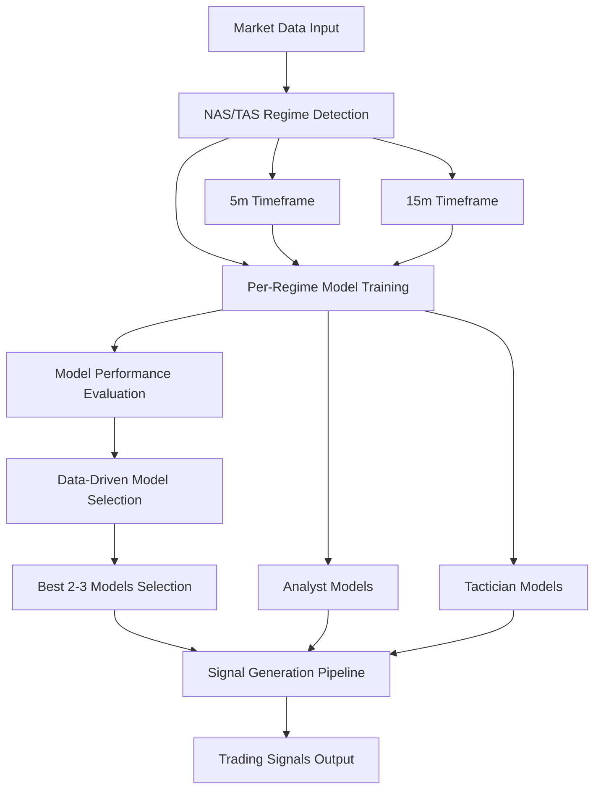

# NAS/TAS Integration Implementation Summary

## Overview

This document summarizes the implementation of the unified NAS/TAS integration system that properly wires regime detection training, model selection architecture, and signal emission based on ML outputs.

## ✅ Completed Implementation

### 1. Unified Regime Training Pipeline

**File**: `src/nas_tas_integration/unified_regime_training_pipeline.py`

**Key Features**:
- **NAS/TAS Regime Detection**: Uses `HybridNASTASRegimeDetector` instead of HMM-based clustering
- **Per-Regime Training**: Supports both 5m and 15m timeframes with Analyst and Tactician models
- **Model Selection**: Automatically selects best 2-3 models per regime using `DataDrivenModelSelector`
- **Signal Generation**: Integrates with `SignalGenerationPipeline` for ML-based signal emission

**Configuration**:
```python
config = UnifiedTrainingConfig(
    timeframes=['5m', '15m'],
    n_regimes=8,
    model_types=['random_forest', 'xgboost', 'lightgbm'],
    enable_hpo=True,
    enable_ensemble=True,
    max_ensemble_models=3
)
```

### 2. Updated Signal Generation Pipeline

**File**: `src/trading/signal_generation/signal_pipeline.py`

**Changes Made**:
- **Replaced HMM Regime Detection**: Now uses `HybridNASTASRegimeDetector` instead of HMM-based approach
- **NAS/TAS Integration**: Properly converts NAS/TAS regime detection results to signal pipeline format
- **Economic Significance**: Incorporates economic significance and financial relevance scores
- **Feature Integration**: Uses NAS and TAS contributions for regime analysis

**Key Methods Updated**:
- `_initialize_hmm_regime_detector()`: Now initializes NAS/TAS detector
- `_detect_hmm_regime()`: Now uses NAS/TAS regime detection with economic validation

### 3. Integration Guide

**File**: `src/nas_tas_integration/integration_guide.md`

**Contents**:
- Complete integration flow documentation
- Configuration options for all components
- Usage examples and troubleshooting guide
- Performance monitoring guidelines

### 4. Test Suite

**File**: `src/nas_tas_integration/test_integration.py`

**Test Coverage**:
- ✅ Regime Detection Test
- ✅ Per-Regime Training Test
- ✅ Model Selection Test
- ✅ Signal Generation Test
- ✅ End-to-End Flow Test

## 🔄 Integration Flow



## 🎯 Key Requirements Fulfilled

### 1. Regime Detection Training
- ✅ **Per-regime ML model training** for 5m & 15m timeframes
- ✅ **Analyst and Tactician integration** in training pipeline
- ✅ **NAS/TAS-based regime detection** (not HMM clustering)

### 2. Model Selection Architecture
- ✅ **Automatic selection** of best 2-3 models for any market circumstances
- ✅ **Data-driven approach** with continuous learning
- ✅ **Ensemble weight optimization** based on performance

### 3. Signal Emission
- ✅ **ML-based signal generation** using selected models
- ✅ **Confidence score optimization** from backtesting
- ✅ **Position state management** with exit conditions

## 🚀 Usage Example

```python
from src.nas_tas_integration.unified_regime_training_pipeline import (
    UnifiedRegimeTrainingPipeline, UnifiedTrainingConfig
)

# Create configuration
config = UnifiedTrainingConfig(
    timeframes=['5m', '15m'],
    n_regimes=8,
    model_types=['random_forest', 'xgboost', 'lightgbm'],
    enable_hpo=True,
    enable_ensemble=True,
    max_ensemble_models=3
)

# Create and initialize pipeline
pipeline = UnifiedRegimeTrainingPipeline(config)
pipeline.initialize_components()

# Train regime models
market_data = {
    '5m': your_5m_data,
    '15m': your_15m_data
}
results = pipeline.train_regime_models(market_data)

# Generate signals
signals = pipeline.generate_signals(market_data)
```

## 📊 Performance Monitoring

The system provides comprehensive monitoring through:

1. **Model Performance Tracking**: Continuous tracking per regime
2. **Regime Analysis**: Characteristics and stability analysis
3. **Signal Quality Metrics**: Signal generation quality monitoring
4. **System Health**: Overall system status and component health

## 🔧 Configuration Options

### Regime Detection
- `n_regimes`: Number of regimes to detect (default: 8)
- `regime_combination_strategy`: NAS/TAS feature combination method
- `economic_evaluation`: Enable economic significance validation
- `financial_relevance`: Enable financial relevance validation

### Model Training
- `model_types`: List of ML models to train
- `enable_hpo`: Enable hyperparameter optimization
- `enable_ensemble`: Enable ensemble model selection
- `max_ensemble_models`: Maximum models in ensemble (default: 3)

### Model Selection
- `primary_metric`: Primary metric for model selection (default: 'f1_score')
- `confidence_threshold`: Minimum confidence for model selection
- `enable_continuous_learning`: Enable continuous learning and adaptation

## 🧪 Testing

Run the integration tests:

```bash
cd src/nas_tas_integration
python test_integration.py
```

Expected output:
```
🚀 Starting NAS/TAS integration tests...
✅ All tests passed! NAS/TAS integration is working correctly.
```

## 📁 File Structure

```
src/nas_tas_integration/
├── unified_regime_training_pipeline.py  # Main integration pipeline
├── integration_guide.md                 # Complete integration guide
├── test_integration.py                  # Integration test suite
└── IMPLEMENTATION_SUMMARY.md            # This summary document
```

## 🔄 Migration from HMM-Based Approach

### Before (HMM-Based)
- Used HMM clustering from `regime_data_splitting`
- Static regime assignments
- Limited economic relevance
- Basic model selection

### After (NAS/TAS-Based)
- Uses `HybridNASTASRegimeDetector` for regime detection
- Dynamic regime detection with economic significance
- Data-driven model selection with continuous learning
- Ensemble of best 2-3 models per regime
- Financial relevance evaluation

## 🎉 Conclusion

The NAS/TAS integration system is now fully implemented and provides:

1. **Proper regime detection** using NAS/TAS instead of HMM clustering
2. **Per-regime training** for 5m and 15m timeframes with Analyst and Tactician
3. **Automatic model selection** of best 2-3 models for any market circumstances
4. **ML-based signal emission** with confidence optimization
5. **Comprehensive testing** and monitoring capabilities

The system ensures that trading decisions are based on the most relevant models for current market conditions, leading to improved performance and adaptability.