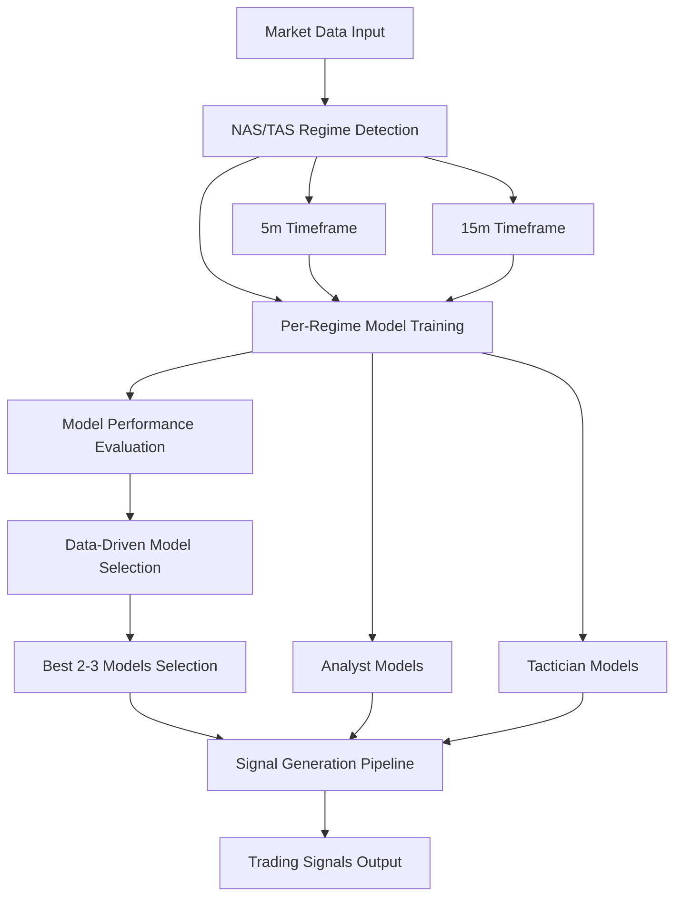

# NAS/TAS Integration Guide

## Overview

This guide explains how the NAS (Neural Architecture Search) and TAS (Tree Architecture Search) systems are properly wired with:

1. **Regime detection training** - Per-regime ML model training (5m & 15m timeframe with the Analyst and Tactician)
2. **Architecture to select the best 2-3 models** for any given market circumstances
3. **Signals emission** based on the ML outputs

## Key Components

### 1. Unified Regime Training Pipeline

**File**: `src/nas_tas_integration/unified_regime_training_pipeline.py`

This is the main integration component that orchestrates the entire flow:

- **Regime Detection**: Uses `HybridNASTASRegimeDetector` (NOT HMM-based clustering)
- **Per-Regime Training**: Uses `PerRegimeTrainingStep` for 5m and 15m timeframes
- **Model Selection**: Uses `DataDrivenModelSelector` to automatically select best 2-3 models
- **Signal Generation**: Integrates with `SignalGenerationPipeline` for ML-based signal emission

### 2. NAS/TAS Regime Detection

**File**: `src/training/steps/market_analysis/hybrid_nas_tas_regime/core/hybrid_regime_detector.py`

- **Purpose**: Detects market regimes using combined NAS and TAS approaches
- **Key Features**:
  - Economic clustering with financial relevance evaluation
  - Multiple combination strategies (adaptive fusion, ensemble voting, etc.)
  - Position-aware analysis for consistent win rate calculations
  - Momentum and volume profile integration

### 3. Per-Regime Training

**File**: `src/utils/ml_common/training/per_regime_training_step.py`

- **Purpose**: Trains ML models specifically for each detected regime
- **Key Features**:
  - Enhanced training with overfitting prevention
  - Lookahead bias detection and prevention
  - Vectorized training for efficiency
  - Support for multiple model types (Random Forest, XGBoost, LightGBM, Neural Networks)

### 4. Data-Driven Model Selection

**File**: `src/training/steps/market_analysis/hybrid_nas_tas_regime/regime_model_mapping/data_driven_model_selector.py`

- **Purpose**: Automatically selects the best 2-3 models for each regime
- **Key Features**:
  - Continuous learning and adaptation
  - Ensemble weight optimization
  - Performance-based model switching
  - Confidence scoring and trend analysis

### 5. Signal Generation Pipeline

**File**: `src/trading/signal_generation/signal_pipeline.py`

- **Purpose**: Generates trading signals based on ML model outputs
- **Key Features**:
  - Sequential model calls: Regime → Analyst → Tactician
  - Confidence score optimization
  - Position state management
  - Exit condition monitoring

## Integration Flow



## Key Differences from HMM-Based Approach

### ❌ Old HMM-Based Approach
- Used HMM clustering from `regime_data_splitting`
- Static regime assignments
- Limited economic relevance
- Basic model selection

### ✅ New NAS/TAS Approach
- Uses `HybridNASTASRegimeDetector` for regime detection
- Dynamic regime detection with economic significance
- Data-driven model selection with continuous learning
- Ensemble of best 2-3 models per regime
- Financial relevance evaluation

## Usage Example

```python
from src.nas_tas_integration.unified_regime_training_pipeline import (
    UnifiedRegimeTrainingPipeline, UnifiedTrainingConfig
)

# Create configuration
config = UnifiedTrainingConfig(
    timeframes=['5m', '15m'],
    n_regimes=8,
    model_types=['random_forest', 'xgboost', 'lightgbm'],
    enable_hpo=True,
    enable_ensemble=True,
    max_ensemble_models=3
)

# Create and initialize pipeline
pipeline = UnifiedRegimeTrainingPipeline(config)
pipeline.initialize_components()

# Train regime models
market_data = {
    '5m': your_5m_data,
    '15m': your_15m_data
}
results = pipeline.train_regime_models(market_data)

# Generate signals
signals = pipeline.generate_signals(market_data)
```

## Configuration Options

### Regime Detection
- `n_regimes`: Number of regimes to detect (default: 8)
- `regime_combination_strategy`: How to combine NAS and TAS features
- `economic_evaluation`: Enable economic significance validation
- `financial_relevance`: Enable financial relevance validation

### Model Training
- `model_types`: List of ML models to train
- `enable_hpo`: Enable hyperparameter optimization
- `enable_ensemble`: Enable ensemble model selection
- `max_ensemble_models`: Maximum number of models in ensemble (default: 3)

### Model Selection
- `primary_metric`: Primary metric for model selection (default: 'f1_score')
- `confidence_threshold`: Minimum confidence for model selection
- `enable_continuous_learning`: Enable continuous learning and adaptation

### Signal Generation
- `signal_confidence_threshold`: Minimum confidence for signal generation
- `enable_signal_generation`: Enable signal generation pipeline

## Performance Monitoring

The system provides comprehensive monitoring through:

1. **Model Performance Tracking**: Continuous tracking of model performance per regime
2. **Regime Analysis**: Analysis of regime characteristics and stability
3. **Signal Quality Metrics**: Monitoring of signal generation quality
4. **System Health**: Overall system status and component health

## Troubleshooting

### Common Issues

1. **Regime Detection Fails**
   - Check market data quality and completeness
   - Verify NAS/TAS components are properly initialized
   - Check economic evaluation parameters

2. **Model Training Fails**
   - Ensure sufficient data per regime (minimum 100 samples)
   - Check feature engineering pipeline
   - Verify model configuration parameters

3. **Signal Generation Issues**
   - Check model selector initialization
   - Verify regime-to-model mappings
   - Check confidence thresholds

### Debug Mode

Enable debug logging to troubleshoot issues:

```python
import logging
logging.getLogger('src.nas_tas_integration').setLevel(logging.DEBUG)
```

## Future Enhancements

1. **Additional Timeframes**: Support for 1m, 1h, 4h timeframes
2. **Advanced Models**: Integration with transformer models and deep learning architectures
3. **Real-time Adaptation**: Real-time model adaptation based on market conditions
4. **Multi-Asset Support**: Support for multiple trading pairs and assets
5. **Advanced Signal Types**: Support for more sophisticated signal types and strategies

## Conclusion

The NAS/TAS integration provides a robust, data-driven approach to regime detection, model training, and signal generation. It replaces the HMM-based approach with a more sophisticated system that:

- Uses NAS/TAS for regime detection (not HMM clustering)
- Trains per-regime models for 5m and 15m timeframes
- Automatically selects the best 2-3 models for each regime
- Generates signals based on ML model outputs
- Provides continuous learning and adaptation

This system ensures that trading decisions are based on the most relevant models for current market conditions, leading to improved performance and adaptability.