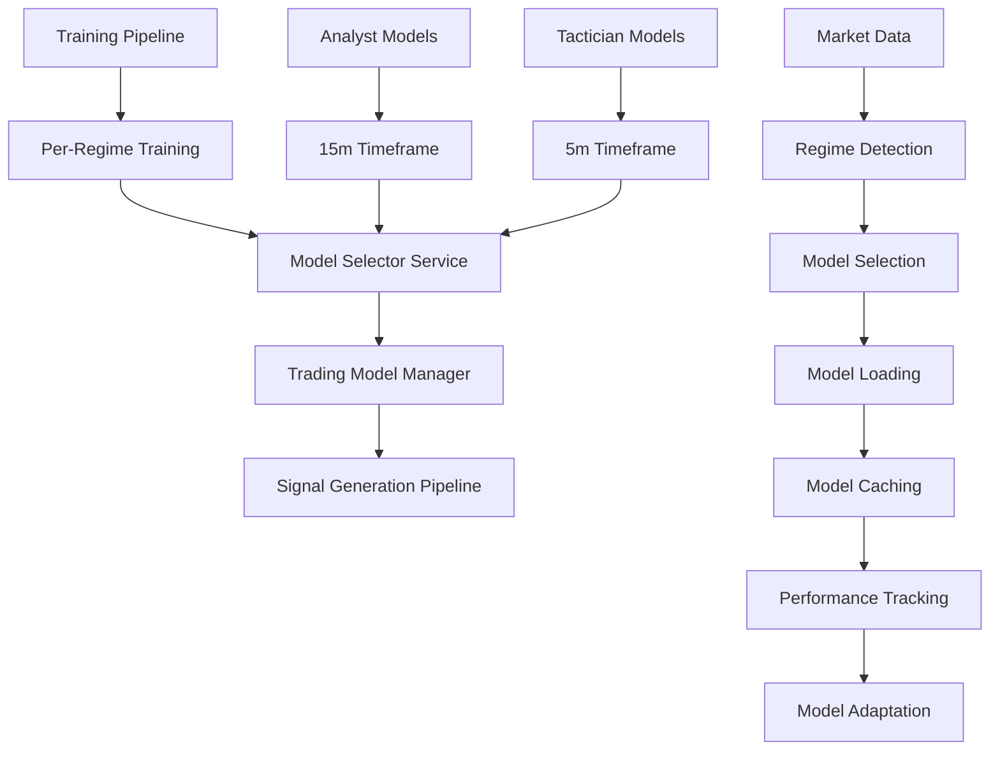

# Trading Model Selection Integration Documentation

## Overview

This document provides comprehensive documentation for the trading model selection integration system that connects per-regime ML model training with real-time trading model selection and management.

## 🏗️ Architecture

### System Components



### Key Modules

1. **Per-Regime Training Integration** (`src/training/steps/model_training/per_regime_training_integration.py`)
   - Integrates with existing Analyst and Tactician training pipelines
   - Uses NAS/TAS regime detection (not HMM clustering)
   - Trains regime-specific models for both 5m and 15m timeframes
   - Provides DataDrivenModelSelector for trading system

2. **Model Selector Service** (`src/trading/model_selection/model_selector_service.py`)
   - Real-time model selection based on current market conditions
   - Uses NAS/TAS regime detection for regime identification
   - Supports ensemble selection with dynamic weights
   - Provides performance monitoring and adaptation

3. **Trading Model Manager** (`src/trading/model_selection/trading_model_manager.py`)
   - Model loading and caching system
   - Real-time performance tracking
   - Model switching based on performance
   - Integration with training system

4. **Signal Generation Integration** (`src/trading/signal_generation/signal_pipeline.py`)
   - Updated to use model selection service
   - Selects best models before generating signals
   - Integrates with existing signal generation pipeline

## 🔄 Data Flow

### Training Phase

1. **Base Model Training**: Existing Analyst and Tactician base models are trained
2. **Per-Regime Training**: Regime-specific models are trained alongside base models
3. **Model Registration**: Per-regime models are registered with DataDrivenModelSelector
4. **Artifact Storage**: Models and metadata are stored for trading system

### Trading Phase

1. **Market Data Input**: Current market data is received
2. **Regime Detection**: NAS/TAS regime detector identifies current market regime
3. **Model Selection**: DataDrivenModelSelector selects best models for current regime
4. **Model Loading**: TradingModelManager loads selected models from cache or storage
5. **Signal Generation**: Selected models are used to generate trading signals
6. **Performance Tracking**: Model performance is tracked and used for adaptation

## 🚀 Usage Examples

### Basic Model Selection

```python
from src.trading.model_selection import get_model_selector_service

# Get model selector service
service = get_model_selector_service()

# Select models for current market conditions
result = service.select_models_for_trading(
    market_data=current_market_data,
    symbol='ETHUSDT',
    timeframe='5m'
)

# Use selected models
selected_models = result.selected_models
ensemble_weights = result.ensemble_weights
```

### Advanced Model Management

```python
from src.trading.model_selection import get_trading_model_manager

# Get model manager
manager = get_trading_model_manager()

# Get models for trading
models = manager.get_models_for_trading(
    market_data=market_data,
    symbol='ETHUSDT',
    timeframe='5m'
)

# Use models
for model_type, model_info in models.items():
    model = model_info['model']
    weight = model_info['weight']
    confidence = model_info['confidence']
    
    # Generate predictions
    predictions = model.predict(features)
    
    # Update performance
    manager.update_model_performance(
        model_name=model_info['name'],
        model_type=model_type,
        regime_id=model_info['regime_id'],
        predictions=predictions,
        actual_values=actual_values,
        execution_time=execution_time
    )
```

### Signal Generation Integration

```python
from src.trading.signal_generation import SignalGenerationPipeline

# Signal generation pipeline now automatically uses model selection
pipeline = SignalGenerationPipeline(config)
await pipeline.initialize()

# Generate signal (model selection happens automatically)
signal_result = await pipeline.generate_signal(
    symbol='ETHUSDT',
    market_data=market_data
)
```

## ⚙️ Configuration

### Per-Regime Training Configuration

```python
config = {
    'n_regimes': 8,
    'timeframes': ['5m', '15m'],
    'model_types': ['random_forest', 'xgboost', 'lightgbm'],
    'enable_hpo': True,
    'enable_ensemble': True,
    'max_ensemble_models': 3,
    'primary_metric': 'f1_score',
    'confidence_threshold': 0.7
}
```

### Trading Model Configuration

```python
from src.trading.model_selection import TradingModelConfig

config = TradingModelConfig(
    analyst_models=['random_forest', 'xgboost', 'lightgbm'],
    tactician_models=['random_forest', 'xgboost', 'lightgbm'],
    n_regimes=8,
    primary_metric='f1_score',
    confidence_threshold=0.7,
    enable_ensemble=True,
    max_ensemble_models=3,
    enable_performance_monitoring=True,
    performance_window=1000,
    adaptation_threshold=0.05
)
```

## 📊 Performance Monitoring

### Model Performance Metrics

- **Accuracy**: Overall prediction accuracy
- **Precision**: Precision for positive predictions
- **Recall**: Recall for positive predictions
- **F1 Score**: Harmonic mean of precision and recall
- **Sharpe Ratio**: Risk-adjusted returns
- **Max Drawdown**: Maximum peak-to-trough decline
- **Win Rate**: Percentage of winning predictions
- **Execution Time**: Model inference time

### Performance Tracking

```python
# Get performance metrics
manager = get_trading_model_manager()
metrics = manager.get_performance_metrics()

for model_key, model_metrics in metrics.items():
    print(f"Model: {model_key}")
    print(f"  F1 Score: {model_metrics['f1_score']:.3f}")
    print(f"  Accuracy: {model_metrics['accuracy']:.3f}")
    print(f"  Execution Time: {model_metrics['execution_time']:.3f}s")
```

### System Status Monitoring

```python
# Get system status
status = manager.get_system_status()

print(f"Model Selector Ready: {status['model_selector_ready']}")
print(f"Cached Models: {status['cached_models']}")
print(f"Tracked Models: {status['tracked_models']}")
```

## 🔧 Troubleshooting

### Common Issues

1. **Model Selection Fails**
   - Check if regime detection is working
   - Verify model selector service is initialized
   - Check market data quality and completeness

2. **Model Loading Fails**
   - Check if models exist in training artifacts
   - Verify model cache is not full
   - Check model storage permissions

3. **Performance Tracking Issues**
   - Verify predictions and actual values are aligned
   - Check if performance window is appropriate
   - Ensure model names are consistent

### Debug Mode

```python
import logging

# Enable debug logging
logging.getLogger('src.trading.model_selection').setLevel(logging.DEBUG)

# Get detailed system status
manager = get_trading_model_manager()
status = manager.get_system_status()
print(json.dumps(status, indent=2))
```

## 🧪 Testing

### Run Integration Tests

```bash
# Test per-regime training integration
cd src/training/steps/model_training
python test_per_regime_integration.py

# Test trading model selection integration
cd src/trading/model_selection
python test_trading_integration.py
```

### Test Coverage

- ✅ Per-Regime Training Integration
- ✅ Model Selector Service
- ✅ Trading Model Manager
- ✅ Performance Tracking
- ✅ System Status Monitoring
- ✅ End-to-End Trading Simulation

## 📈 Performance Benefits

### 1. Regime-Specific Models
- **Better Performance**: Models trained specifically for each market regime
- **Reduced Overfitting**: Per-regime training reduces overfitting to specific conditions
- **Adaptive Selection**: Models automatically selected based on current regime

### 2. Real-Time Adaptation
- **Dynamic Model Switching**: Models change based on current market conditions
- **Performance-Based Selection**: Best performing models are automatically selected
- **Continuous Learning**: Models adapt and improve over time

### 3. System Integration
- **Seamless Integration**: No changes needed to existing training pipeline
- **Backward Compatibility**: Existing functionality remains unchanged
- **Enhanced Performance**: Better model selection leads to improved trading performance

## 🔮 Future Enhancements

### Planned Features

1. **Advanced Model Types**: Support for transformer models and deep learning architectures
2. **Multi-Asset Support**: Support for multiple trading pairs and assets
3. **Real-Time Adaptation**: Real-time model adaptation based on market conditions
4. **Advanced Signal Types**: Support for more sophisticated signal types and strategies
5. **Performance Analytics**: Advanced performance analytics and reporting

### Extension Points

1. **Custom Model Loaders**: Support for custom model loading strategies
2. **Custom Performance Metrics**: Support for custom performance metrics
3. **Custom Selection Strategies**: Support for custom model selection strategies
4. **Custom Caching Strategies**: Support for custom model caching strategies

## 📚 API Reference

### ModelSelectorService

```python
class ModelSelectorService:
    def __init__(self, config: TradingModelConfig)
    def initialize(self) -> bool
    def select_models_for_trading(self, market_data, model_types, symbol, timeframe) -> ModelSelectionResult
    def get_performance_metrics(self) -> Dict[str, Any]
    def get_regime_insights(self, regime_id: int) -> Dict[str, Any]
    def update_model_performance(self, regime_id, model_name, predictions, actual_values, execution_time)
```

### TradingModelManager

```python
class TradingModelManager:
    def __init__(self, config: TradingModelConfig)
    def initialize(self) -> bool
    def get_models_for_trading(self, market_data, symbol, timeframe) -> Dict[str, Any]
    def update_model_performance(self, model_name, model_type, regime_id, predictions, actual_values, execution_time)
    def get_performance_metrics(self) -> Dict[str, Any]
    def get_cache_status(self) -> Dict[str, Any]
    def get_system_status(self) -> Dict[str, Any]
    def shutdown(self)
```

## 🎉 Conclusion

The trading model selection integration provides a comprehensive solution for:

1. **Per-Regime Training**: Regime-specific models trained alongside base models
2. **Real-Time Model Selection**: Best models selected based on current market conditions
3. **Performance Monitoring**: Continuous tracking and adaptation of model performance
4. **Seamless Integration**: Works with existing training and trading infrastructure

This system ensures that trading decisions are based on the most relevant models for current market conditions, leading to improved performance and adaptability while maintaining compatibility with the existing system architecture.