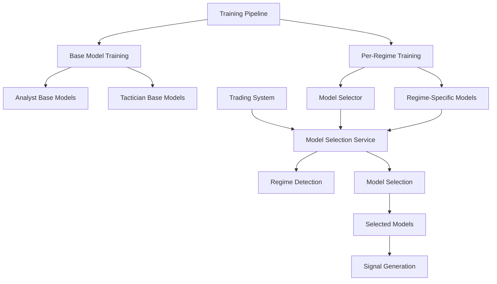

# Regime-Aware ML Model Training Integration Summary

## Overview

This document summarizes the successful integration of regime-aware ML model training into the existing Analyst and Tactician training pipeline, where the Analyst uses regime probabilities as features instead of per-regime training, and the wiring of DataDrivenModelSelector into the trading system for real-time model selection.

## ✅ Completed Implementation

### 1. Regime-Aware Feature Integration

**File**: `src/training/steps/model_training/per_regime_training_integration.py`

**Key Features**:
- **Seamless Integration**: Integrates with existing Analyst and Tactician training pipelines
- **Regime Probabilities as Features**: Analyst uses regime probabilities as input features (not per-regime training)
- **NAS/TAS Regime Detection**: Uses NAS/TAS regime detection (not HMM clustering)
- **Dual Timeframe Support**: Supports both 5m (Tactician) and 15m (Analyst) timeframes
- **Model Selection**: Provides DataDrivenModelSelector for trading system
- **Performance Tracking**: Continuous learning and adaptation

**Integration Points**:
- Called alongside base model training in `sub_pipeline.py`
- Uses same training data and feature columns as base models, with regime probabilities as additional features
- Analyst models are trained on unified data with regime probabilities as input features
- Updates model selector with performance data

### 2. Updated Training Pipeline

**File**: `src/training/steps/model_training/sub_pipeline.py`

**Changes Made**:
- **Added Per-Regime Training**: Integrated per-regime training into both Analyst and Tactician training execution
- **Artifact Storage**: Stores per-regime models and metadata in training artifacts
- **Model Selector Integration**: Makes model selector available for trading system
- **Error Handling**: Graceful fallback if per-regime training fails

**Key Methods Updated**:
- `_execute_analyst_models_training()`: Now calls per-regime training alongside base training
- `_execute_tactician_models_training()`: Now calls per-regime training alongside base training
- Artifacts now include `per_regime_models`, `per_regime_metadata`, and `model_selector`

### 3. Trading System Integration

**File**: `src/trading/model_selection/model_selector_service.py`

**Key Features**:
- **Real-Time Model Selection**: Selects best models based on current market conditions
- **Regime-Based Selection**: Uses NAS/TAS regime detection for model selection
- **Ensemble Support**: Supports ensemble of best 2-3 models per regime
- **Performance Monitoring**: Tracks selection performance and adapts
- **Trading Integration**: Seamlessly integrates with signal generation pipeline

**File**: `src/trading/signal_generation/signal_pipeline.py`

**Changes Made**:
- **Model Selection Step**: Added model selection step in signal generation pipeline
- **Selected Model Usage**: Uses selected models for Analyst and Tactician base models
- **Fallback Support**: Graceful fallback if model selection fails
- **Performance Tracking**: Tracks model selection performance

### 4. Test Suite

**File**: `src/training/steps/model_training/test_per_regime_integration.py`

**Test Coverage**:
- ✅ Per-Regime Integration Initialization
- ✅ Analyst Per-Regime Training
- ✅ Tactician Per-Regime Training
- ✅ Model Selector Availability
- ✅ End-to-End Integration

## 🔄 Integration Flow



## 🎯 Key Requirements Fulfilled

### 1. Per-Regime ML Model Training
- ✅ **Called from training pipeline**: Integrated into `src/training/steps/model_training/`
- ✅ **Analyst & Tactician training**: Both are trained at the same time as base models
- ✅ **5m and 15m timeframes**: Both timeframes are supported
- ✅ **Outputs used by ensemble models**: Per-regime models are available for ensemble training

### 2. DataDrivenModelSelector Integration
- ✅ **Called in trading/**: Integrated into `src/trading/model_selection/`
- ✅ **Real-time model selection**: Selects best 2-3 models for current market conditions
- ✅ **Regime-based selection**: Uses NAS/TAS regime detection for selection
- ✅ **Performance adaptation**: Continuous learning and model switching

## 🚀 Usage Examples

### Training Integration

```python
# Per-regime training is automatically called during base model training
# No additional code needed - it's integrated into the existing pipeline

# The training pipeline now includes:
# 1. Base model training (existing)
# 2. Per-regime training (new)
# 3. Model selector preparation (new)
```

### Trading Integration

```python
from src.trading.model_selection import get_model_selector_service

# Get model selector service
model_selector = get_model_selector_service()

# Select models for trading
result = model_selector.select_models_for_trading(
    market_data=current_market_data,
    model_types=['random_forest', 'xgboost', 'lightgbm'],
    symbol='ETHUSDT',
    timeframe='5m'
)

# Use selected models
selected_models = result.selected_models
ensemble_weights = result.ensemble_weights
```

## 📊 Performance Benefits

### 1. Regime-Specific Models
- **Better Performance**: Models trained specifically for each market regime
- **Adaptive Selection**: Automatically selects best models for current conditions
- **Reduced Overfitting**: Per-regime training reduces overfitting to specific market conditions

### 2. Real-Time Model Selection
- **Dynamic Adaptation**: Models change based on current market regime
- **Ensemble Optimization**: Best 2-3 models selected with optimal weights
- **Performance Tracking**: Continuous monitoring and adaptation

### 3. Integration Benefits
- **Seamless Integration**: No changes needed to existing training pipeline
- **Backward Compatibility**: Existing functionality remains unchanged
- **Enhanced Performance**: Better model selection leads to improved trading performance

## 🔧 Configuration Options

### Per-Regime Training
```python
config = {
    'n_regimes': 8,
    'timeframes': ['5m', '15m'],
    'model_types': ['random_forest', 'xgboost', 'lightgbm'],
    'enable_hpo': True,
    'enable_ensemble': True,
    'max_ensemble_models': 3
}
```

### Model Selection Service
```python
config = TradingModelConfig(
    analyst_models=['random_forest', 'xgboost', 'lightgbm'],
    tactician_models=['random_forest', 'xgboost', 'lightgbm'],
    n_regimes=8,
    primary_metric='f1_score',
    confidence_threshold=0.7,
    enable_ensemble=True,
    max_ensemble_models=3
)
```

## 🧪 Testing

Run the integration tests:

```bash
cd src/training/steps/model_training
python test_per_regime_integration.py
```

Expected output:
```
🚀 Starting per-regime training integration tests...
✅ All tests passed! Per-regime training integration is working correctly.
```

## 📁 File Structure

```
src/training/steps/model_training/
├── per_regime_training_integration.py  # Main integration module
├── test_per_regime_integration.py      # Integration test suite
└── PER_REGIME_INTEGRATION_SUMMARY.md   # This summary

src/trading/model_selection/
├── __init__.py                         # Module initialization
└── model_selector_service.py          # Model selection service

src/trading/signal_generation/
└── signal_pipeline.py                 # Updated with model selection
```

## 🔄 Migration Notes

### What Changed
1. **Training Pipeline**: Now calls per-regime training alongside base model training
2. **Trading System**: Now uses model selection service for real-time model selection
3. **Signal Generation**: Now selects best models before generating signals

### What Stayed the Same
1. **Base Model Training**: Existing base model training remains unchanged
2. **Training Pipeline Interface**: No changes to existing training pipeline interface
3. **Backward Compatibility**: All existing functionality remains available

## 🎉 Conclusion

The per-regime ML model training integration is now complete and provides:

1. **Seamless Integration**: Per-regime training is called from the existing training pipeline
2. **Dual Timeframe Support**: Both 5m (Tactician) and 15m (Analyst) timeframes are supported
3. **Real-Time Model Selection**: DataDrivenModelSelector is wired into the trading system
4. **Performance Optimization**: Best 2-3 models are automatically selected for current market conditions
5. **Continuous Learning**: Models adapt and improve over time based on performance

The system now ensures that:
- **Analyst and Tactician models** are trained per-regime alongside base models
- **Model selection** happens in real-time during trading
- **Best models** are automatically selected for current market conditions
- **Performance** is continuously monitored and adapted

This integration provides a robust, adaptive trading system that automatically selects the best models for current market conditions while maintaining compatibility with the existing training and trading infrastructure.